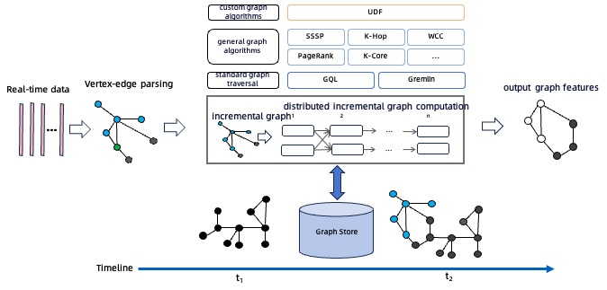

# Guide

[](https://github.com/TuGraph-family/tugraph-analytics/stargazers)
[](https://github.com/TuGraph-family/tugraph-analytics/forks)
[](https://github.com/TuGraph-family/tugraph-analytics/contributors)
[](https://github.com/TuGraph-family/tugraph-analytics/commits/master)
[](https://hub.docker.com/r/tugraph/geaflow-console/tags)
[](https://www.apache.org/licenses/LICENSE-2.0.html)
[](https://github.com/TuGraph-family/tugraph-analytics/releases)
[](https://tugraph-analytics.readthedocs.io/en/latest/docs-cn/introduction/)
[](https://tugraph-analytics.readthedocs.io/en/latest/docs-en/introduction/)
[](https://tugraph-analytics.github.io/)

> 🌐️ English | [中文](README_cn.md)

<!--intro-start-->
## Introduction
GeaFlow is a distributed graph compute engine developed by Ant Group. It supports core capabilities such as trillion-level graph storage, hybrid graph and table processing, real-time graph computation, and interactive graph analysis. Currently, it is widely used in scenarios such as data warehousing acceleration, financial risk control, knowledge graph, and social networks.

For more information about GeaFlow: [GeaFlow Introduction](docs/docs-en/source/2.introduction.md)

For GeaFlow design paper: [GeaFlow: A Graph Extended and Accelerated Dataflow System](https://dl.acm.org/doi/abs/10.1145/3589771)

## Features

* Distributed streaming graph computation
* Hybrid graph and table processing (SQL+GQL)
* Unified stream/batch/graph computation
* Trillion-level graph-native storage
* Interactive graph analytics
* High availability and exactly once semantics
* High-level API operator development
* UDF/graph-algorithms/connector support
* One-stop graph development platform
* Cloud-native deployment

## Quick start
Step 1: Package the JAR and submit the Quick Start task

1. Prepare Git、JDK8、Maven、Docker environment。
2. Download Code：`git clone https://github.com/TuGraph-family/tugraph-analytics geaflow`
3. Build Project：`./build.sh --module=geaflow --output=package`
4. Test Job：`./bin/gql_submit.sh --gql geaflow/geaflow-examples/gql/loop_detection_file_demo.sql`

Step 2: Launch the console and experience submitting the Quick Start task through the console

5. Build console JAR and image (requires starting Docker)：`./build.sh --module=geaflow-console`
6. Start Console：`docker run -d --name geaflow-console -p 8888:8888 geaflow-console:0.1`

For more details：[Quick Start](docs/docs-cn/source/3.quick_start/1.quick_start.md)。

## Development Manual

GeaFlow supports two sets of programming interfaces: DSL and API. You can develop streaming graph computing jobs using GeaFlow's SQL extension language SQL+ISO/GQL or use GeaFlow's high-level API programming interface to develop applications in Java.
* DSL application development: [DSL Application Development](docs/docs-en/source/5.application-development/2.dsl/1.overview.md)
* API application development: [API Application Development](docs/docs-en/source/5.application-development/1.api/1.overview.md)

## Real-time Capabilities

### Dynamic Graph Computation Acceleration

GeaFlow supports incremental graph iterative computation on dynamic graphs. The specific process is as follows: First, real-time data is ingested into GeaFlow through a connector message source. Based on the real-time data, GeaFlow generates internal point-edge structure data and inserts the point-edge data into the underlying graph. The points associated with the real-time data in the current window will be activated, triggering graph iterative computation.

For example, in the case of the WCC (Weakly Connected Components) algorithm, during a time window, each edge's corresponding source ID and target ID vertices will be activated. In the first iteration, their ID information needs to be communicated to their neighboring nodes. If the neighbor nodes receive the message and realize they need to update their information, they need to continue notifying their neighboring nodes about the updates. If the neighbor nodes do not need to update their information, they will not notify their neighbors, and their corresponding iteration will terminate.


To support the processing of dynamic graphs, the industry common solution is to use the capabilities of the Spark GraphX + Spark Streaming engine. This solution can consume data from many data sources and process the data; it is an extension of Spark's core API that can achieve high throughput and provide fault tolerance for real-time stream data processing.

The process for handling the aforementioned incremental graph algorithms with this solution is as follows: First, every Receiver in Spark receives the real-time message stream, parses and splits the messages, and then stores the generated graph data in each Executor. Whenever the data accumulates to a certain batch, a full computation is triggered, and the computed results are then output to the user, known as a snapshot-based graph computation solution.

GeaFlow vs. Spark in terms of WCC algorithm computation time on dynamic graphs:


As shown in the figure, one significant disadvantage of the Spark GraphX + Spark Streaming solution is its redundancy in computations. For instance, if we need to perform a computation for a one-hour window, when using Spark, not only must the current window's data be included, but the entire historical data must also be backtracked, resulting in a considerable amount of redundant calculations, which reduces efficiency.

GeaFlow has the following advantages:
1. GeaFlow outperforms the Spark Streaming + GraphX solution in handling incremental real-time computations, especially on large-scale datasets.
2. By using incremental calculations, GeaFlow avoids redundant processing of the entire dataset, resulting in higher computational efficiency and shorter compute times with negligible performance degradation.
3. GeaFlow supports a hybrid processing language of SQL + GQL, making it more suitable for developing complex graph data processing tasks.

### Stream Computation Acceleration

Compared to traditional stream processing engines like Flink and Storm, which are based on table models for real-time processing systems, GeaFlow utilizes graph as the data model. This approach offers significant performance advantages in handling join relationship operations, particularly in complex multi-hop relationship computations, such as joins of more than three hops and complex cycle searches.

We compare Flink and GeaFlow using the K-Hop algorithm, where K-Hop refers to K-hop relationships. For instance, in social networks, K-Hop indicates a relationship chain where connections can be made through K intermediaries, while in transaction analysis, it refers to the path of K successive fund transfers.

Here is an SQL example of a Flink 2-hop relationship:
```roomsql
-- create source table
CREATE TABLE edge (
    src int,
    dst int
) WITH (
);

CREATE VIEW `v_view` (`vid`) AS
SELECT distinct * from
(
SELECT `src` FROM `edge`
UNION ALL
SELECT `dst` FROM `edge`
);

CREATE VIEW `e_view` (`src`, `dst`) AS
SELECT `src`, `dst` FROM `edge`;

CREATE VIEW `join1_edge`(`id1`, `dst`) AS SELECT `v`.`vid`, `e`.`dst`
FROM `v_view` AS `v` INNER JOIN `e_view` AS `e`
ON `v`.`vid` = `e`.`src`;

CREATE VIEW `join1`(`id1`, `id2`) AS SELECT `e`.`id1`, `v`.`vid`
FROM `join1_edge` AS `e` INNER JOIN `v_view` AS `v`
ON `e`.`dst` = `v`.`vid`;

CREATE VIEW `join2_edge`(`id1`, `id2`, `dst`) AS SELECT `v`.`id1`, `v`.`id2`, `e`.`dst`
FROM `join1` AS `v` INNER JOIN `e_view` AS `e`
ON `v`.`id2` = `e`.`src`;

CREATE VIEW `join2`(`id1`, `id2`, `id3`) AS SELECT `e`.`id1`, `e`.`id2`, `v`.`vid`
FROM `join2_edge` AS `e` INNER JOIN `v_view` AS `v`
ON `e`.`dst` = `v`.`vid`;

;
```

The equivalent example in GeaFlow handling the same 2-hop relationship is shown below (the graph algorithm has been integrated into GeaFlow's IncKHop operator):
```roomsql
set geaflow.dsl.max.traversal=4;
set geaflow.dsl.table.parallelism=4;

CREATE GRAPH modern (
  Vertex node (
    id int ID
  ),
  Edge relation (
    srcId int SOURCE ID,
    targetId int DESTINATION ID
  )
) WITH (
  storeType='rocksdb',
  shardCount = 4
);

CREATE TABLE web_google_20 (
  src varchar,
  dst varchar
) WITH (
  type='file',
  geaflow.dsl.table.parallelism='4',
  geaflow.dsl.column.separator='\t',
  `geaflow.dsl.source.file.parallel.mod`='true',
  geaflow.dsl.file.path = 'resource:///data/web-google-20',
  geaflow.dsl.window.size = 8
);

INSERT INTO modern.node
SELECT cast(src as int)
FROM web_google_20
;

INSERT INTO modern.node
SELECT cast(dst as int)
FROM web_google_20
;

INSERT INTO modern.relation
SELECT cast(src as int), cast(dst as int)
FROM web_google_20;
;

CREATE TABLE tbl_result (
  ret varchar
) WITH (
  type='file',
  geaflow.dsl.file.path='${target}'
);

USE GRAPH modern;

INSERT INTO tbl_result
CALL inc_khop(2) YIELD (ret)
RETURN ret
;
```

Comparison of time consumption between Flink and GeaFlow on the K-Hop algorithm:


As depicted in the figure, it can be observed that for one-hop and two-hop scenarios, Flink's performance slightly outperforms GeaFlow. This is because the data volume involved in the join computations for one-hop and two-hop scenarios is relatively small, and both the left and right tables being traversed are quite small, resulting in short traversal times. Additionally, Flink’s computation framework can cache the historical computation results of joins.

However, when it comes to three-hop and four-hop scenarios, the increasing computational complexity rapidly expands the tables that the join operator needs to traverse, leading to a significant drop in computation performance. In fact, computations for four-hop scenarios may exceed one day without completion. On the other hand, GeaFlow utilizes an incremental graph algorithm based on streaming graphs, where the computation time is only related to the incremental paths and not dependent on historical relationship computation results, thus demonstrating significantly better performance than Flink.


## Contribution
Thank you very much for contributing to GeaFlow, whether bug reporting, documentation improvement, or major feature development, we warmly welcome all contributions. 

For more information: [Contribution](docs/docs-en/source/9.contribution.md).

## Contact Us
You can contact us through the following methods:


**If you are interested in GeaFlow, please give our project a [ ⭐️ ](https://github.com/TuGraph-family/tugraph-analytics).**

## Acknowledgement
Thanks to some outstanding open-source projects in the industry such as Apache Flink, Apache Spark, and Apache Calcite, some modules of GeaFlow were developed with their references. We would like to express our special gratitude for their contributions. Also, thanks to all the individual developers who have contributed to this repository, which are listed below.

<a href="https://github.com/TuGraph-family/tugraph-analytics/graphs/contributors">
  
</a>

Made with [contrib.rocks](https://contrib.rocks).
<!--intro-end-->
