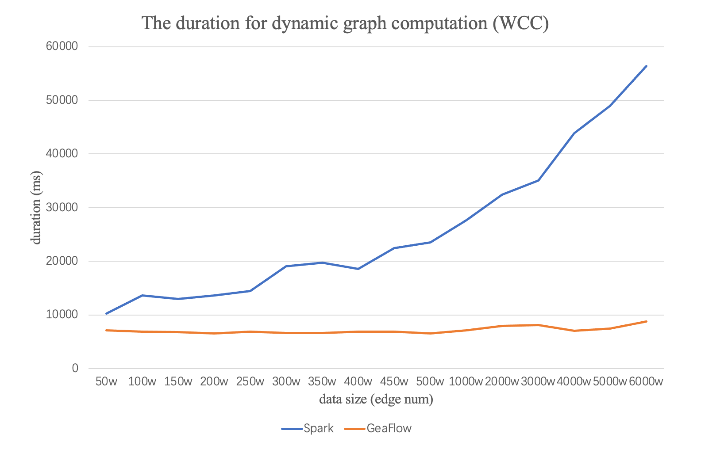
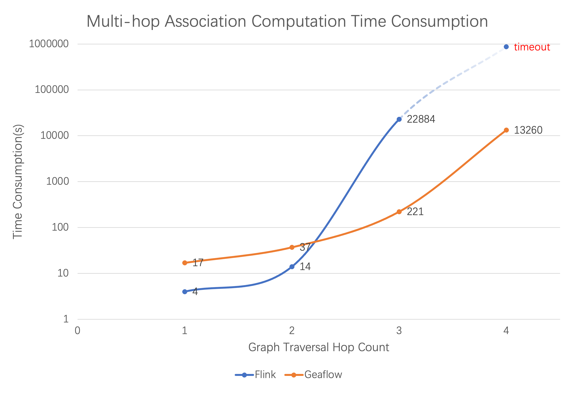

# Guide

> 🌐️ English | [中文](README_cn.md)

<!--intro-start-->
## Introduction
GeaFlow is a distributed streaming graph computing engine developed by Ant Group. It supports core capabilities such as trillion-level graph storage, hybrid graph and table processing, real-time graph computing, and interactive graph analysis. Currently, it is widely used in scenarios such as data warehouse acceleration, financial risk control, knowledge graph, and social networks etc.

For more information about GeaFlow: [GeaFlow Introduction](docs/docs-en/source/2.introduction.md)

For GeaFlow design paper: [GeaFlow: A Graph Extended and Accelerated Dataflow System](https://dl.acm.org/doi/abs/10.1145/3589771)

## Features

* Distributed streaming graph computing
* Hybrid graph and table processing (SQL+GQL)
* Unified stream/batch/graph computing
* Trillion-level graph-native storage
* Interactive graph analytics
* High availability and exactly once semantics
* High-level API operator development
* UDF/graph-algorithms/connector support
* One-stop graph development platform
* Cloud-native deployment

## Quick start
Step 1: Package the JAR and submit the Quick Start task

1. Prepare Git、JDK8、Maven、Docker environment。
2. Download Code：`git clone https://github.com/TuGraph-family/tugraph-analytics geaflow`
3. Build Project：`./build.sh --module=geaflow --output=package`
4. Test Job：`./bin/gql_submit.sh --gql geaflow/geaflow-examples/gql/loop_detection_file_demo.sql`

Step 2: Launch the console and experience submitting the Quick Start task through the console

5. Build console JAR and image (requires starting Docker)：`./build.sh --module=geaflow-console`
6. Start Console：`docker run -d --name geaflow-console -p 8888:8888 geaflow-console:0.1`

For more details：[Quick Start](docs/docs-en/source/3.quick_start/1.quick_start.md)。

## Development Manual

GeaFlow supports two sets of programming interfaces: DSL and API. You can develop streaming graph computing jobs using GeaFlow's SQL extension language SQL+ISO/GQL or use GeaFlow's high-level API programming interface to develop applications in Java.
* DSL application development: [DSL Application Development](docs/docs-en/source/5.application-development/2.dsl/1.overview.md)
* API application development: [API Application Development](docs/docs-en/source/5.application-development/1.api/1.overview.md)

## Performance

### Incremental Graph Computing

GeaFlow supports incremental graph computing capabilities, allowing for continuous streaming incremental graph iterative computing or traversals on dynamic graphs (graphs that are constantly changing). When GeaFlow consumes messages from real-time middleware, the points associated with the real-time data in the current window are activated, triggering iterative graph computing. In each iteration, only the updated points need to notify their neighboring nodes, while unchanged points are not triggered for computing, significantly enhancing the timeliness of the calculations.

In the early days of the industry, there were systems for distributed offline graph computing using Spark GraphX. To support similar engine capabilities, Spark relied on the Spark Streaming framework. However, although this integrated approach can handle streaming consumption of point-edge data, it still requires full graph computings every time a calculation is triggered. This makes it challenging to meet the performance expectations of the business (this approach is also referred to as snapshot-based graph computing).

Using the WCC (Weakly Connected Components) algorithm as an example, we compared the algorithmic execution time of GeaFlow and Spark solutions, with specific performance results as follows:

Since GeaFlow only activates the vertex-edge relations involved in the current window for incremental computing, the computing time can be completed within seconds, and the computing time for each window remains fairly stable. As the data volume increases, Spark’s need to backtrack through historical data during computing also grows. While the machine capacity has not reached its limit, the computing delay shows a positive correlation with the data volume. In similar conditions, GeaFlow's computing time may slightly increase but can generally still be kept at the level of seconds.

### Stream Computing Acceleration

Compared to traditional stream processing engines (such as Flink and Storm, which are based on table models), GeaFlow utilizes a graph as its data model (using a vertex-edge storage format), offering significant performance advantages in handling Join operations, especially for complex multi-hop relationships (like joins exceeding 3 hops and complex cycle searches).

To make a comparison, we analyzed the performance of Flink and GeaFlow using the K-Hop algorithm. K-Hop relationships refer to chains of relationships in which individuals can know each other through K intermediaries. For example, in social networks, K-Hop indicates user relationships connected through K intermediaries. In transaction analysis, K-Hop refers to the path of funds transferred consecutively K times.

In comparing the time consumption of the K-Hop algorithm in Flink and GeaFlow:

As shown in the figure above, Flink performs slightly better than GeaFlow in one-hop and two-hop scenarios. This is because, in these cases, the data volume involved in the Join calculations is relatively small, and both the left and right tables are compact, resulting in shorter traversal times. Additionally, Flink's computing framework can cache the historical results of Join operations.

## Contribution
Thank you very much for contributing to GeaFlow, whether bug reporting, documentation improvement, or major feature development, we warmly welcome all contributions.

For more information: [Contribution](docs/docs-en/source/9.contribution.md).

## Contact Us
You can contact us through the following methods:

**If you are interested in GeaFlow, please give our project a [ ⭐️ ](https://github.com/TuGraph-family/tugraph-analytics).**

## Acknowledgement
Thanks to some outstanding open-source projects in the industry such as Apache Flink, Apache Spark, and Apache Calcite, some modules of GeaFlow were developed with their references. We would like to express our special gratitude for their contributions. Also, thanks to all the individual developers who have contributed to this repository, which are listed below.

Made with [contrib.rocks](https://contrib.rocks).
<!--intro-end-->
