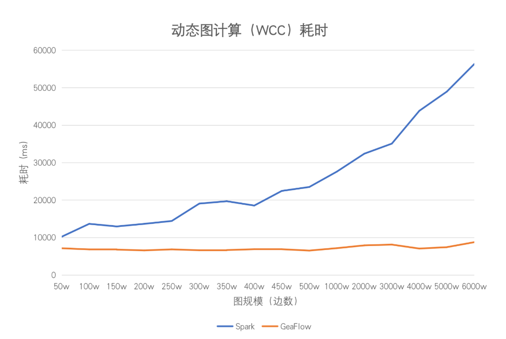
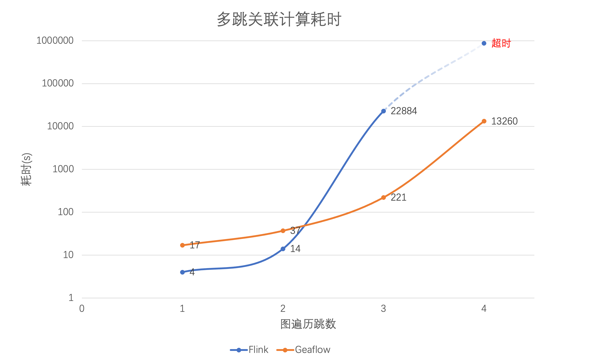

# GeaFlow 文档地图

[](https://github.com/TuGraph-family/tugraph-analytics/stargazers)
[](https://github.com/TuGraph-family/tugraph-analytics/forks)
[](https://github.com/TuGraph-family/tugraph-analytics/contributors)
[](https://github.com/TuGraph-family/tugraph-analytics/commits/master)
[](https://hub.docker.com/r/tugraph/geaflow-console/tags)
[](https://www.apache.org/licenses/LICENSE-2.0.html)
[](https://github.com/TuGraph-family/tugraph-analytics/releases)
[](https://tugraph-analytics.readthedocs.io/en/latest/docs-cn/introduction/)
[](https://tugraph-analytics.readthedocs.io/en/latest/docs-en/introduction/)
[](https://tugraph-analytics.github.io/)

> 🌐️ 中文 | [English](README.md)

<!--intro-start-->
## 介绍
GeaFlow 是蚂蚁集团开源的流图计算引擎，支持万亿级图存储、图表混合处理、实时图计算、交互式图分析等核心能力，目前广泛应用于数仓加速、金融风控、知识图谱以及社交网络等场景。

关于GeaFlow更多介绍请参考：[GeaFlow介绍文档](docs/docs-cn/source/2.introduction.md)

GeaFlow设计论文参考：[GeaFlow: A Graph Extended and Accelerated Dataflow System](https://dl.acm.org/doi/abs/10.1145/3589771)

## 特性

* 分布式实时图计算
* 图表混合处理（SQL+GQL语言）
* 统一流批图计算
* 万亿级图原生存储
* 交互式图分析
* 高可用和Exactly Once语义
* 高阶API算子开发
* UDF/图算法/Connector插件支持
* 一站式图研发平台
* 云原生部署

## 快速上手
第一步 打包jar包并提交quick start任务

1. 准备Git、JDK8、Maven、Docker环境。
2. 下载源码：`git clone https://github.com/TuGraph-family/tugraph-analytics geaflow`
3. 项目构建：`./build.sh --module=geaflow --output=package`
4. 测试任务：`./bin/gql_submit.sh --gql geaflow/geaflow-examples/gql/loop_detection_file_demo.sql`

第二步 启动控制台，体验白屏提交quick start任务

5. 构建控制台jar和镜像(需启动Docker)：`./build.sh --module=geaflow-console`
6. 启动控制台：`docker run -d --name geaflow-console -p 8888:8888 geaflow-console:0.1`

更多详细内容请参考：[快速上手文档](docs/docs-cn/source/3.quick_start/1.quick_start.md)。

## 开发手册

GeaFlow支持DSL和API两套编程接口，您既可以通过GeaFlow提供的类SQL扩展语言SQL+ISO/GQL进行流图计算作业的开发，也可以通过GeaFlow的高阶API编程接口通过Java语言进行应用开发。
* DSL应用开发：[DSL开发文档](docs/docs-cn/source/5.application-development/2.dsl/1.overview.md)
* API应用开发：[API开发文档](docs/docs-cn/source/5.application-development/1.api/guid.md)

## 性能优势

### 增量图计算

GeaFlow支持增量图计算的能力，即在动态图（图是不断变化的）上，可以持续进行流式增量的图迭代计算或遍历。当GeaFlow消费实时中间件的消息时，当前窗口的实时数据所涉及的点会被激活，从而触发迭代图计算。每一轮迭代仅需将有更新的点通知其邻居节点，未更新的点则不会被触发计算，这显著提升了计算的时效性。

在业界早期，存在Spark GraphX分布式离线图计算的系统。为了支持类似的引擎能力，Spark需要依赖Spark Streaming框架。然而，尽管这种融合的方式可以支持流式消费点边数据，每次触发计算时仍需进行全量图计算，这使得计算的时效性很难满足业务预期（这种方式也被称为基于快照的图计算方案）。

以WCC算法为例，我们对GeaFlow与Spark方案的算法耗时进行了比较，具体性能表现如下：


由于GeaFlow仅激活当前窗口中涉及的点边进行增量计算，计算时间可以在秒级别内完成，每个窗口的计算时间基本稳定。随着数据量的增加，Spark在进行计算时需回溯的历史数据也随之增多。在机器容量未达到上限的情况下，其计算延迟与数据量呈正相关分布。在相同情况下，GeaFlow的计算时间可能会略有增加，但仍可基本保持在秒级别完成。

### 流计算加速

与传统的流式计算引擎（如Flink、Storm等基于表模型的实时处理系统）相比，GeaFlow采用图作为数据模型（点边的存储模式），在处理Join关系运算，特别是复杂多跳关系运算（如超过3跳的Join、复杂环路查找）时具备显著的性能优势。

为了进行比较，我们采用K-Hop算法分析了Flink与GeaFlow的性能。K-Hop关系是指可以通过K个中间人相互认识的关系链，例如在社交网络中，K-Hop指的是通过K个中介联系的用户关系。在交易分析中，K-Hop指的是资金的K次连续转移路径。

在Flink与GeaFlow的K-Hop算法耗时对比中：


如上图所示，在一跳和两跳的场景中，Flink的性能略优于GeaFlow。这是因为在这些场景中，参与Join计算的数据量较小，左表和右表都很小，使得遍历操作耗时短。此外，Flink的计算框架能够缓存Join操作的历史计算结果。

然而，当进入三跳和四跳场景时，计算复杂度的上升导致Join算子需要遍历的表迅速膨胀，从而使计算性能大幅下降，甚至在四跳场景中超过一天仍无法完成计算。相比之下，GeaFlow采用基于流图的增量算法，计算时间仅与增量路径相关，而与历史的关联关系计算结果无关，因此性能明显优于Flink。

### SQL Join分析加速

在反欺诈分析中，复杂的多层资金链条挖掘通常依赖多表JOIN操作来进行复杂的多跳追踪。然而，当关联层级超过3跳时，传统JOIN操作的时间复杂度呈指数级增长，以多表JOIN为核心的分析模式逐渐失去优势，变成效率的“枷锁”。分析师团队耗费数天编写SQL脚本，最终查询耗时可达小时级别——而此时资金已完成洗白转移。这揭示了传统数据仓库的深层矛盾：关系型范式与真实世界网状业务逻辑的错位，常常面临高查询耗时和复杂查询逻辑等挑战。

GeaFlow以图作为数据模型，支持图OLAP分析能力。通过将多表JOIN查询转化为图路径检索，GeaFlow利用图引擎的关联性分析优势，使得性能从分钟级跃升至秒级，单点分析则可达到毫秒级。同时，GeaFlow支持动态图数据的实时更新，与传统的批量处理模式（如T+1）的滞后性形成鲜明对比。

[](docs/docs-cn/source/reference/vs_join.md)

[为什么使用图进行关联运算比表Join更具吸引力？](docs/docs-cn/source/reference/vs_join.md)

基于GQL的关联分析Demo：

```roomsql
--GQL Style
Match (s:student)-[sc:selectCource]->(c:cource)
Return c.name
;
```

基于SQL的关联分析Demo：

```roomsql
--SQL Style
SELECT c.name
FROM course c JOIN selectCourse sc 
ON c.id = sc.targetId
JOIN student s ON sc.srcId = s.id
;
```

## 参与贡献
非常感谢您参与到 GeaFlow 的贡献中来，无论是Bug反馈还是文档完善，或者是大的功能点贡献，我们都表示热烈的欢迎。

具体请参考：[参与贡献文档](docs/docs-cn/source/9.contribution.md)。

**如果您对GeaFlow感兴趣，欢迎给我们项目一颗[ ⭐️ ](https://github.com/TuGraph-family/tugraph-analytics)。**

## 联系我们
您可以通过以下方式联系我们。


## 致谢
GeaFlow 开发过程中部分模块参考了一些业界优秀的开源项目，包括 Apache Flink、Apache Spark 以及 Apache Calcite 等, 这里表示特别的感谢。也感谢对 GeaFlow 做过贡献的个人开发者，名单如下：

<a href="https://github.com/TuGraph-family/tugraph-analytics/graphs/contributors">
  
</a>

生成 By [contrib.rocks](https://contrib.rocks).
<!--intro-end-->
<!--intro-end-->
