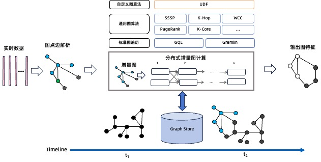

# GeaFlow 文档地图

[](https://github.com/TuGraph-family/tugraph-analytics/stargazers)
[](https://github.com/TuGraph-family/tugraph-analytics/forks)
[](https://github.com/TuGraph-family/tugraph-analytics/contributors)
[](https://github.com/TuGraph-family/tugraph-analytics/commits/master)
[](https://hub.docker.com/r/tugraph/geaflow-console/tags)
[](https://www.apache.org/licenses/LICENSE-2.0.html)
[](https://github.com/TuGraph-family/tugraph-analytics/releases)
[](https://tugraph-analytics.readthedocs.io/en/latest/docs-cn/introduction/)
[](https://tugraph-analytics.readthedocs.io/en/latest/docs-en/introduction/)
[](https://tugraph-analytics.github.io/)

> 🌐️ 中文 | [English](README.md)

<!--intro-start-->
## 介绍
GeaFlow 是蚂蚁集团开源的流图计算引擎，支持万亿级图存储、图表混合处理、实时图计算、交互式图分析等核心能力，目前广泛应用于数仓加速、金融风控、知识图谱以及社交网络等场景。

关于GeaFlow更多介绍请参考：[GeaFlow介绍文档](docs/docs-cn/source/2.introduction.md)

GeaFlow设计论文参考：[GeaFlow: A Graph Extended and Accelerated Dataflow System](https://dl.acm.org/doi/abs/10.1145/3589771)

## 特性

* 分布式实时图计算
* 图表混合处理（SQL+GQL语言）
* 统一流批图计算
* 万亿级图原生存储
* 交互式图分析
* 高可用和Exactly Once语义
* 高阶API算子开发
* UDF/图算法/Connector插件支持
* 一站式图研发平台
* 云原生部署

## 快速上手
第一步 打包jar包并提交quick start任务

1. 准备Git、JDK8、Maven、Docker环境。
2. 下载源码：`git clone https://github.com/TuGraph-family/tugraph-analytics geaflow`
3. 项目构建：`./build.sh --module=geaflow --output=package`
4. 测试任务：`./bin/gql_submit.sh --gql geaflow/geaflow-examples/gql/loop_detection_file_demo.sql` 

第二步 启动控制台，体验白屏提交quick start任务

5. 构建控制台jar和镜像(需启动Docker)：`./build.sh --module=geaflow-console`
6. 启动控制台：`docker run -d --name geaflow-console -p 8888:8888 geaflow-console:0.1`

更多详细内容请参考：[快速上手文档](docs/docs-cn/source/3.quick_start/1.quick_start.md)。

## 开发手册

GeaFlow支持DSL和API两套编程接口，您既可以通过GeaFlow提供的类SQL扩展语言SQL+ISO/GQL进行流图计算作业的开发，也可以通过GeaFlow的高阶API编程接口通过Java语言进行应用开发。
* DSL应用开发：[DSL开发文档](docs/docs-cn/source/5.application-development/2.dsl/1.overview.md)
* API应用开发：[API开发文档](docs/docs-cn/source/5.application-development/1.api/guid.md)

## 实时能力

### 动态图计算加速

GeaFlow支持动态图上进行增量的图迭代计算，具体流程如下：首先，实时数据通过connector消息源输入的GeaFlow中，GeaFlow依据实时数据，生成内部的点边结构数据，并且将点边数据插入进底图中。当前窗口的实时数据涉及到的点会被激活，触发图迭代计算。
这里以WCC算法为例，对联通分量算法而言，在一个时间窗口内每条边对应的src id和target id对应的顶点会被激活，第一次迭代需要将其id信息通知其邻居节点。如果邻居节点收到消息后，发现需要更新自己的信息，那么它需要继续将更新消息通知给它的邻居节点；如果说邻居节点不需要更新自己的信息，那么它就不需要通知其邻居节点，它对应的迭代终止。


为了支持动态图的处理，业界常见的解决方案是业界可以通过Spark GraphX + Spark Streaming的引擎能力，该方案可以从很多数据源消费数据并对数据进行处理，是Spark核心API的一个扩展，可以实现高吞吐量的、具备容错机制的实时流数据的处理。
该方案处理上述增量图算法的流程为：首先Spark中的每个Receiver接收到实时消息流后，对实时消息进行解析和切分，之后将生成的图数据存储在每个Executor中。每当数据累积到一定的批次，就会触发一次全量计算，最后将计算出的结果输出给用户，这也称之为基于快照的图计算方案。

GeaFlow VS. Spark在动态图计算WCC算法耗时对比：

如上图所示，由于Spark GraphX+Spark Streaming的方案有一个比较大的缺点，就是它存在着重复计算的问题，假如我们需要以1小时一个窗口做一次计算，那么在使用Spark进行计算时，不仅要将当前窗口的数据计算进去，历史所有数据也需要进行回溯，存在大量重复计算，这样做效率不高。
而GeaFlow引擎主要有以下几个方面的优势：
1. GeaFlow在处理增量实时计算时，性能优于Spark Streaming + GraphX方案，尤其是在大规模数据集上。
2. GeaFlow通过增量计算避免了全量数据的重复处理，计算效率更高，计算时间更短性能不明显下降。
3. GeaFlow支持SQL+GQL混合处理语言，更适合开发复杂的图数据处理任务。


### 流计算加速

相比传统的流式计算引擎比如Flink、Storm这些以表为模型的实时处理系统而言，GeaFlow以图为数据模型，在处理Join关系运算，尤其是复杂多跳的关系运算如3跳以上的Join、复杂环路查找上具备极大的性能优势。
我们使用K_Hop算法将Flink和GeaFlow进行对比，其中k-Hop是指K跳关系，例如在社交网络中k-Hop指的是可以通过K个中间人相互认识的关系链，在交易分析中指资金的K次连续转移的路径。

以下是Flink 2跳关系为例的SQL示例：
```roomsql
-- create source table
CREATE TABLE edge (
    src int,
    dst int
) WITH (
);

CREATE VIEW `v_view` (`vid`) AS
SELECT distinct * from
(
SELECT `src` FROM `edge`
UNION ALL
SELECT `dst` FROM `edge`
);

CREATE VIEW `e_view` (`src`, `dst`) AS
SELECT `src`, `dst` FROM `edge`;                

CREATE VIEW `join1_edge`(`id1`, `dst`) AS SELECT `v`.`vid`, `e`.`dst`
FROM `v_view` AS `v` INNER JOIN `e_view` AS `e`
ON `v`.`vid` = `e`.`src`;

CREATE VIEW `join1`(`id1`, `id2`) AS SELECT `e`.`id1`, `v`.`vid`
FROM `join1_edge` AS `e` INNER JOIN `v_view` AS `v`
ON `e`.`dst` = `v`.`vid`;                                

CREATE VIEW `join2_edge`(`id1`, `id2`, `dst`) AS SELECT `v`.`id1`, `v`.`id2`, `e`.`dst`
FROM `join1` AS `v` INNER JOIN `e_view` AS `e`
ON `v`.`id2` = `e`.`src`;

CREATE VIEW `join2`(`id1`, `id2`, `id3`) AS SELECT `e`.`id1`, `e`.`id2`, `v`.`vid`
FROM `join2_edge` AS `e` INNER JOIN `v_view` AS `v`
ON `e`.`dst` = `v`.`vid`;

;
```

GeaFlow处理相同2跳关系的示例如下（图算法已经集成到GeaFlow的IncKHop算子中）：
```roomsql
set geaflow.dsl.max.traversal=4;
set geaflow.dsl.table.parallelism=4;

CREATE GRAPH modern (
  Vertex node (
    id int ID
  ),
  Edge relation (
    srcId int SOURCE ID,
    targetId int DESTINATION ID
  )
) WITH (
  storeType='rocksdb',
  shardCount = 4
);

CREATE TABLE web_google_20 (
  src varchar,
  dst varchar
) WITH (
  type='file',
  geaflow.dsl.table.parallelism='4',
  geaflow.dsl.column.separator='\t',
  `geaflow.dsl.source.file.parallel.mod`='true',
  geaflow.dsl.file.path = 'resource:///data/web-google-20',
  geaflow.dsl.window.size = 8
);

INSERT INTO modern.node
SELECT cast(src as int)
FROM web_google_20
;

INSERT INTO modern.node
SELECT cast(dst as int)
FROM web_google_20
;

INSERT INTO modern.relation
SELECT cast(src as int), cast(dst as int)
FROM web_google_20;
;

CREATE TABLE tbl_result (
  ret varchar
) WITH (
  type='file',
  geaflow.dsl.file.path='${target}'
);

USE GRAPH modern;

INSERT INTO tbl_result
CALL inc_khop(2) YIELD (ret)
RETURN ret
;
```

Flink VS. GeaFlow在K-Hop算法上的耗时对比：


如上图所示可以看到在一跳、两跳场景中，Flink的性能要略优于GeaFlow，这是因为在一跳、两跳场景中参与join计算的数据量比较小，join需要遍历的左表和右表都很小，遍历本身耗时短，而且Flink的计算框架可以缓存join的历史计算结果。但是到了三跳、四跳场景时候，由于计算复杂度的上升，join算子需要遍历的表迅速膨胀，带来计算性能的急剧下降，甚至四跳场景超过一天也无法完成计算。而GeaFlow采用基于流图增量图算法，计算耗时只和增量路径相关，和历史的关联关系计算结果无关，所以性能明显优于Flink。


## 参与贡献
非常感谢您参与到 GeaFlow 的贡献中来，无论是Bug反馈还是文档完善，或者是大的功能点贡献，我们都表示热烈的欢迎。

具体请参考：[参与贡献文档](docs/docs-cn/source/9.contribution.md)。

**如果您对GeaFlow感兴趣，欢迎给我们项目一颗[ ⭐️ ](https://github.com/TuGraph-family/tugraph-analytics)。**

## 联系我们
您可以通过以下方式联系我们。


## 致谢
GeaFlow 开发过程中部分模块参考了一些业界优秀的开源项目，包括 Apache Flink、Apache Spark 以及 Apache Calcite 等, 这里表示特别的感谢。也感谢对 GeaFlow 做过贡献的个人开发者，名单如下：

<a href="https://github.com/TuGraph-family/tugraph-analytics/graphs/contributors">
  
</a>

生成 By [contrib.rocks](https://contrib.rocks).
<!--intro-end-->
<!--intro-end-->
