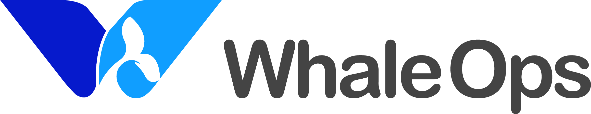

# TuGraph Analytics

[](https://github.com/TuGraph-family/tugraph-analytics/stargazers)
[](https://github.com/TuGraph-family/tugraph-analytics/forks)
[](https://github.com/TuGraph-family/tugraph-analytics/contributors)
[](https://github.com/TuGraph-family/tugraph-analytics/commits/master)
[](https://hub.docker.com/r/tugraph/geaflow-console/tags)
[](https://www.apache.org/licenses/LICENSE-2.0.html)
[](https://github.com/TuGraph-family/tugraph-analytics/releases)
[](https://tugraph-analytics.readthedocs.io/en/latest/docs-cn/introduction/)
[](https://tugraph-analytics.readthedocs.io/en/latest/docs-en/introduction/)
[](https://tugraph-analytics.github.io/)

> 🌐️ 中文 | [English](README.md)

<!--intro-start-->
## 介绍
**TuGraph Analytics** (别名：GeaFlow) 是蚂蚁集团开源的[**性能世界一流**](https://ldbcouncil.org/benchmarks/snb-bi/)的OLAP图数据库，支持万亿级图存储、图表混合处理、实时图计算、交互式图分析等核心能力，目前广泛应用于数仓加速、金融风控、知识图谱以及社交网络等场景。

关于GeaFlow更多介绍请参考：[GeaFlow介绍文档](docs/docs-cn/introduction.md)

GeaFlow设计论文参考：[GeaFlow: A Graph Extended and Accelerated Dataflow System](https://dl.acm.org/doi/abs/10.1145/3589771)

## 特性

* 分布式实时图计算
* 图表混合处理（SQL+GQL语言）
* 统一流批图计算
* 万亿级图原生存储
* 交互式图分析
* 高可用和Exactly Once语义
* 高阶API算子开发
* UDF/图算法/Connector插件支持
* 一站式图研发平台
* 云原生部署

## 快速上手

1. 准备Git、JDK8、Maven、Docker环境。
2. 下载源码：`git clone https://github.com/TuGraph-family/tugraph-analytics`
3. 项目构建：`mvn clean install -DskipTests`
4. 测试任务：`./bin/gql_submit.sh --gql geaflow/geaflow-examples/gql/loop_detection.sql`
3. 构建镜像：`./build.sh --all`
4. 启动容器：`docker run -d --name geaflow-console -p 8888:8888 geaflow-console:0.1`

更多详细内容请参考：[快速上手文档](docs/docs-cn/quick_start.md)。

## 开发手册

GeaFlow支持DSL和API两套编程接口，您既可以通过GeaFlow提供的类SQL扩展语言SQL+ISO/GQL进行流图计算作业的开发，也可以通过GeaFlow的高阶API编程接口通过Java语言进行应用开发。
* DSL应用开发：[DSL开发文档](docs/docs-cn/application-development/dsl/overview.md)
* API应用开发：[API开发文档](docs/docs-cn/application-development/api/guid.md)

## 实时能力

相比传统的流式计算引擎比如Flink、Storm这些以表为模型的实时处理系统而言，GeaFlow以图为数据模型，在处理Join关系运算，尤其是复杂多跳的关系运算如3跳以上的Join、复杂环路查找上具备极大的性能优势。

[](./docs/docs-cn/principle/vs_join.md)

[为什么使用图进行关联运算比表Join更具吸引力？](./docs/docs-cn/principle/vs_join.md)

基于GQL的关联分析Demo：

```roomsql
--GQL Style
Match (s:student)-[sc:selectCource]->(c:cource)
Return c.name
;
```

基于SQL的关联分析Demo：

```roomsql
--SQL Style
SELECT c.name
FROM course c JOIN selectCourse sc 
ON c.id = sc.targetId
JOIN student s ON sc.srcId = s.id
;
```

## 参与贡献
非常感谢您参与到GeaFlow的贡献中来，无论是Bug反馈还是文档完善，或者是大的功能点贡献，我们都表示热烈的欢迎。

具体请参考：[参与贡献文档](docs/docs-cn/contribution.md)。

**如果您对GeaFlow感兴趣，欢迎给我们项目一颗[ ⭐️ ](https://github.com/TuGraph-family/tugraph-analytics)。**

## 合作伙伴
<table cellspacing="0" cellpadding="0">
  <tr align="center">
    <td height="80"><a href="https://github.com/CGCL-codes/YiTu"></a></td>
    <td height="80"><a href="http://kw.fudan.edu.cn/"></a></td>
    <td height="80"></td>
  </tr>
  <tr align="center">
    <td height="80"><a href="http://www.whaleops.com/"></a></td>
    <td height="80"><a href="https://github.com/oceanbase/oceanbase"></a></td>
    <td height="80"><a href="https://github.com/secretflow/secretflow"></a></td>
  </tr>
</table>

## 联系我们
您可以通过以下方式联系我们。


## 致谢
GeaFlow开发过程中部分模块参考了一些业界优秀的开源项目，包括Apache Flink、Apache Spark以及Apache Calcite等, 这里表示特别的感谢。
<!--intro-end-->
