# GeaFlow Dashboard
## 简介
Geaflow-dashboard为Geaflow提供作业级别的监控页面，可以轻松地通过dashboard查看作业的以下信息：
* 作业的健康度（Container和Worker活跃度）
* 作业的进度（Pipeline和Cycle信息）
* 作业各个组件的实时日志
* 作业各个组件的进程指标
* 作业各个组件的火焰图
* 作业各个组件的Thread Dump

## 如何访问页面
当作业运行在k8s集群中时，可以通过master的service对外暴露HTTP服务，直接通过service进行访问即可。
在本地或开发环境，也可以直接通过kubectl port-forward指令来直接映射到master pod的端口。

### 以minikube为例
1. 将作业部署到minikube中，部署作业方式参考[快速上手](quick_start.md)。
2. 打开minikube-dashboard，找到master的pod名称（或者在终端中输入以下命令获取）。
```shell
kubectl get pods
```
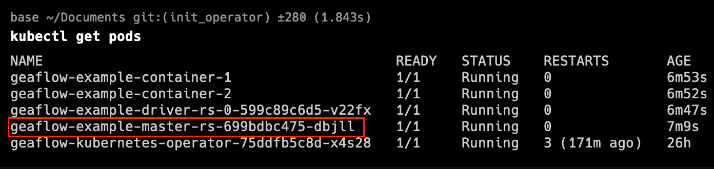
3. 打开终端，输入以下命令，即可将pod容器内的8090端口映射到localhost的本机8090端口。
请将 **${your-master-pod-name}** 替换为你自己的pod名称
```shell
kubectl port-forward ${your-master-pod-name} 8090:8090
```
4. 打开浏览器，访问localhost:8090即可打开页面。

## 功能介绍
### Overview
Overview页面会展示整个作业的健康状态。你可以在这里查看container和driver是否都在正常运行。

除此之外，Overview页面也会展示作业的Pipeline列表。


### Pipeline列表
也可以通过侧边栏的Pipeline菜单进入页面。页面包括作业的每一项Pipeline的名称、开始时间和耗时。
耗时为0表示该Pipeline已开始执行，但尚未完成。

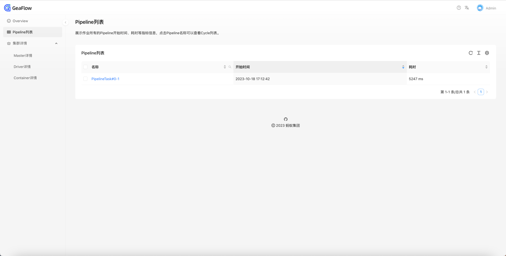

### Cycle列表
点击Pipeline名称可以进入二级菜单，查看当前Pipeline下所有的Cycle列表的各项信息。


### 作业组件详情
可以查看作业的各个组件（包括master、driver、container）的各项信息。
可以通过侧边栏的菜单进行访问。

其中Driver详情展示所有driver的基础信息。Container详情展示所有Container的基础信息。

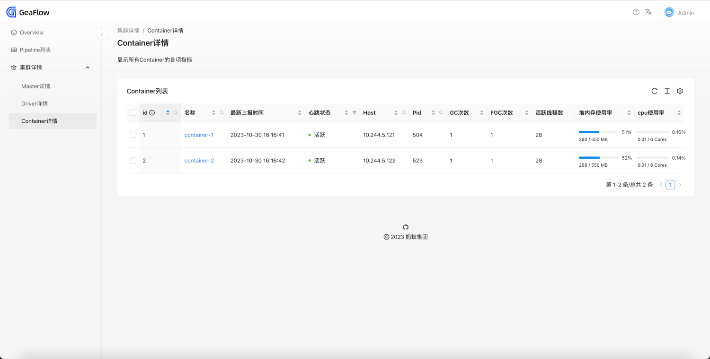
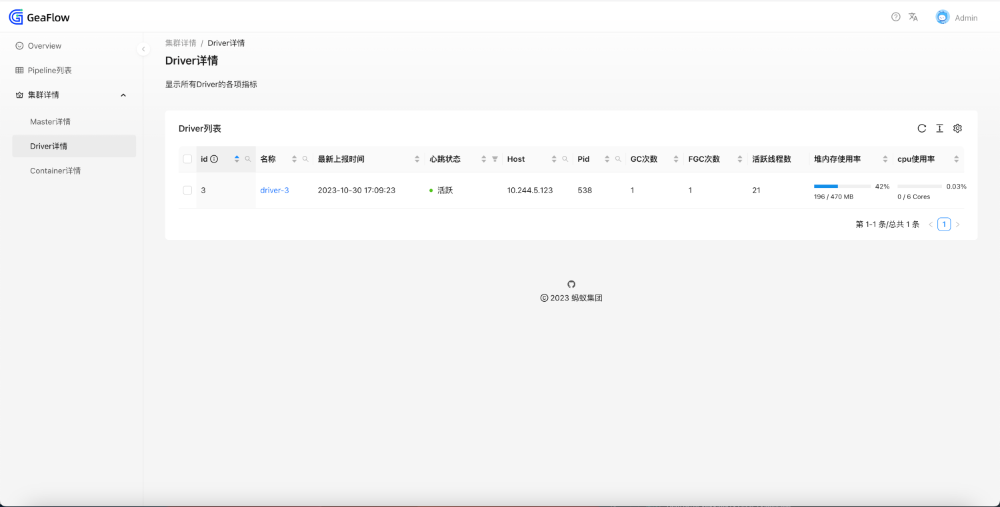

### 组件运行时详情
通过点击左边栏的Master详情，或者通过点击Driver/Container详情中的组件名称，可以跳转到组件的运行时页面。
在运行时页面中，可以查看和操作以下内容。
* 查看容器的进程指标

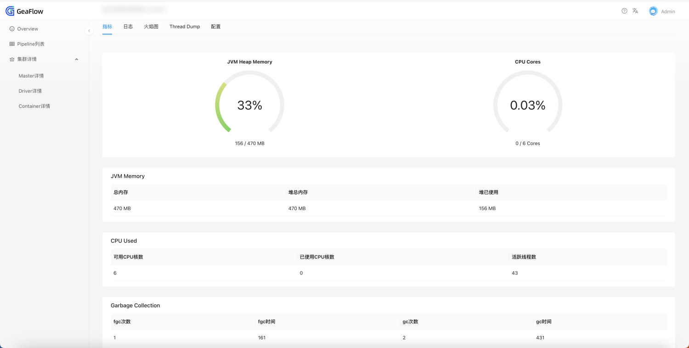
* 查看实时的日志。这里以master为例介绍其中的日志文件。
  * master.log：Master的java主进程日志。
  * master.log.1 / master.log.2：Master的java主进程日志备份。
  * agent.log：Master的agent服务日志。
  * geaflow.log：进入容器后的shell启动脚本日志。
  
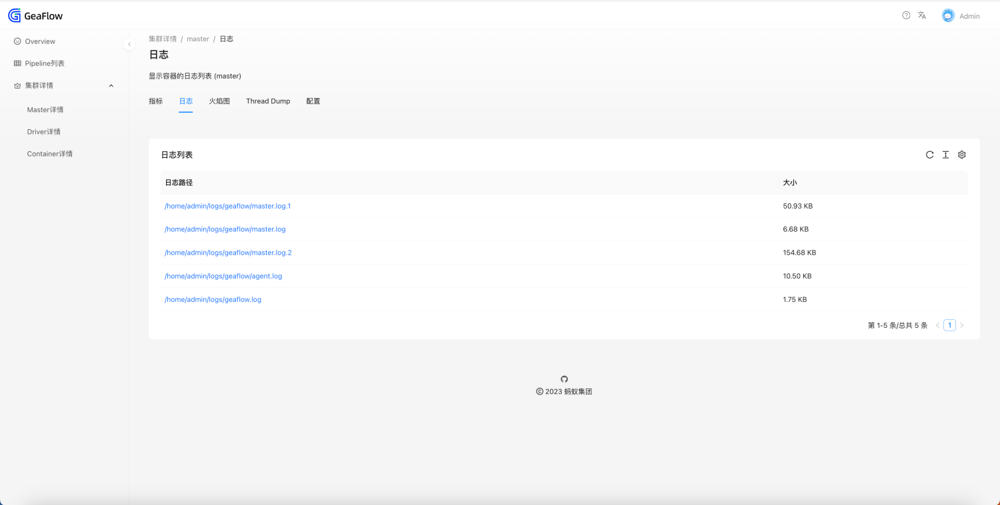
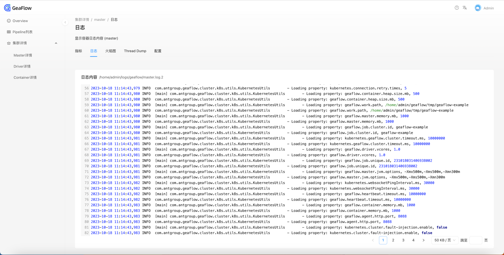
* 对进程进行CPU/ALLOC分析，生成火焰图。
火焰图分析类型可选择CPU或ALLOC，单次最多分析60秒，最多保留10份历史记录。

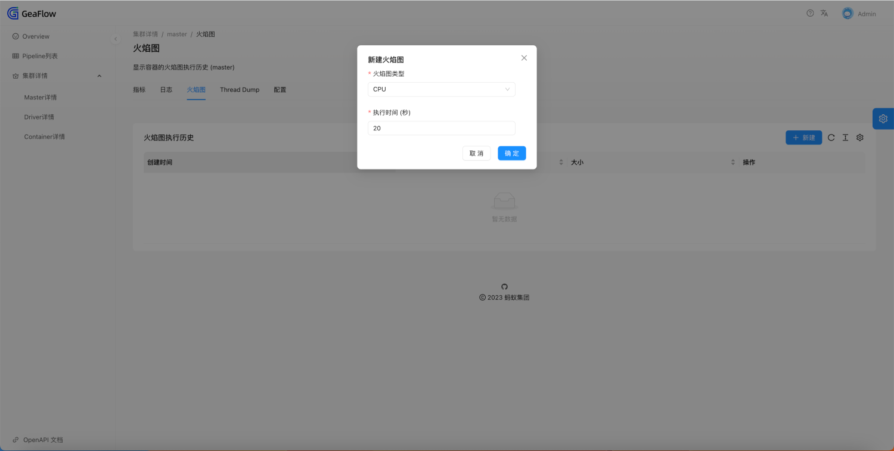
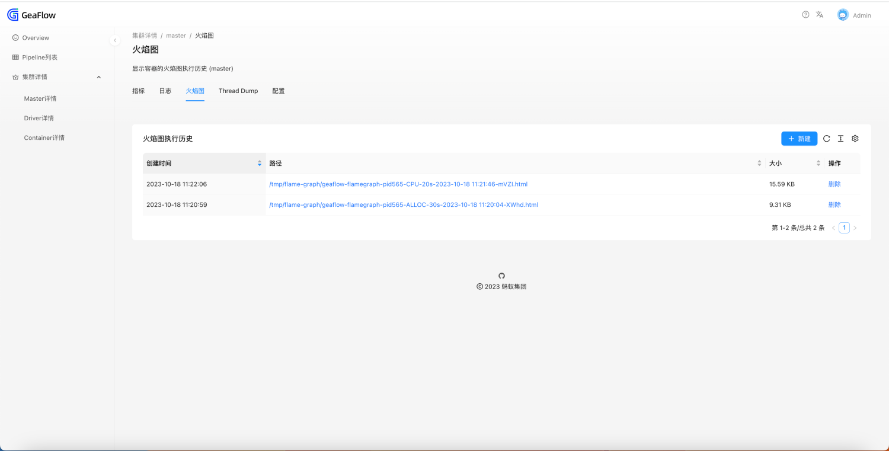
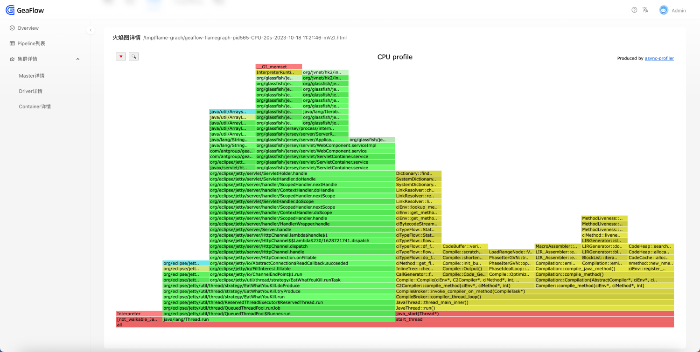

* 对进程进行Thread Dump。保留最新一次dump的结果。


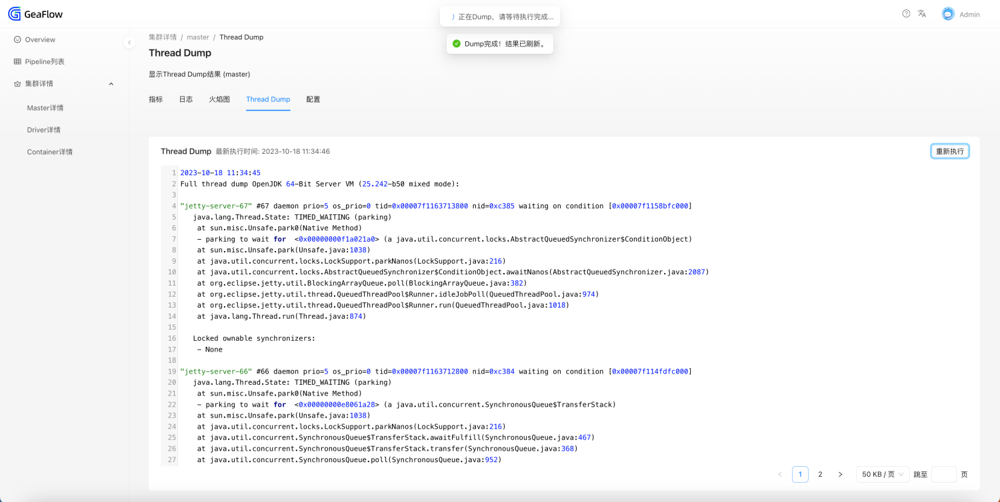

* 查看进程的所有配置项（仅master拥有此页面）

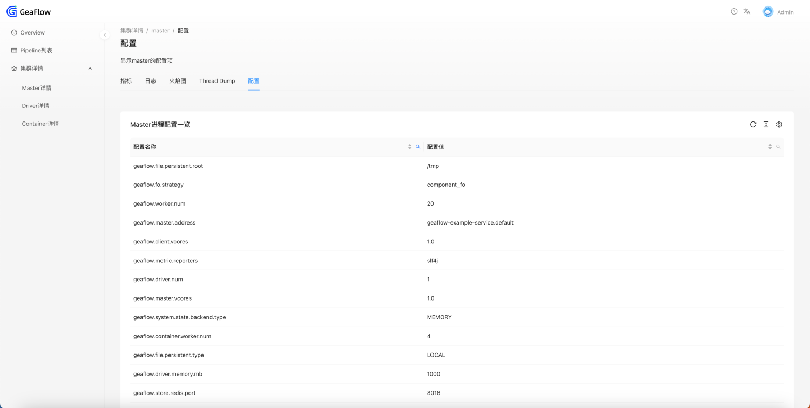


## 其他功能
### 列表排序与查询
部分列表的列可以进行排序和查询。

查询时，点击“搜索”标识，输入关键字，点击“搜索”按钮即可。

重置时，点击“重置”按钮，列表会重新刷新。

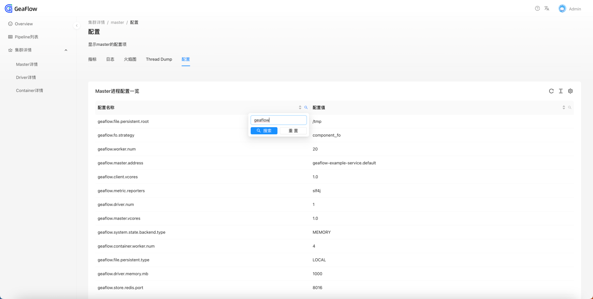

### 本地化
页面支持中英文切换，点击右上角的“文A”图标，即可选择语言。

