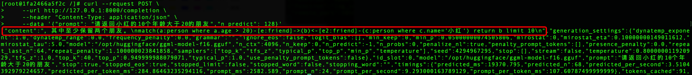

用户可以在本地完成大模型的服务化部署，以下步骤描述了从下载预训练模型，服务化部署和调试的整个过程。用户机器确保已安装Docker，可访问大模型存储库。
 
 ## 步骤1:下载大模型文件
 
我们已将预训练好的大模型文件，上传至[Hugging Face仓库](https://huggingface.co/tugraph/CodeLlama-7b-GQL-hf)，下载模型文件后解压到本地。下载完成后，解压模型文件到指定的本地目录，如 /home/huggingface。
 
 
 ## 步骤2:准备 Docker 容器环境
1. 在终端运行以下命令下载模型服务化所需的 Docker 镜像：
   
```
docker pull tugraph/llam_infer_service:0.0.1

//使用以下命令来验证镜像是否成功下载
docker images
```
 
2. 运行以下命令启动Docker容器：
   
```
docker run -it  --name ${容器名称} -v ${本地模型路径}:${容器模型路径} -p ${本地端口}:${容器服务化端口} -d ${镜像名}  

//例如
docker run -it --name my-model-container -v /home/huggingface:/opt/huggingface -p 8000:8000 -d llama_inference_server:v1

// 检查容器是否正常运行
docker ps 
```

在这里，我们将容器的 8000 端口映射到本地机器的 8000 端口，将本地模型（/home/huggingface）所在目录挂载到容器的路径（/opt/huggingface），并将容器名称设置为 my-model-container。

## 步骤3:模型服务化部署
1. 模型转换
```
//进入上述刚创建好的容器
docker exec -it ${container_id} bash

//执行如下命令
cd /opt/llama_cpp
python3 ./convert.py ${容器模型路径}
```
执行完成后， 会在容器模型路径下生成前缀为ggml-model的文件
 

2. 模型量化（可选）
以llam2-7B模型为例：通过convert.py默认转换后的模型精度为F16，模型大小为13.0GB。如果当前机器资源无法满足这么大的模型推理，可通过./quantize对转换后的模型进一步量化。
```
// 如下所示 q4_0即将原始模型量化为int4，模型大小压缩至3.5GB；
// 其它参数类似
cd /opt/llama_cpp
./quantize 默认生成的F16模型路径 量化后模型路径 q4_0
```
以下是量化后模型的大小和推理速度等参考指标：


3. 模型服务化
通过以下命令，将上述生成的模型进行服务化的部署，通过参数指定服务绑定的地址和端口：
```
// ./server -h 可查看参数详情
// ${ggml-model...文件}为生成的ggml-model前缀的文件名

cd /opt/llama_cpp
./server --host ${ip} --port ${port} -m ${容器模型路径}/${ggml-model...文件} -c 4096

//例如
./server --host 0.0.0.0 --port 8000 -m  /opt/huggingface/ggml-model-f16.gguf -c 4096
```

4. 调试服务
向服务地址发送http请求，其中"prompt"为查询的语句, 在返回的"content"中则是推理结果。

```
curl --request POST \
    --url http://127.0.0.1:8000/completion \
    --header "Content-Type: application/json" \
    --data '{"prompt": "请返回小红的10个年龄大于20的朋友","n_predict": 128}'
```
如下是服务化部署后的模型推理结果：

   