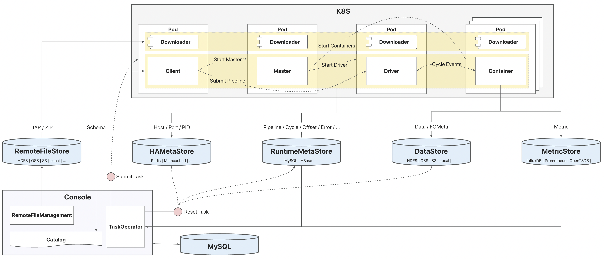

# Console平台介绍

GeaFlow Console提供了一站式图研发、运维的平台能力，同时为引擎运行时提供元数据（Catalog）服务。

### 平台架构

* **标准化API**：平台提供了标准化的RESTful API和认证机制，同时支持了页面端和应用端的统一API服务能力。
* **任务研发**：平台支持“关系-实体-属性”的图数据建模。基于字段映射配置，可以定义图数据传输任务，包括数据集成（Import）和数据分发（Export）。基于图表模型的图数据加工任务支持多样化的计算场景，如Traversal、Compute、Mining等。基于数据加速器的图数据服务，提供了多协议的实时分析能力，支持BI、可视化分析工具的接入集成。
* **构建提交**：平台通过任务和作业的独立抽象，实现研发态与运维态的分离。任务开发完成后执行发布动作，会自动触发构建流水线（Release Builder），生成发布版本。任务提交器（Task Submitter）负责将发布版本的内容提交到执行环境，生成计算作业。
* **作业运维**：作业属于任务的运行态，平台提供了作业的操纵（启停、重置）、监控（指标、告警、审计）、调优（诊断、伸缩、调参）、调度等运维能力。作业的运行时资源会由资源池统一分配和管理。
* **元数据服务**：平台同时承载了引擎运行时的元数据服务能力，以实现研发与运维的自动化。元数据以实例维度进行隔离，实例内的研发资源可以根据名字直接访问，如点、边、图、表、视图、函数等。
* **系统管理**：平台提供了多租户隔离机制、细粒度用户权限控制，以及系统资源的管理能力。

## 部署架构

GeaFlow支持多种异构环境执行，以常见的K8S部署环境为例，GeaFlow物理部署架构如下：

在GeaFlow作业的全生命周期过程中，涉及的关键数据流程有：

* **研发阶段**：Console平台提供了实例下所有的研发资源的管理，用户可以在创建任务前，提前准备所需的研发资源信息，并存储在Catalog。
* **构建阶段**：任务创建完成后，通过发布动作触发构建流水线，用户的JAR包、任务的ZIP包等会上传到RemoteFileStore。
* **提交阶段**：作业提交时，Console会根据作业的参数配置、运行时环境信息，以及远程文件地址等创建KubernetesJobClient，既而会拉起Client Pod，Client会拉起Master Pod，Master会拉起Container Pods和Driver Pod。所有的Pod拉起后，Client会把作业的Pipeline发送给Driver执行，Driver最终通过Cycle调度的Events与Containers交互。所有的Pod启动时都会从RemoteFileStore下载版本JAR包、用户JAR包、作业ZIP包等信息。Driver对DSL代码编译时，也需要通过Console提供的Catalog API操作Schema信息。
* **运行阶段**：作业运行时，各个组件会上报不同的数据和信息。Master会上报作业的心跳汇总信息，Driver会上报作业的Pipeline/Cycle指标以及错误信息，Container会上报作业的Offset、指标定义以及错误信息等。RuntimeMetaStore存储作业的Pipeline/Cycle指标、Offset、心跳汇总、错误等信息。HAMetaStore存储各个运行组件的地址信息。DataStore存储State数据和作业FailOver时所需的元数据信息。MetricStore存储运行时指标信息。
* **监控阶段**：Console会主要查询RuntimeMetaStore和MetricStore存储的信息用于作业的运行时监控。
* **清理阶段**：作业重置/删除时，Console会对作业的RuntimeMeta、HAMeta以及部分Data做清理操作。
