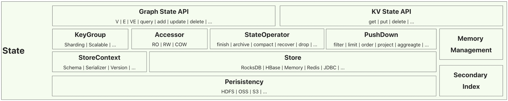

# State原理介绍

## Geaflow 中的状态管理
Geaflow 中的状态是指图、流计算过程中的直接计算节点的中间计算结果，此中间结果可能是经过组织后的源数据信息，也有可能是计算产生的一些结果。状态管理负责这些数据的存取以及一致性保障，它作为Geaflow数据中枢存在于系统中，它的功能模型、性能和可靠性直接影响着Geaflow的整个使用过程，是作为整个系统的底盘存在。

* 从功能来看，它支持Geaflow实时、多模的动态图引擎，包括低延迟流图融合计算、高性能长周期图仿真、大规模动态图探索等等。
* 从计算模型来看，Geaflow 中的状态管理属于实时模型和图模型的结合，需要克服实时计算中，带有状态的处理机制，时延低，容错和恢复机制；另外它也需要解决图模型中数据复杂、关联度高，计算由数据驱动、中间结果大等问题。
* 从性能上看，状态管理需要解决在低成本，多场景、大规模数据的前提下实现高吞吐、低延迟的存储和查询能力。包括在万亿边的规模下的存取，较大的属性信息的存取，带有多种下推语义的随机访问和遍历访问等。

为此，我们有如下的架构图，整体结构上灵活可变、支持多种可插拔组件。

### 架构图



* **State API**：提供了面向KV存储API，如get/put/delete等。以及面向图存储的API，如V/E/VE，以及点/边的add/update/delete等。
* **State执行层**：通过KeyGroup的设计实现数据的Sharding和扩缩容能力，Accessor提供了面向不同读写策略和数据模型的IO抽象，StateOperator抽象了存储层SPI，如finish（刷盘）、archive（Checkpoint）、compact（压缩）、recover（恢复）等。另外，State提供了多种PushDown优化以加速IO访问效率。通过自定义内存管理和面向属性的二级索引也会提供大量的存储访问优化手段。
* **Store层**：GeaFlow支持了多种存储系统类型，并通过StoreContext封装了Schema、序列化器，以及数据版本信息。这层涉及到内存数据结构如何真正映射到存储结构上。目前包括Redis、Rocksdb、CStore（GeaFlow自建存储系统）等存储引擎，各种不同的存储引擎通过SPI来提供服务，另外根据存储引擎的特点，他们可支持的数据模型可能不同，例如对Rocksdb所有的数据结构都需要映射到KV，而Redis天生就提供list/map等高阶的数据结构。
* **持久化层**：GeaFlow State本身不提供持久化的能力，如果机器发生故障，磁盘损坏可能就会导致数据丢失。因此它需要依赖外部的组件来提供持久化存储，这里组件也是可插拔的，支持 HDFS/OSS/S3等分布式文件存储或对象存储。

## State 运行流程

在作业运行期间State的生命流程为：

 

当FailOver的时候，会从最近一个持久化的数据恢复，以下是其详细流程。

### State创建

State所处理的数据已经是每个分区维度的，也就是已经经过框架层分好片了。

所有的State申请的入口都是StateFactory，可以根据不同的Descriptor申请不同的State。
```java
buildGraphState(GraphStateDescriptor, Configuration):GraphState
buildKeyValueState(KeyValueStateDescriptor, Configuration):KeyValueState
buildKeyListState(KeyListDescriptor, Configuration):KeyListState
buildKeyMapState(KeyMapStateDescriptor, Configuration):KeyMapState
```

Descriptor 中需要申明基本的信息，包括State name，Store type等。不同的state name对应的 state 是相互隔离的，可以申请不同的 State 表示不同的场景，例如可以申请一个Memory Store State作为临时存储或者计算中介。

Store type 的选择与存储性能也息息相关，例如对于Key State，如果底层Store支持 KMap 的方式则会直接使用到KMap的功能，可以进行增量的subkey操作；如果不支持则会转为 KV 模型的State，会对 Map 整体进行操作，这样无论读还是写都会放大很多。

在创建完成后，我们还需要对state读写。

### State 读写

根据上文申请的不同State类型，具有不同的读写方式，文末部分会有介绍。

### State 持久化
在某一个计算任务中，如果有异常信息发生，例如机器故障，那么磁盘上存储的状态数据都会丢失。为了能够正常回滚，State还需要考虑持久化的能力，这样重新分配的机器可以拉取State数据继续进行计算。

在每个计算任务中，用户需要定期做checkpoint，持久化数据来保证状态数据安全。可以在某批任务结束后做，也可以在导数任务完成后，此处的时机应该和source offset保持一致，只有state checkpoint以及source offset都保存完成才说明这个作业的所有状态数据都持久化。

### State 恢复

当异常发生时，框架层会进行FailOver, state也会自动回滚到最新的状态。根据上述持久层的选择不同，会从相应的分布式文件存储或对象存储拉取State数据并加载。


## State 类型

State大体可以区分为Graph State 和 Key State，分别对应不同的数据结构，同时映射到Store层的不同存储模型，例如对于rocksdb 的 store type，将会有KV、Graph等不同类型的存储模型。


### Graph State

GraphState根据是否是动态图，我们又区分 StaticGraph 和 DynamicGraph。
区别在于 StaticGraph将整个图看做是一个完整的，所有操作都在一个完整图上进行。
而DynamicGraph认为图动态变化的，由一个个切片图构成，所有切片构成一个完整的图。


#### Static Graph State
StaticGraphState API分成不同的几个部分，包括query、upsert、delete、manage。

* query即图查询，允许用户灵活的查询GraphStatte，可以从点、边、点以及出边等多个角度进行查询，可以是随机查询、也可以是全局查询，可以增加不同的pushdown条件等等。最后的返回值也可以是迭代器或者list。

* upsert即增加点或者边

* delete可以删除某个点或者id。

* manage分成operator以及其他操作，operator是对state的数据操作，可以进行刷盘持久化或者恢复。其他操作包括summary以及metrics等信息的获取。


#### Dynamic Graph State
DynamicGraphState API 与 StaticGraphState 类似，但是每个点和边都会和一个版本号绑定。

于此同时，DynamicGraphState还增加了版本信息相关的查询，可以获取某些点对应的所有版本或者最新版本，以及可以获取每个版本的具体值。


### Key State
KeyState API分成几个部分，包括
* KeyValueState
* KeyListState
* KeyMapState。


分别对应不同的用户层数据结构。与GraphState类似，KeyState同样提供 query/upsert/delete/manage的能力，但query没有类似GraphState的接口提供复杂的查询语义信息。不同的State数据结构在查询和存储上有差异，例如kmap允许对单个subkey修改和查询，而kv是是整个value进行修改和查询。
