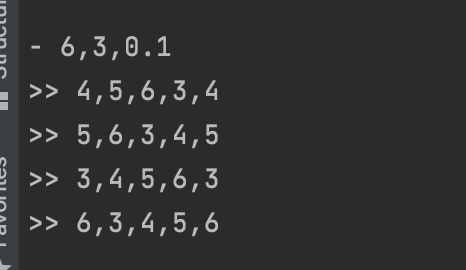

# 快速上手(本地运行)

## 准备工作
### 编译GeaFlow源码
编译GeaFlow依赖以下环境：
* JDK8
* Maven(推荐3.6.3及以上版本)
* Git

执行以下命令来编译GeaFlow源码：
```shell
git clone https://github.com/TuGraph-family/tugraph-analytics.git
cd tugraph-analytics/
mvn clean package -DskipTests
```

## 本地运行流图作业

下面介绍如何在本地环境运行一个实时环路查找的图计算作业。

1. 启动流图作业

在编译完geaflow代码后，在工程目录下执行以下命令，启动实时环路查找的计算作业：

```shell
bin/gql_submit.sh --gql geaflow/geaflow-examples/gql/loop_detection.sql
```

其中loop_detection.sql是一段实时查询图中所有四度环路的DSL计算作业，其内容如下：

```sql
set geaflow.dsl.window.size = 1;
set geaflow.dsl.ignore.exception = true;

CREATE GRAPH IF NOT EXISTS dy_modern (
  Vertex person (
    id bigint ID,
    name varchar
  ),
  Edge knows (
    srcId bigint SOURCE ID,
    targetId bigint DESTINATION ID,
    weight double
  )
) WITH (
  storeType='rocksdb',
  shardCount = 1
);

CREATE TABLE IF NOT EXISTS tbl_source (
  text varchar
) WITH (
  type='socket',
  `geaflow.dsl.column.separator` = '#',
  `geaflow.dsl.socket.host` = 'localhost',
  `geaflow.dsl.socket.port` = 9003
);

CREATE TABLE IF NOT EXISTS tbl_result (
  a_id bigint,
  b_id bigint,
  c_id bigint,
  d_id bigint,
  a1_id bigint
) WITH (
  type='socket',
    `geaflow.dsl.column.separator` = ',',
    `geaflow.dsl.socket.host` = 'localhost',
    `geaflow.dsl.socket.port` = 9003
);

USE GRAPH dy_modern;

INSERT INTO dy_modern.person(id, name)
SELECT
cast(trim(split_ex(t1, ',', 0)) as bigint),
split_ex(t1, ',', 1)
FROM (
  Select trim(substr(text, 2)) as t1
  FROM tbl_source
  WHERE substr(text, 1, 1) = '.'
);

INSERT INTO dy_modern.knows
SELECT
 cast(split_ex(t1, ',', 0) as bigint),
 cast(split_ex(t1, ',', 1) as bigint),
 cast(split_ex(t1, ',', 2) as double)
FROM (
  Select trim(substr(text, 2)) as t1
  FROM tbl_source
  WHERE substr(text, 1, 1) = '-'
);

INSERT INTO tbl_result
SELECT
  a_id,
  b_id,
  c_id,
  d_id,
  a1_id
FROM (
  MATCH (a:person) -[:knows]->(b:person) -[:knows]-> (c:person)
   -[:knows]-> (d:person) -> (a:person)
  RETURN a.id as a_id, b.id as b_id, c.id as c_id, d.id as d_id, a.id as a1_id
);
```
该DSL实时读取socket服务 9003端口数据，实时构图，然后计算图中所有的4度的环路, 并将环路上的点id输出到socket服务9003端口，然后显示在socket控制台。

2. 启动SocketServer

执行以下命令，启动socket server程序:
```shell
bin/socket.sh 
```
socket服务启动后，控制台显示如下信息：


3. 输入数据

输入数据如下，数据前面的"."代表一条点数据，"-"代表一条边数据(起点、终点和权重)。

```
. 1,jim
. 2,kate
. 3,lily
. 4,lucy
. 5,brown
. 6,jack
. 7,jackson
- 1,2,0.2
- 2,3,0.3
- 3,4,0.2
- 4,1,0.1
- 4,5,0.1
- 5,1,0.2
- 5,6,0.1
- 6,7,0.1
```
可以看到socket控制台上显示计算出来的环路数据：


你也可以继续输入新的点边数据，查看最新计算结果，如输入一下数据：

```
- 6,3,0.1
```

可以看到新的环路3-4-5-6-3被检查出来：



## GeaFlow Console快速上手
GeaFlow Console是GeaFlow提供的图计算研发平台，我们将介绍如何在Docker容器里面启动GeaFlow Console平台，提交流图计算作业。文档地址：
[文档](quick_start_docker.md)