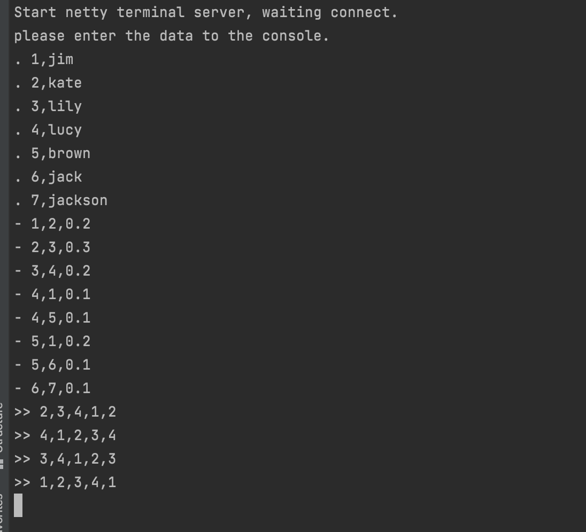

# 开始上手(GeaFlow Console运行)

## 准备工作
1. 下载安装[Docker](https://docs.docker.com/engine/install/)，调整Docker服务资源配置（Dashboard-Settings-Resources）后启动Docker服务：


2. 拉取GeaFlow Console镜像

执行以下命令拉取远程geaflow console镜像:

x86架构拉取x86镜像：
```shell
docker pull tugraph/geaflow-console:0.1
```

如果是arm架构，拉取arm镜像：
```shell
docker pull tugraph/geaflow-console-arm:0.1
```

如果遇到网络问题导致拉取失败，也可以通过下面命令直接构建镜像(构建镜像之前需要先启动docker容器,构建脚本根据机器类型build对应类型的镜像):


```shell
git clone https://github.com/TuGraph-family/tugraph-analytics.git
cd tugraph-analytics/
bash ./build.sh --all

```


整个编译过程可能持续一段时间，请耐心等待。镜像编译成功后，通过以下命令查看镜像：
```shell
docker images
```
远程拉取的镜像名称为：**tugraph/geaflow-console:0.1**(x86架构) 或者**tugraph/geaflow-console-arm:0.1**(arm架构)
。本地镜像名称为：**geaflow-console:0.1**，只需选择一种方式构建镜像即可。

## Docker容器运行GeaFlow作业
下面介绍在docker容器里面运行前面[本地模式运行](quick_start.md)介绍的流图作业。

1. 启动GeaFlow Console平台服务。

* 远程镜像启动方式如下：

**x86架构**
```
docker run -d --name geaflow-console -p 8080:8080 -p 8888:8888 tugraph/geaflow-console:0.1
```

**arm架构**
```
docker run -d --name geaflow-console -p 8080:8080 -p 8888:8888 tugraph/geaflow-console-arm:0.1
```
通过**uname -a**命令可以查看机器架构类型.

* 本地镜像启动方式如下：
```
docker run -d --name geaflow-console -p 8080:8080 -p 8888:8888 geaflow-console:0.1
```
**注意**: 远程拉取镜像和本地镜像tag名称不同，启动命令有所区别。

进入容器等待Java进程启动完成后，访问[localhost:8888](http://localhost:8888)进入GeaFlow Console平台页面。


```shell
> docker exec -it geaflow-console tailf /tmp/logs/geaflow/app-default.log

# wait the logs below and open url http://localhost:8888
GeaflowApplication:61   - Started GeaflowApplication in 11.437 seconds (JVM running for 13.475)
```

2. 注册用户

首位注册用户将默认被设置为管理员，以管理员身份登录，通过一键安装功能开始系统初始化。


3. 配置运行时环境

GeaFlow首次运行需要配置运行时环境相关的配置，包括集群配置、运行时配置、数据存储配置以及文件存储配置。

3.1 集群配置

使用默认Container模式，即本地容器运行。


3.2 运行时配置

本地运行模式下可以跳过这一步配置，使用系统默认配置，直接点下一步。


3.3 数据存储配置

选择图数据存储位置，本地模式下选择LOCAL,填写一个本地目录。默认不需填写，直接点下一步。


3.4 文件存储配置

该配置为GeaFlow引擎JAR、用户JAR文件的持久化存储，比如HDFS等。本地运行模式下和数据存储配置相同，选择LOCAL模式，填写一个本地目录。默认不需填写，直接点下一步。


配置完成后点击一键安装按钮，安装成功后，管理员会自动切换到个人租户下的默认实例，并可以直接创建发布图计算任务。

4. 创建图计算任务

进入图研发页面，选择左侧图任务Tab栏，点击右上角新增按钮，新建一个DSL作业。


分别填写任务名称、任务描述和DSL内容。其中DSL内容和前面本地运行作业介绍的一样，只需修改DSL,**将tbl_source和tbl_result表的${your.host.ip}替换成本机ip**即可。

```sql
set geaflow.dsl.window.size = 1;
set geaflow.dsl.ignore.exception = true;

CREATE GRAPH IF NOT EXISTS dy_modern (
  Vertex person (
    id bigint ID,
    name varchar
  ),
  Edge knows (
    srcId bigint SOURCE ID,
    targetId bigint DESTINATION ID,
    weight double
  )
) WITH (
  storeType='rocksdb',
  shardCount = 1
);

CREATE TABLE IF NOT EXISTS tbl_source (
  text varchar
) WITH (
  type='socket',
  `geaflow.dsl.column.separator` = '#',
  `geaflow.dsl.socket.host` = '${your.host.ip}',
  `geaflow.dsl.socket.port` = 9003
);

CREATE TABLE IF NOT EXISTS tbl_result (
  a_id bigint,
  b_id bigint,
  c_id bigint,
  d_id bigint,
  a1_id bigint
) WITH (
  type='socket',
    `geaflow.dsl.column.separator` = ',',
    `geaflow.dsl.socket.host` = '${your.host.ip}',
    `geaflow.dsl.socket.port` = 9003
);

USE GRAPH dy_modern;

INSERT INTO dy_modern.person(id, name)
SELECT
cast(split_ex(t1, ',', 0) as bigint),
split_ex(t1, ',', 1)
FROM (
  Select trim(substr(text, 2)) as t1
  FROM tbl_source
  WHERE substr(text, 1, 1) = '.'
);

INSERT INTO dy_modern.knows
SELECT
 cast(split_ex(t1, ',', 0) as bigint),
 cast(split_ex(t1, ',', 1) as bigint),
 cast(split_ex(t1, ',', 2) as double)
FROM (
  Select trim(substr(text, 2)) as t1
  FROM tbl_source
  WHERE substr(text, 1, 1) = '-'
);

INSERT INTO tbl_result
SELECT DISTINCT
  a_id,
  b_id,
  c_id,
  d_id,
  a1_id
FROM (
  MATCH (a:person) -[:knows]->(b:person) -[:knows]-> (c:person)
   -[:knows]-> (d:person) -> (a:person)
  RETURN a.id as a_id, b.id as b_id, c.id as c_id, d.id as d_id, a.id as a1_id
);
```
本机ip获取方式如下，执行命令：

```shell
ifconfig
```
找到eth0或者en0的网卡，其中ipv4的地址即为你本机的ip地址。


创建完成作业后，点击发布按钮发布作业。


然后进入作业管理页面，点击提交按钮提交作业执行。


5. 启动socket服务输入数据

进入GeaFlow项目路径，执行如下命令启动socket服务(启动socket服务前需要先提前编译一次GeaFlow工程，如果前面编译过则忽略)

```shell
bin/socket.sh
```
socket服务启动后，输入点边数据，计算结果会实时显示在屏幕下：

```
. 1,jim
. 2,kate
. 3,lily
. 4,lucy
. 5,brown
. 6,jack
. 7,jackson
- 1,2,0.2
- 2,3,0.3
- 3,4,0.2
- 4,1,0.1
- 4,5,0.1
- 5,1,0.2
- 5,6,0.1
- 6,7,0.1
```

 

## K8S部署
GeaFlow支持K8S部署, 部署详细文档请参考文档：[K8S部署](deploy/install_guide.md)