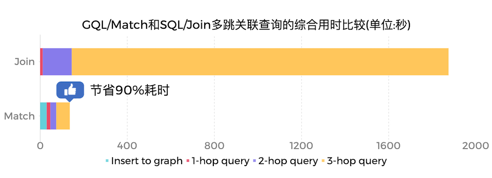

# 文档地图
这里是文档地图，帮助用户快速学习和使用GeaFlow。

## 介绍
**GeaFlow** 是蚂蚁集团开源的[**性能世界一流**](https://ldbcouncil.org/benchmarks/snb-bi/)的OLAP图数据库，支持万亿级图存储、图表混合处理、实时图计算、交互式图分析等核心能力，目前广泛应用于数仓加速、金融风控、知识图谱以及社交网络等场景。

关于GeaFlow更多介绍请参考：[GeaFlow介绍文档](2.introduction.md)

GeaFlow设计论文参考：[GeaFlow: A Graph Extended and Accelerated Dataflow System](https://dl.acm.org/doi/abs/10.1145/3589771)

## 快速上手

第一步 打包jar包并提交quick start任务
1. 准备Git、JDK8、Maven、Docker环境。
2. 下载源码：`git clone https://github.com/apache/geaflow.git`
3. 项目构建：`./build.sh --module=geaflow --output=package`
4. 测试任务：`./bin/gql_submit.sh --gql geaflow/geaflow-examples/gql/loop_detection_file_demo.sql`

第二步 启动控制台，体验白屏提交quick start任务
5. 构建控制台jar和镜像(需启动Docker)：`./build.sh --module=geaflow-console`
6. 启动控制台：`docker run -d --name geaflow-console -p 8888:8888 geaflow-console:0.1`

更多详细内容请参考：[快速上手文档](3.quick_start/1.quick_start.md)。

## 开发手册

GeaFlow支持DSL和API两套编程接口，您既可以通过GeaFlow提供的类SQL扩展语言SQL+ISO/GQL进行流图计算作业的开发，也可以通过GeaFlow的高阶API编程接口通过Java语言进行应用开发。
* DSL应用开发：[DSL开发文档](5.application-development/2.dsl/1.overview.md)
* API应用开发：[API开发文档](5.application-development/1.api/1.overview.md)

## 实时能力

相比传统的流式计算引擎比如Flink、Storm这些以表为模型的实时处理系统而言，GeaFlow以图为数据模型，在处理Join关系运算，尤其是复杂多跳的关系运算如3跳以上的Join、复杂环路查找上具备极大的性能优势。

## 合作伙伴
|                  |                  |                  |
|------------------|------------------|------------------|
|  |  |  |
|  |  |  |

