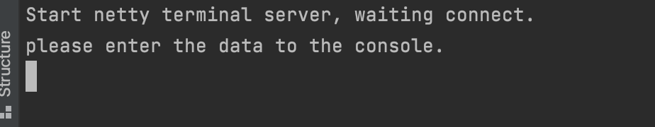
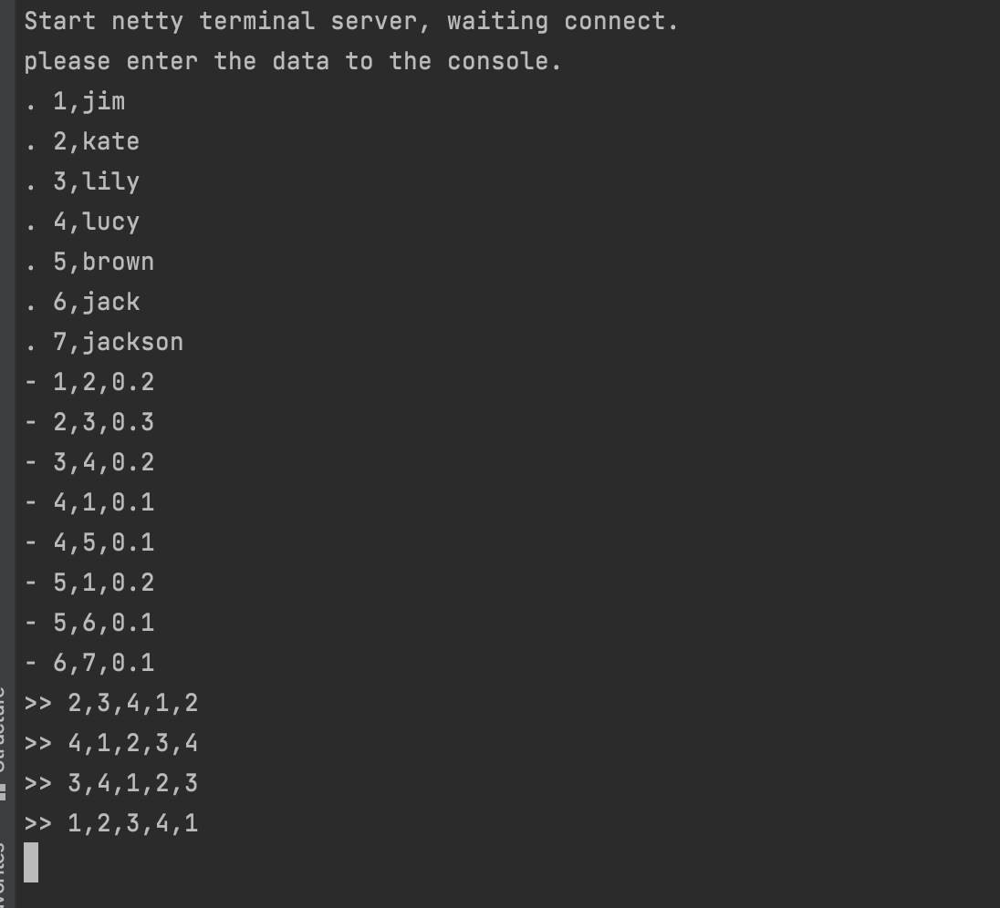
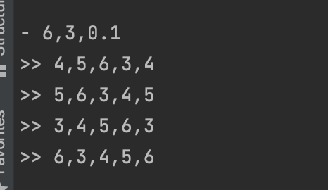
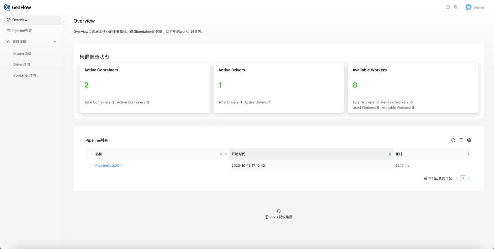

# 源码部署

## 准备工作

### 编译 GeaFlow 源码

编译 GeaFlow 依赖以下环境：

- JDK8
- Maven(推荐 3.6.3 及以上版本)
- Git

执行以下命令来编译 GeaFlow 源码：

```shell
git clone https://github.com/apache/geaflow.git geaflow
cd geaflow/
./build.sh --module=geaflow --output=package
```

## 本地运行流图作业

下面介绍如何在本地环境运行一个实时环路查找的图计算作业。

### Demo1 从本地文件读取数据

1. 直接运行脚本即可:

```shell
bin/gql_submit.sh --gql geaflow/geaflow-examples/gql/loop_detection_file_demo.sql
```

其中 loop_detection_file_demo.sql 是一段实时查询图中所有四度环路的 DSL 计算作业，其内容如下：

```sql
set geaflow.dsl.window.size = 1;
set geaflow.dsl.ignore.exception = true;

CREATE GRAPH IF NOT EXISTS dy_modern (
  Vertex person (
    id bigint ID,
    name varchar
  ),
  Edge knows (
    srcId bigint SOURCE ID,
    targetId bigint DESTINATION ID,
    weight double
  )
) WITH (
  storeType='rocksdb',
  shardCount = 1
);

CREATE TABLE IF NOT EXISTS tbl_source (
  text varchar
) WITH (
  type='file',
  `geaflow.dsl.file.path` = 'resource:///demo/demo_job_data.txt',
  `geaflow.dsl.column.separator`='|'
);

CREATE TABLE IF NOT EXISTS tbl_result (
  a_id bigint,
  b_id bigint,
  c_id bigint,
  d_id bigint,
  a1_id bigint
) WITH (
  type='file',
  `geaflow.dsl.file.path` = '/tmp/geaflow/demo_job_result'
);

USE GRAPH dy_modern;

INSERT INTO dy_modern.person(id, name)
  SELECT
  cast(trim(split_ex(t1, ',', 0)) as bigint),
  split_ex(trim(t1), ',', 1)
  FROM (
    Select trim(substr(text, 2)) as t1
    FROM tbl_source
    WHERE substr(text, 1, 1) = '.'
  );

INSERT INTO dy_modern.knows
  SELECT
  cast(split_ex(t1, ',', 0) as bigint),
  cast(split_ex(t1, ',', 1) as bigint),
  cast(split_ex(t1, ',', 2) as double)
  FROM (
    Select trim(substr(text, 2)) as t1
    FROM tbl_source
    WHERE substr(text, 1, 1) = '-'
  );

INSERT INTO tbl_result
  SELECT DISTINCT
  a_id,
  b_id,
  c_id,
  d_id,
  a1_id
  FROM (
  MATCH (a:person) -[:knows]->(b:person) -[:knows]-> (c:person)
  -[:knows]-> (d:person) -> (a:person)
  RETURN a.id as a_id, b.id as b_id, c.id as c_id, d.id as d_id, a.id as a1_id
  );
```

该 DSL 会从项目中的 resource 文件 **demo_job_data.txt** 中读取点边数据，进行构图，然后计算图中所有的 4 度的环路, 并将环路上的点 id 输出到
/tmp/geaflow/demo_job_result,
用户也可通过修改 `geaflow.dsl.file.path` 参数自定义输出路径。

2. 输出结果如下

```
2,3,4,1,2
4,1,2,3,4
3,4,1,2,3
1,2,3,4,1
```

### Demo2 交互式使用 socket 读取数据

用户也可自己在命令台输入数据，实时进行构图。

1. 运行脚本:

```shell
bin/gql_submit.sh --gql geaflow/geaflow-examples/gql/loop_detection_socket_demo.sql
```

loop_detection_socket_demo.sql 主要区别是 source 表是通过 socket 进行读取：

```sql
CREATE TABLE IF NOT EXISTS tbl_source (
  text varchar
) WITH (
  type='socket',
  `geaflow.dsl.column.separator` = '#',
  `geaflow.dsl.socket.host` = 'localhost',
  `geaflow.dsl.socket.port` = 9003
);

CREATE TABLE IF NOT EXISTS tbl_result (
  a_id bigint,
  b_id bigint,
  c_id bigint,
  d_id bigint,
  a1_id bigint
) WITH (
  type='socket',
    `geaflow.dsl.column.separator` = ',',
    `geaflow.dsl.socket.host` = 'localhost',
    `geaflow.dsl.socket.port` = 9003
);
```

该 DSL 实时读取 socket 服务 9003 端口数据，实时构图，然后计算图中所有的 4 度的环路, 并将环路上的点 id 输出到 socket 服务 9003 端口，然后显示在 socket 控制台。

2. 启动 SocketServer

执行以下命令，启动 socket server 程序:

```shell
bin/socket.sh
```

socket 服务启动后，控制台显示如下信息：



3. 输入数据

输入数据如下，数据前面的"."代表一条点数据，"-"代表一条边数据(起点、终点和权重)。

```
. 1,jim
. 2,kate
. 3,lily
. 4,lucy
. 5,brown
. 6,jack
. 7,jackson
- 1,2,0.2
- 2,3,0.3
- 3,4,0.2
- 4,1,0.1
- 4,5,0.1
- 5,1,0.2
- 5,6,0.1
- 6,7,0.1
```

可以看到 socket 控制台上显示计算出来的环路数据：



你也可以继续输入新的点边数据，查看最新计算结果，如输入一下数据：

```
- 6,3,0.1
```

可以看到新的环路 3-4-5-6-3 被检查出来：



4. 访问可视化 dashboard 页面

本地模式的进程会占用本地的 8090 和 8088 端口，附带一个可视化页面。

在浏览器中输入 http://localhost:8090 即可访问前端页面。

若端口被占用，`gql_submit.sh`脚本会选择更大的空闲端口号，请查看控制台输出的如下日志确定使用的端口。
```
View dashboard via http://localhost:${master_port}.
```



关于更多 dashboard 相关的内容，请参考文档：
[文档](../7.deploy/3.dashboard.md)

### Demo3 使用SQL进行图查询

1. 运行脚本，提交已经编辑好的demo GQL:

```shell
bin/gql_submit.sh --gql geaflow/geaflow-examples/gql/sql_join_to_graph_demo.sql
```

其中 sql_join_to_graph_demo.sql 是一段在模拟流图中的SQL Join查询，其关键内容如下：

```sql
USE GRAPH dy_modern;

select u.name, friend.name
from person u, knows e, person friend
where u.id = e.srcId and e.targetId = friend.id
;
```

该 DSL 会从项目中的 resource 文件 **demo_job_data.txt** 中读取点边数据，进行构图。

然后在图`dy_modern`上执行点与边的Join查询，引擎解析Join语义后自动转为图的查询。

2. 输出结果如下

运行以下命令，可以打印结果文件的内容。

```shell
cat /tmp/geaflow/sql_join_to_graph_demo_result/partition_0  
```

查询结果默认写入`/tmp/geaflow/sql_join_to_graph_demo_result`, 用户也可通过修改 `geaflow.dsl.file.path` 参数自定义输出路径。

```
jim,jim
kate,kate
lily,lily
lucy,lucy
jim,jim
lucy,lucy
lucy,lucy
jack,jack
```

关于更多 SQL图查询 相关的内容，请参考文档：
[文档](./4.quick_start_sql_to_graph.md)


## GeaFlow Console 快速上手

GeaFlow Console 是 GeaFlow 提供的图计算研发平台，我们将介绍如何在 Docker 容器里面启动 GeaFlow Console 平台，提交流图计算作业。文档地址：
[文档](2.quick_start_docker.md)

## GeaFlow Kubernetes Operator 快速上手

Geaflow Kubernetes Operator 是一个可以快速将 Geaflow 应用部署到 kubernetes 集群中的部署工具。
我们将介绍如何通过 Helm 安装 geaflow-kubernetes-operator，通过 yaml 文件快速提交 geaflow 作业，
并访问 operator 的 dashboard 页面查看集群下的作业状态。文档地址：
[文档](../7.deploy/2.quick_start_operator.md)

## 使用 G6VP 进行流图计算作业可视化

G6VP 是一个可扩展的图可视分析平台，包括数据源管理、构图、图元素个性化配置、图可视分析等功能模块。使用 G6VP 能够很方便的对 Geaflow 计算结果进行可视化分析。文档地址：
[文档](../7.deploy/4.collaborate_with_g6vp.md)
