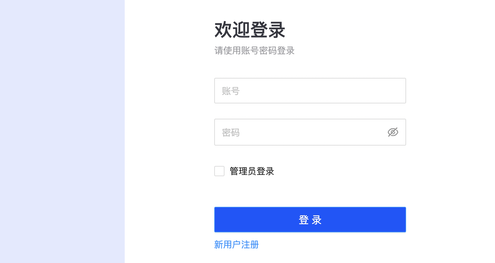
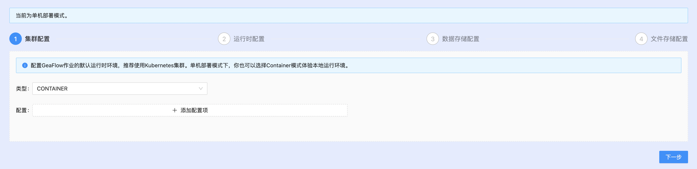
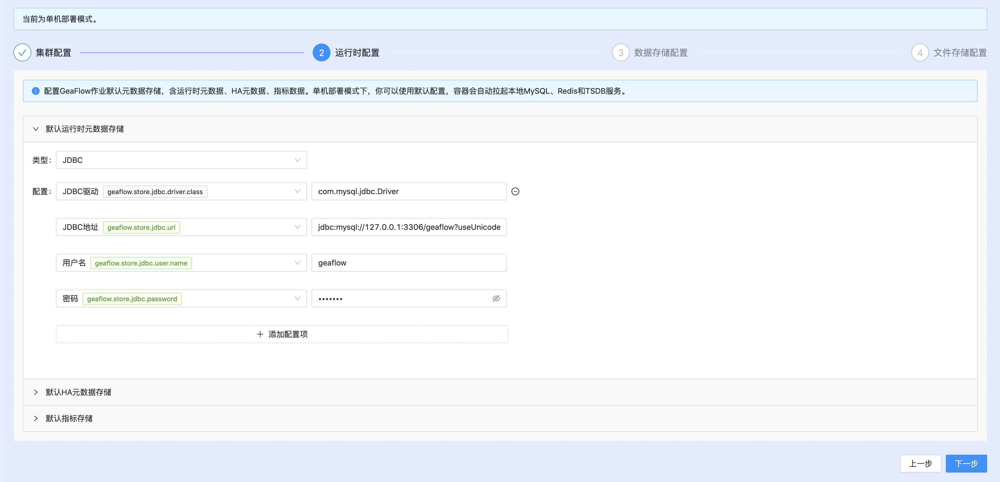
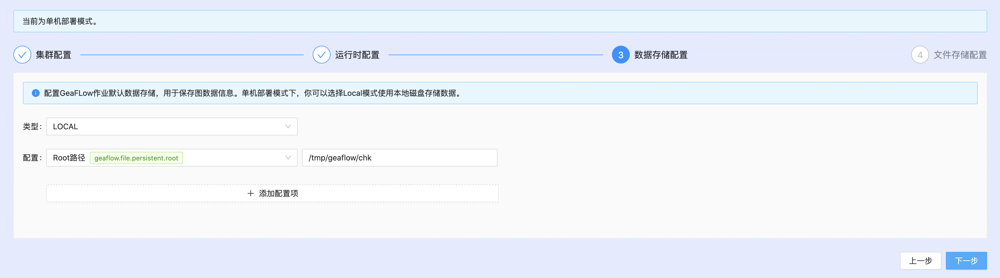
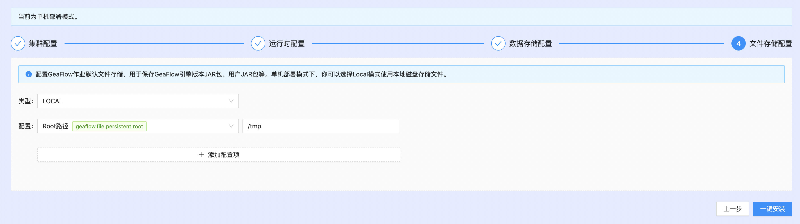
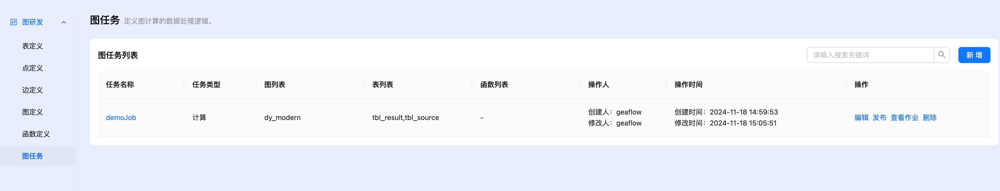
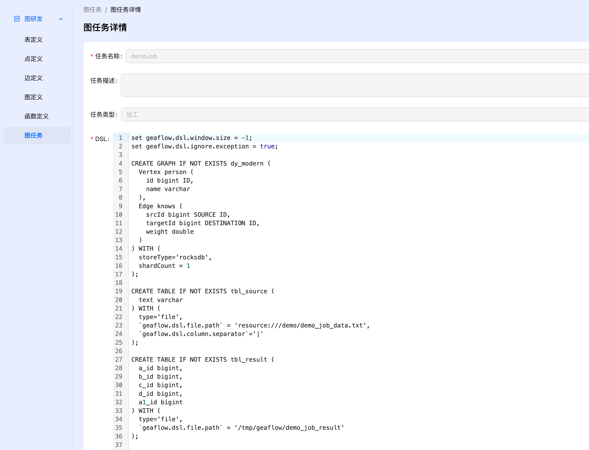
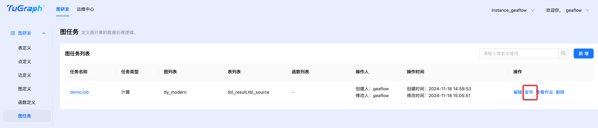
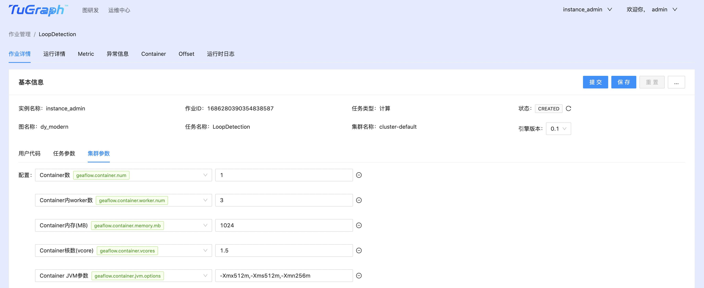

# 白屏部署

## 准备工作
1. 下载安装[Docker](https://docs.docker.com/engine/install/)，调整Docker服务资源配置（Dashboard-Settings-Resources）后启动Docker服务：


2. 拉取GeaFlow Console镜像

执行以下命令拉取远程geaflow console镜像:

x86架构拉取x86镜像：
```shell
docker pull tugraph/geaflow-console:<version>
```

如果是arm架构，拉取arm镜像：
```shell
docker pull tugraph/geaflow-console-arm:<version>
```

如果遇到网络问题导致拉取失败，也可以通过下面命令直接构建镜像(构建镜像之前需要先启动docker容器,构建脚本根据机器类型build对应类型的镜像):


```shell
git clone https://github.com/apache/geaflow.git geaflow
cd geaflow/
./build.sh --module=geaflow-console

```


整个编译过程可能持续一段时间，请耐心等待。镜像编译成功后，通过以下命令查看镜像：
```shell
docker images
```
远程拉取的镜像名称为：**tugraph/geaflow-console:0.1**(x86架构) 或者**tugraph/geaflow-console-arm:0.1**(arm架构)
。本地镜像名称为：**geaflow-console:0.1**，只需选择一种方式构建镜像即可。

## Docker容器运行GeaFlow作业
下面介绍在docker容器里面运行前面[本地模式运行](1.quick_start.md)介绍的流图作业。

1. 启动GeaFlow Console平台服务。

* 远程镜像启动方式如下：

**x86架构**
```
docker run -d --name geaflow-console -p 8888:8888 tugraph/geaflow-console:0.1
```

**arm架构**
```
docker run -d --name geaflow-console -p 8888:8888 tugraph/geaflow-console-arm:0.1
```
通过**uname -a**命令可以查看机器架构类型.

* 本地镜像启动方式如下：
```
docker run -d --name geaflow-console -p 8888:8888 geaflow-console:0.1
```
**注意**: 远程拉取镜像和本地镜像tag名称不同，启动命令有所区别。

进入容器等待Java进程启动完成后，访问[localhost:8888](http://localhost:8888)进入GeaFlow Console平台页面。


```shell
> docker exec -it geaflow-console tailf /tmp/logs/geaflow/app-default.log

# wait the logs below and open url http://localhost:8888
GeaflowApplication:61   - Started GeaflowApplication in 11.437 seconds (JVM running for 13.475)
```

2. 注册用户

首位注册用户将默认被设置为管理员，以管理员身份登录，通过一键安装功能开始系统初始化。




3. 配置运行时环境

GeaFlow首次运行需要配置运行时环境相关的配置，包括集群配置、运行时配置、数据存储配置以及文件存储配置。

3.1 集群配置

使用默认Container模式，即本地容器运行。



3.2 运行时配置

本地运行模式下可以跳过这一步配置，使用系统默认配置，直接点下一步。


3.3 数据存储配置

选择图数据存储位置，本地模式下选择LOCAL,填写一个本地目录。默认不需填写，直接点下一步。



3.4 文件存储配置

该配置为GeaFlow引擎JAR、用户JAR文件的持久化存储，比如HDFS等。本地运行模式下和数据存储配置相同，选择LOCAL模式，填写一个本地目录。默认不需填写，直接点下一步。


配置完成后点击一键安装按钮，安装成功后，管理员会自动切换到个人租户下的默认实例，并可以直接创建发布图计算任务。

4. 提交图计算任务

进入图研发页面，console在启动后会自动创建出一个demo作业。([本地模式运行](1.quick_start.md)中的环路查找作业)




可点击发布按钮，直接发布作业。



然后进入作业管理页面，点击提交按钮提交作业执行。



5. 运行后可在docker中设置的输出路径中看到结果文件 (默认路径为/tmp/geaflow/demo_job_result)
```
2,3,4,1,2
4,1,2,3,4
3,4,1,2,3
1,2,3,4,1
```

## K8S部署
GeaFlow支持K8S部署, 部署详细文档请参考文档：[K8S部署](../7.deploy/1.install_guide.md)
