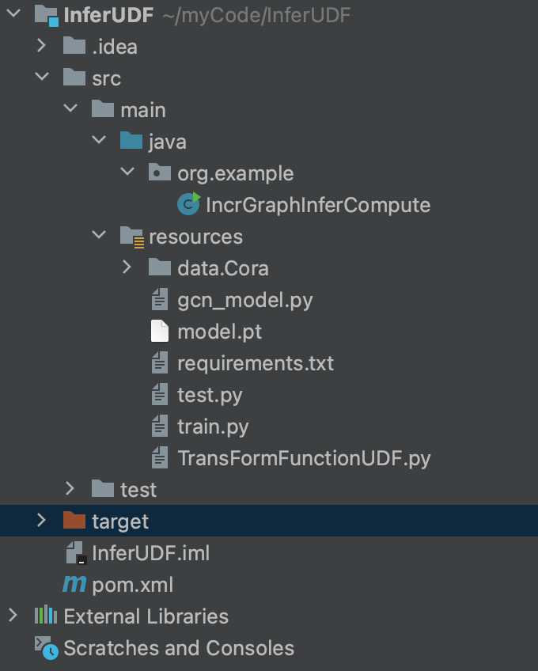
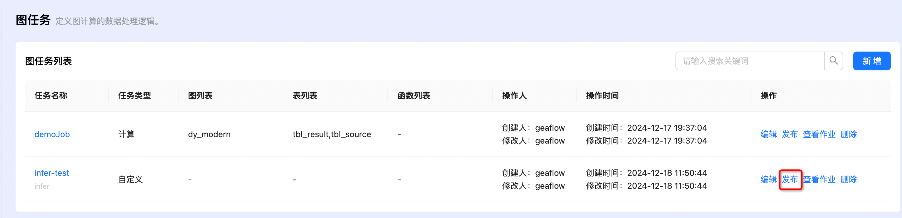
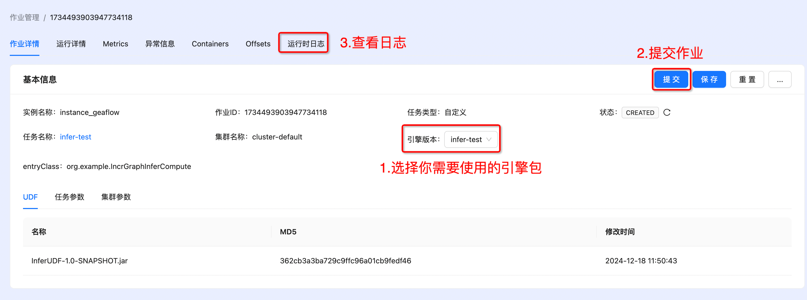
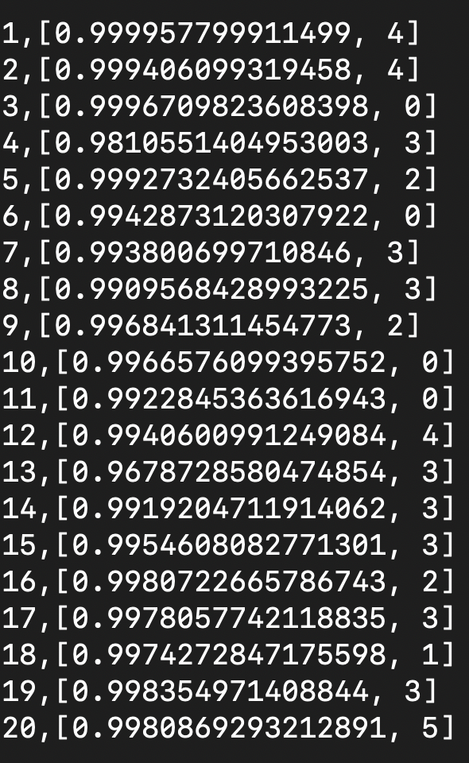

# 近线推理udf部署
GeaFlow提供了近线模型推理能力，只需要用户提供模型调用的python文件，不需要将模型转换成onnx模型，避免了模型转换带来的性能下降，
同时降低了算法开发人员的部署难度。这个例子展示了如何使用GeaFlow在近线计算的过程中调用AI模型进行推理并获取模型推理结果。
本例子中的AI模型是一个在GNN常用的数据集Cora上训练的图节点分类模型，GeaFlow读取节点id构建vertex，然后在近线计算的过程中，
将节点id发送给python的模型推理进程，调用AI模型推理得到节点预测的类型以及相应的概率，然后将结果返回给GeaFlow的java进程。
本例子展示了如何通过GeaFlow进行模型推理，在真实场景中近线计算的逻辑可能会更加复杂，模型推理只是近线计算的一个步骤，
在获取模型结果之后可以进行复杂的迭代计算，甚至多次调用推理模型，可以根据需要进行扩展。
## 准备工作

### 1. 编译 GeaFlow 源码

* 参考[1.quick_start.md](./1.quick_start.md)

## 2. 启动docker
* 参考[2.quick_start_docker.md](./2.quick_start_docker.md)

## 3. 准备udf
* [udf资源](../../../../data/InferUDF.zip)

* udf的项目结构如下


* IncrGraphInferCompute.java中实现了IncVertexCentricCompute接口，内容如下：
```java
package org.example;

import org.apache.geaflow.api.function.io.SinkFunction;
import org.apache.geaflow.api.graph.compute.IncVertexCentricCompute;
import org.apache.geaflow.api.graph.function.vc.IncVertexCentricComputeFunction;
import org.apache.geaflow.api.graph.function.vc.VertexCentricCombineFunction;
import org.apache.geaflow.api.graph.function.vc.base.IncGraphInferContext;
import org.apache.geaflow.api.pdata.stream.window.PWindowSource;
import org.apache.geaflow.api.window.impl.SizeTumblingWindow;
import org.apache.geaflow.common.config.Configuration;
import org.apache.geaflow.common.config.keys.ExecutionConfigKeys;
import org.apache.geaflow.common.config.keys.FrameworkConfigKeys;
import org.apache.geaflow.common.type.primitive.IntegerType;
import org.apache.geaflow.env.Environment;
import org.apache.geaflow.env.EnvironmentFactory;
import org.apache.geaflow.example.function.FileSink;
import org.apache.geaflow.example.function.FileSource;
import org.apache.geaflow.file.FileConfigKeys;
import org.apache.geaflow.model.graph.edge.IEdge;
import org.apache.geaflow.model.graph.edge.impl.ValueEdge;
import org.apache.geaflow.model.graph.meta.GraphMetaType;
import org.apache.geaflow.model.graph.vertex.IVertex;
import org.apache.geaflow.model.graph.vertex.impl.ValueVertex;
import org.apache.geaflow.pipeline.IPipelineResult;
import org.apache.geaflow.pipeline.Pipeline;
import org.apache.geaflow.pipeline.PipelineFactory;
import org.apache.geaflow.pipeline.task.IPipelineTaskContext;
import org.apache.geaflow.pipeline.task.PipelineTask;
import org.apache.geaflow.view.GraphViewBuilder;
import org.apache.geaflow.view.IViewDesc.BackendType;
import org.apache.geaflow.view.graph.GraphViewDesc;
import org.apache.geaflow.view.graph.PGraphView;
import org.apache.geaflow.view.graph.PIncGraphView;
import org.slf4j.Logger;
import org.slf4j.LoggerFactory;

import java.util.Arrays;
import java.util.Collections;
import java.util.HashMap;
import java.util.Iterator;
import java.util.List;
import java.util.Map;

public class IncrGraphInferCompute {

    private static final Logger LOGGER = LoggerFactory.getLogger(IncrGraphInferCompute.class);

    // Set result dir.
    public static final String RESULT_FILE_PATH = "/tmp/geaflow";
    public static final String INFER_PYTHON_CLASS_NAME = "myTransFormFunction";

    public static void main(String[] args) {
        Map<String, String> config = new HashMap<>();
        config.put(ExecutionConfigKeys.JOB_APP_NAME.getKey(), IncrGraphInferCompute.class.getSimpleName());
        config.put(FileConfigKeys.ROOT.getKey(), "/tmp/");
        Environment environment = EnvironmentFactory.onLocalEnvironment(args);
        Configuration configuration = environment.getEnvironmentContext().getConfig();

        configuration.putAll(config);
        IPipelineResult result = submit(environment);
        result.get();
    }

    public static IPipelineResult<?> submit(Environment environment) {
        final Pipeline pipeline = PipelineFactory.buildPipeline(environment);
        Configuration envConfig = environment.getEnvironmentContext().getConfig();

        envConfig.put(FrameworkConfigKeys.INFER_ENV_ENABLE, "true");
        envConfig.put(FrameworkConfigKeys.INFER_ENV_USER_TRANSFORM_CLASSNAME, INFER_PYTHON_CLASS_NAME);
        envConfig.put(FrameworkConfigKeys.INFER_ENV_INIT_TIMEOUT_SEC, "1800");
        envConfig.put(FrameworkConfigKeys.INFER_ENV_CONDA_URL, "https://repo.anaconda.com/miniconda/Miniconda3-latest-Linux-aarch64.sh");
        envConfig.put(FileSink.OUTPUT_DIR, RESULT_FILE_PATH);

        //build graph view
        final String graphName = "graph_view_name";
        GraphViewDesc graphViewDesc = GraphViewBuilder.createGraphView(graphName)
                .withShardNum(1)
                .withBackend(BackendType.RocksDB)
                .withSchema(new GraphMetaType(IntegerType.INSTANCE, ValueVertex.class, Integer.class,
                        ValueEdge.class, IntegerType.class))
                .build();
        pipeline.withView(graphName, graphViewDesc);
        pipeline.submit(new PipelineTask() {
            @Override
            public void execute(IPipelineTaskContext pipelineTaskCxt) {
                Configuration conf = pipelineTaskCxt.getConfig();
                PWindowSource<IVertex<Integer, List<Object>>> vertices =
                        // extract vertex from edge file
                        pipelineTaskCxt.buildSource(new FileSource<>("data/Cora/node_ids.txt",
                                line -> {
                                    String[] fields = line.split(",");
                                    IVertex<Integer, List<Object>> vertex = new ValueVertex<>(
                                            Integer.valueOf(fields[0]), null);
                                    return Arrays.asList(vertex);
                                }), SizeTumblingWindow.of(10000))
                                .withParallelism(1);

                PWindowSource<IEdge<Integer, Integer>> edges =
                        pipelineTaskCxt.buildSource(new org.apache.geaflow.example.function.FileSource<>("data/Cora/node_ids.txt",
                                line -> {
                                    String[] fields = line.split(",");
                                    IEdge<Integer, Integer> edge = new ValueEdge<>(Integer.valueOf(fields[0]),
                                            Integer.valueOf(fields[0]), 1);
                                    return Collections.singletonList(edge);
                                }), SizeTumblingWindow.of(5000));


                PGraphView<Integer, List<Object>, Integer> fundGraphView =
                        pipelineTaskCxt.getGraphView(graphName);

                PIncGraphView<Integer, List<Object>, Integer> incGraphView =
                        fundGraphView.appendGraph(vertices, edges);
                int mapParallelism = 1;
                int sinkParallelism = 1;
                SinkFunction<String> sink = new FileSink<>();
                incGraphView.incrementalCompute(new IncGraphAlgorithms(1))
                        .getVertices()
                        .map(v -> String.format("%s,%s", v.getId(), v.getValue()))
                        .withParallelism(mapParallelism)
                        .sink(sink)
                        .withParallelism(sinkParallelism);
            }
        });

        return pipeline.execute();
    }

    public static class IncGraphAlgorithms extends IncVertexCentricCompute<Integer, List<Object>,
            Integer, Integer> {

        public IncGraphAlgorithms(long iterations) {
            super(iterations);
        }

        @Override
        public IncVertexCentricComputeFunction<Integer, List<Object>, Integer, Integer> getIncComputeFunction() {
            return new InferVertexCentricComputeFunction();
        }

        @Override
        public VertexCentricCombineFunction<Integer> getCombineFunction() {
            return null;
        }

    }

    public static class InferVertexCentricComputeFunction implements
            IncVertexCentricComputeFunction<Integer, List<Object>, Integer, Integer> {

        private IncGraphComputeContext<Integer, List<Object>, Integer, Integer> graphContext;
        private IncGraphInferContext<List<Object>> graphInferContext;

        @Override
        public void init(IncGraphComputeContext<Integer, List<Object>, Integer, Integer> graphContext) {
            this.graphContext = graphContext;
            this.graphInferContext = (IncGraphInferContext<List<Object>>) graphContext;
        }

        @Override
        public void evolve(Integer vertexId,
                           TemporaryGraph<Integer, List<Object>, Integer> temporaryGraph) {
            long lastVersionId = 0L;
            IVertex<Integer, List<Object>> vertex = temporaryGraph.getVertex();
            HistoricalGraph<Integer, List<Object>, Integer> historicalGraph = graphContext
                    .getHistoricalGraph();
            if (vertex == null) {
                vertex = historicalGraph.getSnapShot(lastVersionId).vertex().get();
            }

            if (vertex != null) {
                // Call the AI model to predict the class to which the node belongs and the corresponding probability.  
                List<Object> result = this.graphInferContext.infer(vertexId);
                // Sink result.
                graphContext.collect(vertex.withValue(result));
                LOGGER.info("node-{} max prob: {}, predict class: {}", vertexId, result.get(0), result.get(1));
            }
        }

        @Override
        public void compute(Integer vertexId, Iterator<Integer> messageIterator) {
        }

        @Override
        public void finish(Integer vertexId, MutableGraph<Integer, List<Object>, Integer> mutableGraph) {
        }
    }

}
```
* TransFormFunctionUDF.py文件中定义了AI推理逻辑（对[Cora数据集](https://linqs-data.soe.ucsc.edu/public/lbc/cora.tgz)中的图节点分类），内容如下：
```python
import abc
from typing import Union, List
import torch
import ast
from torch_geometric.datasets import Planetoid
from gcn_model import GCN

def safe_int(number):
    try:
        return int(number)
    except:
        return 0


def safe_float(number):
    try:
        return float(number)
    except:
        return 0.0


class TransFormFunction(abc.ABC):
    def __init__(self, input_size):
        self.input_size = input_size

    @abc.abstractmethod
    def load_model(self, *args):
        pass

    @abc.abstractmethod
    def transform_pre(self, *args) -> Union[torch.Tensor, List[torch.Tensor]]:
        pass

    @abc.abstractmethod
    def transform_post(self, *args):
        pass


# User class need to inherit TransFormFunction.
class myTransFormFunction(TransFormFunction):
    def __init__(self):
        super().__init__(1)
        print("init myTransFormFunction")
        self.device = torch.device('cuda' if torch.cuda.is_available() else 'cpu')
        self.dataset = Planetoid(root='./data', name='Cora')
        self.data = self.dataset[0].to(self.device)
        self.load_model('model.pt')

    def load_model(self, model_path: str):
        model = GCN(self.dataset.num_node_features, self.dataset.num_classes).to(self.device)
        model.load_state_dict(torch.load(model_path))
        model.eval()
        out = model(self.data)
        self.prob = torch.exp(out)

    # Define model infer logic.
    def transform_pre(self, *args):
        node_prob = self.prob[args[0]]
        max_prob, max_class = node_prob.max(dim=0)
        return [max_prob.item(), max_class.item()], [max_prob.item(), max_class.item()]

    def transform_post(self, res):
        return res

```
* requirements.txt中设置模型推理所需要用到的python依赖，内容如下：
```text
--index-url https://pypi.tuna.tsinghua.edu.cn/simple
torch
torchvision
torchaudio
torch-scatter
torch-sparse
torch-cluster
torch-spline-conv
torch-geometric
```
* model.pt是需要用到的已经训练好的模型文件
* pom.xml中需要引入相应的引擎依赖，version需要修改为你使用的引擎的版本
```xml
<?xml version="1.0" encoding="UTF-8"?>
<project xmlns="http://maven.apache.org/POM/4.0.0"
         xmlns:xsi="http://www.w3.org/2001/XMLSchema-instance"
         xsi:schemaLocation="http://maven.apache.org/POM/4.0.0 http://maven.apache.org/xsd/maven-4.0.0.xsd">
    <modelVersion>4.0.0</modelVersion>

    <groupId>org.example</groupId>
    <artifactId>InferUDF</artifactId>
    <version>1.0-SNAPSHOT</version>
    <packaging>jar</packaging>

    <properties>
        <maven.compiler.source>8</maven.compiler.source>
        <maven.compiler.target>8</maven.compiler.target>
        <project.build.sourceEncoding>UTF-8</project.build.sourceEncoding>
    </properties>
    <dependencies>
        <dependency>
            <groupId>org.apache.geaflow</groupId>
            <artifactId>geaflow-api</artifactId>
            <version>0.5.0-SNAPSHOT</version>
        </dependency>

        <dependency>
            <groupId>org.apache.geaflow</groupId>
            <artifactId>geaflow-pdata</artifactId>
            <version>0.5.0-SNAPSHOT</version>
        </dependency>

        <dependency>
            <groupId>org.apache.geaflow</groupId>
            <artifactId>geaflow-cluster</artifactId>
            <version>0.5.0-SNAPSHOT</version>
        </dependency>

        <dependency>
            <groupId>org.apache.geaflow</groupId>
            <artifactId>geaflow-on-local</artifactId>
            <version>0.5.0-SNAPSHOT</version>
        </dependency>

        <dependency>
            <groupId>org.apache.geaflow</groupId>
            <artifactId>geaflow-pipeline</artifactId>
            <version>0.5.0-SNAPSHOT</version>
        </dependency>

        <dependency>
            <groupId>org.apache.geaflow</groupId>
            <artifactId>geaflow-infer</artifactId>
            <version>0.5.0-SNAPSHOT</version>
        </dependency>

        <dependency>
            <groupId>org.apache.geaflow</groupId>
            <artifactId>geaflow-operator</artifactId>
            <version>0.5.0-SNAPSHOT</version>
        </dependency>

        <dependency>
            <groupId>org.apache.geaflow</groupId>
            <artifactId>geaflow-common</artifactId>
            <version>0.5.0-SNAPSHOT</version>
        </dependency>

        <dependency>
            <groupId>org.apache.geaflow</groupId>
            <artifactId>geaflow-examples</artifactId>
            <version>0.5.0-SNAPSHOT</version>
        </dependency>
    </dependencies>
</project>
```
* 执行命令mvn clean install，在target目录下可以看到编译好的udf包
## 3. 在console运行udf
* 创建作业
  
* 发布作业
  
* 提交作业
  
* 查看结果，结果保存在路径/tmp/geaflow/result_0
  

