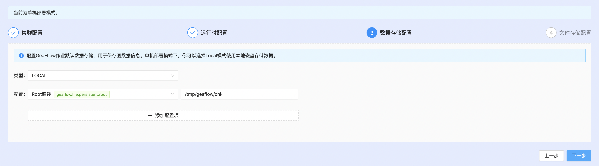

# K8S集群部署
## 准备K8S环境

这里以minikube为例，单机模拟K8S集群。如果已有K8S集群可以直接使用，跳过该部分。安装minikube可以参考[安装minikube](6.install_minikube.md)章节。

创建geaflow服务账号，否则程序无权限新建k8s资源（只有第一次需要）
```shell
# 创建服务账号
kubectl create serviceaccount geaflow
kubectl create clusterrolebinding geaflow-role-binding --clusterrole=edit --serviceaccount=default:geaflow --namespace=default
```

最后，为了使docker内的容器可以访问minikube api，需要将minikube代理到${your_local_ip}:8000，使得其他容器可以通过此端口直接访问minikube。

注意不要关闭proxy所属的terminal进程，后续操作请另起终端进行。
```shell
# 创建端口号8000的代理
kubectl proxy --port=8000 --address='${your_local_ip}' --accept-hosts='^.*' &
```

## 构建镜像
下载GeaFlow源码，构建GeaFlow引擎镜像和GeaFlow Console平台镜像。
```shell
git clone https://github.com/apache/geaflow.git geaflow
cd geaflow/
bash ./build.sh --all
```

镜像编译成功后，通过以下命令查看镜像：
```shell
# check geaflow image
eval $(minikube docker-env)
docker images

# check geaflow-console image
eval $(minikube docker-env --unset)
docker images
```
默认构建的GeaFlow平台镜像名为geaflow-console:0.1，引擎镜像名为geaflow:0.1。平台镜像geaflow-console:0.1启动后可以通过浏览器访问GeaFlow控制台，创建提交GeaFlow作业。GeaFlow作业运行时默认基于构建好的引擎镜像geaflow:1.0。

## 启动容器

本地启动GeaFlow Console平台服务，适用于minikube环境。（需要将${your.host.name}替换为本机对外IP地址）

```shell
docker run -d --name geaflow-console -p 8888:8888 -p 3306:3306 -p 6379:6379 -p 8086:8086 -e geaflow.host=${your.host.name} geaflow-console:0.1
```

启动对外GeaFlow Console平台服务，适用于K8S真实集群环境。（需要将${your.host.name}替换为本机内网IP地址，例如172.xx.xxx.xx；${your.public.ip} 替换为外部公网IP地址，才能从外部访问GeaFlow Console）
```shell
docker run -d --name geaflow-console -p 8888:8888 -p 3306:3306 -p 6379:6379 -p 8086:8086 -e geaflow.host=${your.host.name} geaflow-console:0.1
```

容器默认以本地模式（local）启动，默认拉起本地的MySQL、Redis、InfluxDB。
```properties
# /opt/geaflow/config/application.properties
geaflow.deploy.mode=local
geaflow.host=127.0.0.1
geaflow.gateway.port=8888
geaflow.gateway.url=http://${geaflow.host}:${geaflow.gateway.port}

# Datasource
spring.datasource.driver-class-name=com.mysql.jdbc.Driver
spring.datasource.url=jdbc:mysql://${geaflow.host}:3306/geaflow?useUnicode=true&characterEncoding=utf8
spring.datasource.username=geaflow
spring.datasource.password=geaflow
```

进入容器等待geaflow-web进程启动完成后，访问[localhost:8888](http://localhost:8888)进入GeaFlow Console平台页面。
K8S集群环境这里为访问对外IP地址的8888端口。
```shell
> docker exec -it geaflow-console tailf /tmp/logs/geaflow/app-default.log

# wait the logs below and open url http://localhost:8888
GeaflowApplication:61   - Started GeaflowApplication in 11.437 seconds (JVM running for 13.475)
```

若希望以集群模式（cluster）启动容器，需要调整datasource配置指向外部数据源，并设置对外的统一服务url地址。容器支持环境变量注入数据源配置和服务url，例如：
```shell
docker run -d --name geaflow-console -p 8888:8888 \
-e geaflow.deploy.mode="cluster" \
-e geaflow.host=${your.host.name} \
-e geaflow.gateway.port=8888 \
-e geaflow.gateway.url=${your.geaflow.gateway.url} \
-e spring.datasource.url=${your.datasource.url} \
-e spring.datasource.username=${your.datasource.username} \
-e spring.datasource.password=${your.datasource.password} \
geaflow-console:1.0
```

如果希望Java进程端口号，只需设置geaflow.gateway.port环境变量，并重新映射端口号即可，如：
```shell
docker run -d --name geaflow-console -p 9999:9999 \
-e geaflow.gateway.port=9999 \
geaflow-console:1.0
```

## 注册登录
首位注册用户将默认被设置为管理员，以管理员身份登录，通过一键安装功能开始系统初始化。


## 一键安装
管理员首次进入GeaFlow系统，会触发一键安装流程，为系统做初始化准备工作。

### 集群配置
配置GeaFlow作业的运行时集群，推荐使用Kubernates。本地模式下默认为本地的代理地址${your.host.name}:8000，请确保本地已经启动minikube并设置好代理地址。如果设置K8S集群地址，请确保集群地址的连通性正常。


K8S集群模式添加以下配置
```
# 存储限制为10Gi
"kubernetes.resource.storage.limit.size":"10Gi"
# 服务API配置为K8S服务地址，一般为6443端口
"kubernetes.master.url":"https://${your.host.name}:6443"
# 在K8S集群找到 /etc/kubernetes/admin.conf 配置文件，从上到下分别配置以下三个字段
"kubernetes.ca.data":""
"kubernetes.cert.data":""
"kubernetes.cert.key":""
```

### 运行时配置
配置GeaFlow作业运行时元数据的存储，运行时元数据包含了作业的Pipeline、Cycle、位点、异常等信息，推荐使用MySQL。
配置GeaFlow作业运行时HA元数据的存储，HA元数据包含Master、Driver、Container等主要组件信息，推荐使用Redis。
配置GeaFlow作业运行时指标数据存储，用于作业指标监控，推荐使用InfluxDB。


本地模式下，docker容器启动时会默认自动拉起MySQL、Redis和InfluxDB服务。

K8S集群模式添加以下配置
```
# influshdb.token可配置为随机值
"influxdb.token":"f5fb50a361f762a0af045c47d98f66e401f1b632b3133b3dc2680110262d1135"
```

### 数据存储配置
配置GeaFlow作业、图、表等数据的持久化存储，推荐使用HDFS。本地模式默认为容器内磁盘。


### 文件存储配置
配置GeaFlow引擎JAR、用户JAR文件的持久化存储，推荐使用HDFS。本地模式默认为容器内磁盘。


安装成功后，**管理员会自动切换到租户默认下的默认实例**，此时可以直接创建发布图计算任务。

## 工作模式
GeaFlow控制台支持租户隔离，支持系统模式视角和租户模式视角使用产品功能。

**注意：**
页面右上角用户图标菜单，提供了快捷的模式切换入口。

### 系统模式
用户以管理员身份登录后，会进入系统模式。此时可以进行系统的一键安装、系统管理等操作。


系统模式下，管理员可以管理集群、GeaFlow引擎版本、文件、用户、租户等信息。

### 租户模式
用户正常登录后，会进入租户模式。此时可以进行图计算的研发和运维操作。


租户模式下，用户可以创建实例、图、表、图计算任务等研发资源，并可以发布图计算任务，提交图计算作业等操作。


## 任务管理
添加图计算任务，使用SQL+GQL的方式描述图计算的业务逻辑。


任务创建后，点击发布，进入作业运维。

## 作业运维
作业提交前，还可以调整默认生成的任务参数和集群参数，以方便对作业行为进行调整。


访问作业详情页面的其他标签页，查看作业的运行时、指标、容器、异常、日志等信息。


