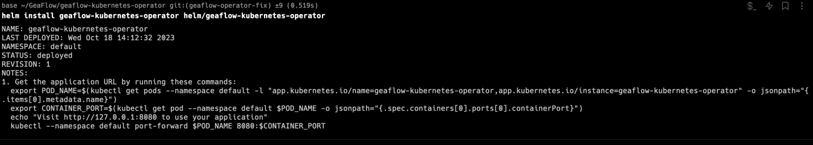
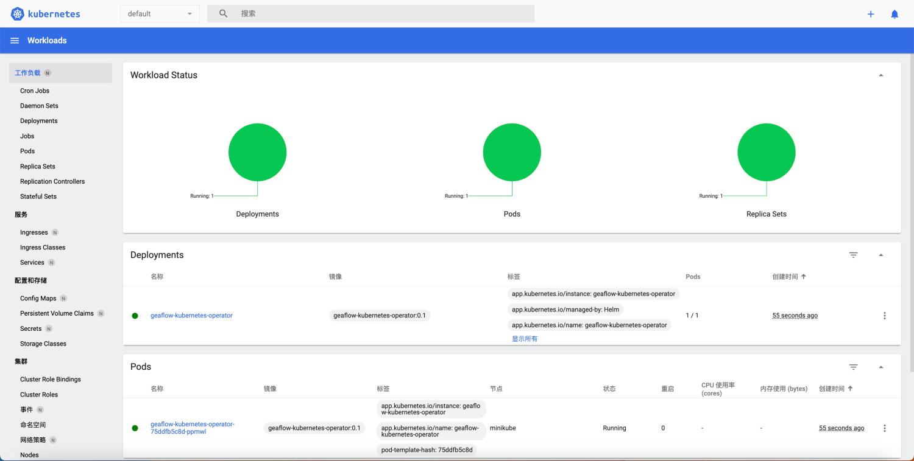
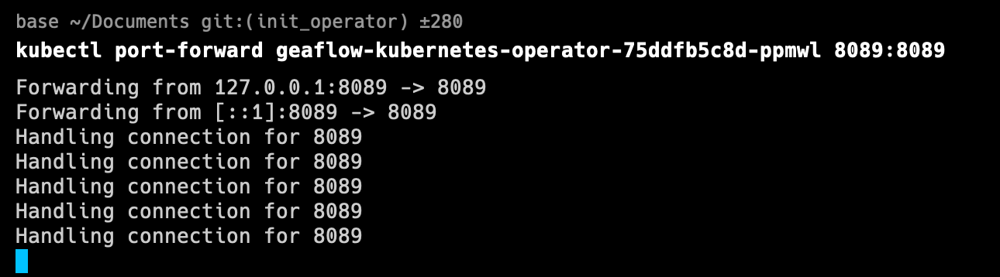
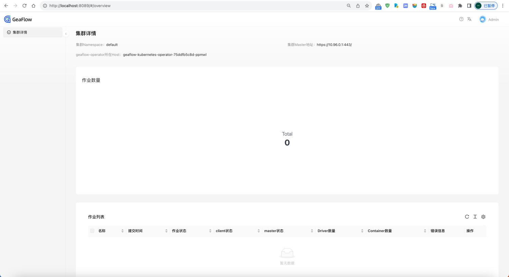
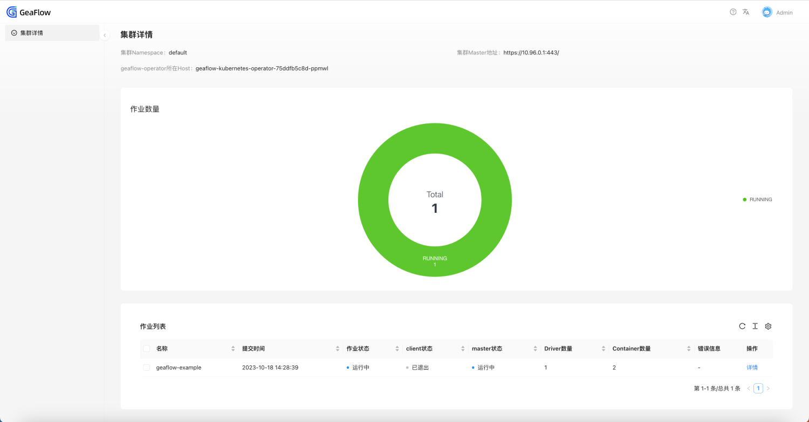

# K8S Operator部署

## 准备工作
1. 下载安装docker和minikube。参考文档：[安装minikube](6.install_minikube.md)
2. 拉取GeaFlow镜像

```shell
docker pull tugraph/geaflow:0.6
```

如果遇到网络问题导致拉取失败，也可以通过下面命令直接构建镜像(构建镜像之前需要先启动docker容器,构建脚本根据机器类型build对应类型的镜像):


```shell
git clone https://github.com/apache/geaflow.git geaflow
cd geaflow/
bash ./build.sh --module=geaflow
```


整个编译过程可能持续一段时间，请耐心等待。镜像编译成功后，通过以下命令查看镜像：
```shell
docker images
```
远程拉取的镜像名称为：**tugraph/geaflow:0.6**。
本地镜像名称为：**geaflow:0.1**，只需选择一种方式构建镜像即可。

## 安装Geaflow Kubernetes Operator
下面介绍如何安装Geaflow Kubernetes Operator。

1. 下载GeaFlow代码。
```shell
git clone https://github.com/apache/geaflow.git geaflow
cd geaflow/
```
2. 构建Geaflow Kubernetes Operator的镜像
```shell
docker pull tugraph/geaflow-kubernetes-operator:0.6
```

如果遇到网络问题导致拉取失败，也可以通过下面命令直接构建镜像:


```shell
cd geaflow/geaflow-kubernetes-operator/
bash ./build-operator.sh
```

operator项目最低要求jdk11。整个编译过程可能持续一段时间，请耐心等待。镜像编译成功后，通过以下命令查看镜像：
```shell
docker images
```
远程拉取的镜像名称为：**tugraph/geaflow-kubernetes-operator:0.6**。
本地镜像名称为：**geaflow-kubernetes-operator:0.1**，只需选择一种方式构建镜像即可。

3. 确认helm的镜像名称

打开/helm/geaflow-kubernetes-operator/values.yaml。

如有必要则可修改image.repository和image.tag以使用正确的镜像名。

4. 通过helm安装GeaFlow Kubernetes Operator
```shell
cd geaflow/geaflow-kubernetes-operator/
helm install geaflow-kubernetes-operator helm/geaflow-kubernetes-operator
```


5. 在minikube dashboard中查看pod是否正常运行

6. 将GeaFlow-Operator-Dashboard通过portforward代理到本地端口（默认为8089端口）

请将operator-pod-name替换为实际的operator pod名称。
```shell
kubectl port-forward ${operator-pod-name} 8089:8089
```


7. 浏览器访问localhost:8089即可打开operator集群页面


## 通过Geaflow Kubernetes Operator提交作业

Geaflow-kubernetes-operator成功部署并运行后，就可以编写CR的yaml文件进行作业提交啦。

### 提交作业
geaflow-kubernetes-operator成功部署并运行后，就可以编写作业的yaml文件进行作业提交了。
首先我们编写一个geaflow内置示例作业的yaml文件。

```yaml
apiVersion: geaflow.antgroup.com/v1
kind: GeaflowJob
metadata:
  # 作业名称
  name: geaflow-example
spec:
  # 作业使用的GeaFlow镜像
  image: geaflow:0.1
  # 作业拉取镜像的策略
  imagePullPolicy: IfNotPresent
  # 作业使用的k8s service account
  serviceAccount: geaflow
  # 作业java进程的主类
  entryClass: com.antgroup.geaflow.example.graph.statical.compute.khop.KHop
  clientSpec:
    # client pod相关的资源设置
    resource:
      cpuCores: 1
      memoryMb: 1000
      jvmOptions: -Xmx800m,-Xms800m,-Xmn300m
  masterSpec:
    # master pod相关的资源设置
    resource:
      cpuCores: 1
      memoryMb: 1000
      jvmOptions: -Xmx800m,-Xms800m,-Xmn300m
  driverSpec:
    # driver pod相关的资源设置
    resource:
      cpuCores: 1
      memoryMb: 1000
      jvmOptions: -Xmx800m,-Xms800m,-Xmn300m
    # driver个数
    driverNum: 1
  containerSpec:
    # container pod相关的资源设置
    resource:
      cpuCores: 1
      memoryMb: 1000
      jvmOptions: -Xmx800m,-Xms800m,-Xmn300m
    # container个数
    containerNum: 1
    # 每个container内部的worker个数(线程数)
    workerNumPerContainer: 4
  userSpec:
    # 作业指标相关配置
    metricConfig:
      geaflow.metric.reporters: slf4j
      geaflow.metric.stats.type: memory
    # 作业存储相关配置
    stateConfig:
      geaflow.file.persistent.type: LOCAL
      geaflow.store.redis.host: host.minikube.internal
      geaflow.store.redis.port: "6379"
    # 用户自定义参数配置
    additionalArgs:
      kubernetes.resource.storage.limit.size: 12Gi
      geaflow.system.state.backend.type: MEMORY
```

Geaflow 作业依赖于redis组件，可以通过docker快速启动一个redis容器并将端口映射到localhost。
```shell
docker pull redis:latest
docker run -p 6379:6379 --name geaflow_redis redis:latest
```
若你已经部署了一个redis组件，则可以将example.yaml中的以下参数替换为已有的redis host和端口号。
```yaml
spec:
  userSpec:
    stateConfig:
      geaflow.store.redis.host: ${your.redis.host}
      geaflow.store.redis.port: ${your.redis.port}
```

然后通过如下命令即可将作业提交到k8s集群。
```shell
cd geaflow/geaflow-kubernetes-operator/example
kubectl apply example_hla.yml
```
### 提交HLA作业
对于提交HLA作业的情况，需要额外注意以下几个参数：
* entryClass必填。
* udfJars选填，如有的话请填写自己文件的url地址。

```yaml
spec:
  # 必填
  entryClass: com.example.MyEntryClass
  # 可选
  udfJars:
    - name: myUdf.jar
      url: http://localhost:8888/download/myUdf.jar
```

### 提交DSL作业
对于提交DSL作业的情况，需要额外注意以下几个参数：
* entryClass不填，留空。
* gqlFile必填，请填写自己文件的名称和url地址。
* udfJars选填，如有的话请填写自己文件的url地址。

```yaml
spec:
  # 不填
  # entryClass: com.example.MyEntryClass
  # 必填
  gqlFile:
    # name必须填写正确，否则无法找到对应文件
    name: myGql.gql
    url: http://localhost:8888/download/myGql.gql
  # 可选
  udfJars:
    - name: myUdf.jar
      url: http://localhost:8888/download/myUdf.jar
```
关于DSL作业和HLA作业的更多参数，我们在项目目录geaflow-kubernetes-operator/example目录中准备了两个demo作业供大家参考，请分别参考项目中的示例文件：
* example/example-dsl.yml
* example/example-hla.yml。

### 查看作业状态
#### 通过geaflow-kubernetes-operator-dashboard查看
浏览器访问http://localhost:8089/，即可打开集群页面查看集群下所有geaflowjob作业列表和详情。



#### 通过命令行查看
执行以下命令可以查看CR的状态
```shell
kubectl get geaflowjob geaflow-example
```
