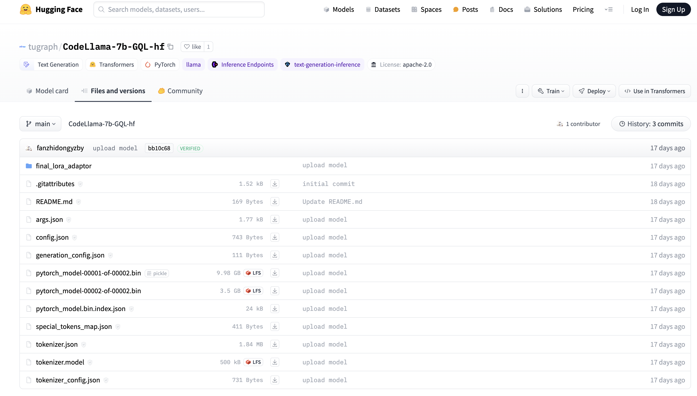
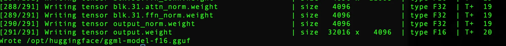
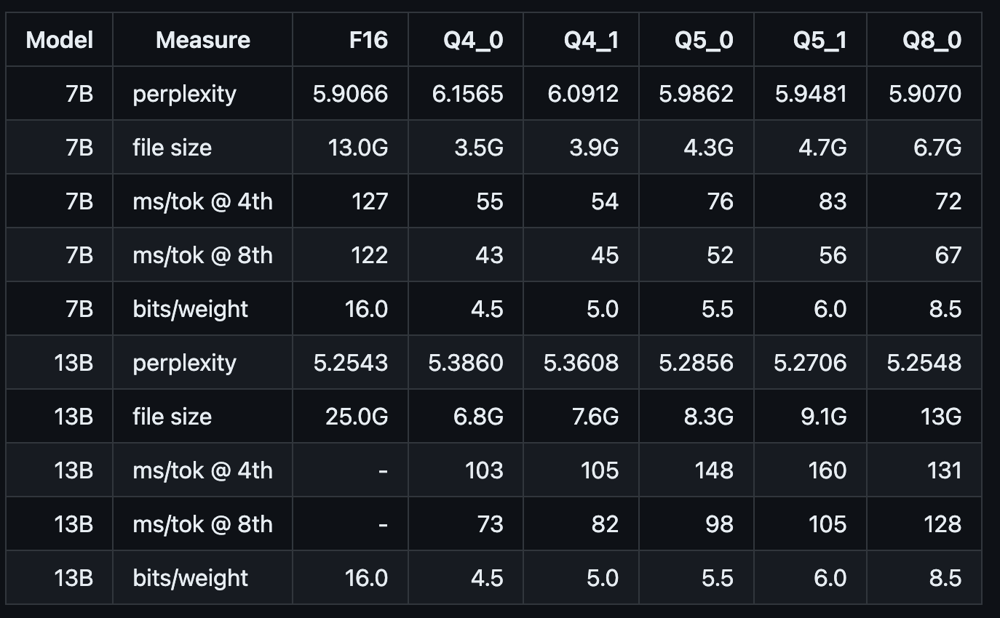

The users have the capability to locally deploy extensive models as a service. The complete process, encompassing downloading pre-trained models, deploying them as a service, and debugging, is described in the following steps. It is essential for the user's machine to have Docker installed and be granted access to the repository containing these large models.
 
 ## Step 1: Download the model file
 The pre-trained large model file has been uploaded to the [Hugging Face repository](https://huggingface.co/tugraph/CodeLlama-7b-GQL-hf). Please proceed with downloading and locally unzipping the model file.


 ## Step 2: Prepare the Docker container environment
1. Run the following command on the terminal to download the Docker image required for model servicing:
   
```
docker pull tugraph/llam_infer_service:0.0.1

// Use the following command to verify that the image was successfully downloaded

docker images
```
 
2. Run the following command to start the Docker container:
   
```
docker run -it  --name ${Container name} -v ${Local model path}:${Container model path} -p ${Local port}:${Container service port} -d ${Image name}  

// Such as
docker run -it --name my-model-container -v /home/huggingface:/opt/huggingface -p 8000:8000 -d llama_inference_server:v1

// Check whether the container is running properly
docker ps 
```

Here, we map the container's port 8000 to the local machine's port 8000, mount the directory where the local model (/home/huggingface) resides to the container's path (/opt/huggingface), and set the container name to my-model-container.

## Step 3: Model service deployment
1. Model transformation
```
// Enter the container you just created
docker exec -it ${container_id} bash

// Execute the following command
cd /opt/llama_cpp
python3 ./convert.py ${Container model path}
```
When the execution is complete, a file with the prefix ggml-model is generated under the container model path.


2. Model quantization (optional)
Take the llam2-7B model as an example: By default, the accuracy of the model converted by convert.py is F16 and the model size is 13.0GB. If the current machine resources cannot satisfy such a large model inference, the converted model can be further quantized by./quantize.

```
// As shown below, q4_0 quantizes the original model to int4 and compresses the model size to 3.5GB

cd /opt/llama_cpp
./quantize ${Default generated F16 model path} ${Quantized model path} q4_0
```
The following are reference indicators such as the size and reasoning speed of the quantized model:


3. Model servicing
Run the following command to deploy the above generated model as a service, and specify the address and port of the service binding through the parameters:
```
// ./server -h. You can view parameter details
// ${ggml-model...file} The file name prefixes the generated ggml-model

cd /opt/llama_cpp
./server --host ${ip} --port ${port} -m ${Container model path}/${ggml-model...file} -c 4096

// Such as
./server --host 0.0.0.0 --port 8000 -m  /opt/huggingface/ggml-model-f16.gguf -c 4096
```

4. Debugging service
Send an http request to the service address, where "prompt" is the query statement and "content" is the inference result.

```
curl --request POST \
    --url http://127.0.0.1:8000/completion \
    --header "Content-Type: application/json" \
    --data '{"prompt": "请返回小红的10个年龄大于20的朋友","n_predict": 128}'
```
Debugging service
The following is the model inference result after service deployment:

   
   