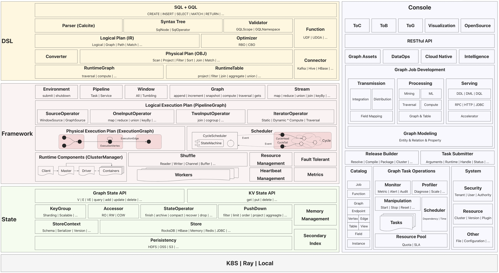
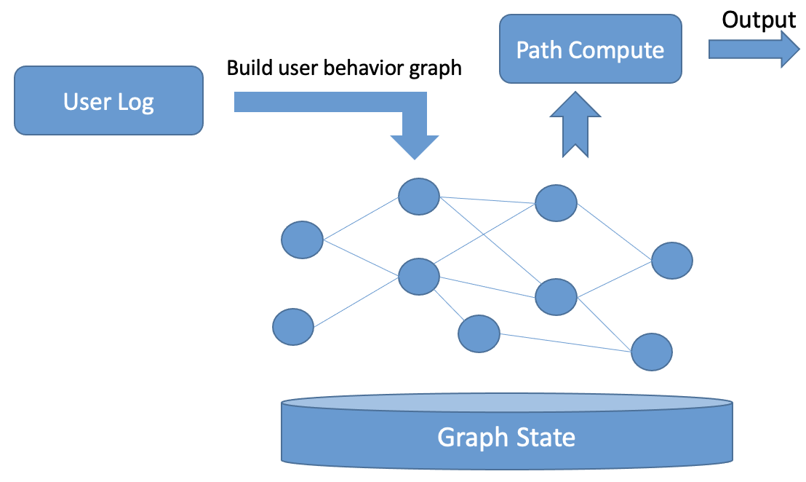

# Introduction

## Background introduction
Early big data processing mainly relied on offline processing, with technologies like Hadoop effectively solving 
the problem of analyzing large-scale data. However, processing efficiency was inadequate for high real-time demand scenarios. The emergence of stream computing engines, represented by Storm, effectively addressed the issue of real-time data processing, improving processing efficiency. However, Storm itself does not provide state management capabilities and is powerless in handling stateful computations such as aggregation. The emergence of Flink effectively addressed this shortcoming by introducing state management and checkpoint mechanisms, achieving efficient stateful stream computing capabilities.

As real-time data processing scenarios evolve, particularly in real-time data warehousing scenarios, real-time 
relational operations (i.e. stream join) increasingly become a challenge in realizing data real-time. Although Flink has excellent state management capabilities and outstanding performance, its performance bottleneck becomes more pronounced when handling join operations, especially when it involves three or more degrees of join. This is because each end of the join requires its own data state, and when there are multiple joins, the amount of data in the state increases significantly, making it difficult to accept in terms of performance. The root cause of this problem is that streaming computing systems like Flink use tables as their data model. However, the table model is a two-dimensional structure that does not include relationship definitions and storage, and when handling relationship operations, it can only be achieved through join operations, which incurs high costs.

In Ant Financial's big data scenarios, particularly in financial risk control and real-time data warehousing, there 
are a large number of join operations, and how to improve the efficiency and performance of joins has become an important challenge we face. We have introduced the graph model, which is a data model that describes entity relationships using a point-edge structure. In the graph model, points represent entities, and edges represent relationships, and the data is stored together at the point-edge level. Therefore, the graph model naturally defines relationships and simultaneously materializes point-edge relationships at the storage level. Based on the graph model, we have implemented the next-generation real-time computing engine, GeaFlow, which effectively addresses the problem of complex relationship operations that traditional streaming computing engines face. Currently, GeaFlow has been widely used in scenarios such as data warehousing acceleration, financial risk control, knowledge graphs, and social networks.

## Features

* Distribute streaming graph computing.
* High availability and exactly once support.
* Graph and table integrated processing.
* Easy to develop with SQL + ISO/GQL.
* Pluggable for UDF、graph algorithm and connector.
* High level api support.
* One-stop graph development platform
* Cloud native deployment support.

[Why using graphs for relational operations is more appealing than table joins?](./principle/vs_join.md)

The similarities and differences between GeaFlow and traditional stream computing engine, such as Flink, are as follows:

| Features | GeaFlow | Flink |
| -------- | -------- | -------- |
|  Data Model    | A graph-based stream computing engine that can handle both graph and table model data     | A stream computing engine based on the table model     |
| State Management | Supports both stream and graph data state management | Supports stream state management |
| Exactly once |Supported | Supported|
| Join Support | Supports complex multi-degree join operations | Not suitable for complex joins |
| Graph Algorithm Support| Native graph algorithm support | Flink Gelly module support (currently removed)|
| Query Language| SQL + ISO/GQL| SQL |

GeaFlow's relevant design reference papers are as follows: [GeaFlow: A Graph Extended and Accelerated Dataflow 
System](https://dl.acm.org/doi/abs/10.1145/3589771)

## Technical overview

The overall architecture of GeaFlow is as follows:

* [DSL Layer](./principle/dsl_principle.md): GeaFlow has designed a fusion analysis language, SQL+GQL, which supports unified processing of table models and graph models.
* [Framework Layer](./principle/framework_principle.md): GeaFlow has designed two sets of APIs for graph and stream, supporting the fusion computation of streaming, batch, and graph processing. It has also implemented a unified distributed scheduling model based on Cycle.
* [State Layer](./principle/state_principle.md): GeaFlow has designed two sets of APIs for graph and key-value storage, supporting the mixed storage of table data and graph data. The overall design follows the Sharing Nothing principle and supports the persistence of data to remote storage.
* [Console Platform](./principle/console_principle.md): GeaFlow provides an all-in-one graph development platform, implementing the capabilities of graph data modeling, processing, and analysis. It also provides operational and control support for graph tasks.
* **Execution Environment**: GeaFlow can run in various heterogeneous execution environments, such as K8S, Ray, and local mode.

## Application Scenarios

### Real-time Data Warehouse Acceleration
In data warehouse scenarios, there are a large number of join operations, and in the DWD layer, it is often necessary to expand multiple tables into one large wide table to speed up subsequent queries. When the number of tables involved in a join increases, traditional real-time computing engines find it difficult to ensure the efficiency and performance of joins. This has become a challenging problem in the field of real-time data warehousing. GeaFlow's real-time graph computing engine can effectively address this problem. GeaFlow uses the graph as its data model, replacing the wide tables in the DWD layer, and can realize real-time graph construction. At the query stage, utilizing the point-edge materialization characteristics of the graph can greatly accelerate relationship operation queries. The following is the process diagram of GeaFlow's real-time data warehouse acceleration:

### Real-time Attribution Analysis
Under the background of informationization, channel attribution and path analysis of user behavior are the core of traffic analysis. By calculating the effective behavior path of users in real-time, and constructing a complete conversion path, it can quickly help businesses understand the value of products and assist operations in adjusting their strategies in a timely manner. The core points of real-time attribution analysis are accuracy and effectiveness. Accuracy requires ensuring the accuracy of user behavior path analysis under controllable costs. Effectiveness requires high real-time calculation to quickly assist business decision-making.
Based on the capabilities of the GeaFlow's streaming computing, accurate and timely attribution analysis can be achieved. The following figure shows how this is accomplished:

Firstly, GeaFlow converts the user behavior logs into a user behavior topology graph in real-time, with users as the vertex and every behavior related to them as an the edge towards the buried page. Then, GeaFlow analyzes the subgraph of user behavior in advance using its streaming computing capability, and based on the attribution path matching rule, matches and calculates the attribution path of the corresponding user for the transaction behavior, and outputs it to the downstream systems.

### Real-time Anti-Crash System
In the context of credit risk management, detecting credit card cashing-out fraud is a typical risk management requirement. Based on analysis of existing cashing-out patterns, it can be seen that cashing-out is a loop subgraph. How to efficiently and quickly identify cashing-out in a large graph can greatly increase the efficiency of risk identification. Taking the following graph as an example, by transforming real-time transaction flows and transfer flows from input data sources into a real-time transaction graph, and then performing graph feature analysis on user transaction behavior based on risk management policies, such as loop checking and other feature calculations, real-time detection of cashing-out can be provided to decision-making and monitoring platforms. GeaFlow's real-time graph construction and calculation abilities can quickly identify abnormal transactional behaviors such as cashing-out, greatly reducing platform risk.
