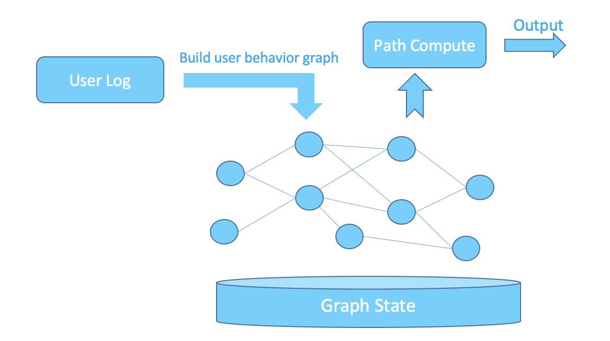

# Introduction
GeaFlow is an open-source distributed real-time graph computing engine developed by Ant Group. It is widely used in scenarios such as financial risk control, social networks, knowledge graphs, and data applications. The core competence of GeaFlow is streaming graph computing, which provides a high-time efficiency and low-latency graph computing mode compared to offline graph computing. It mainly consists of stream graph construction, streaming graph computing, and post-processing of graph computing results. Stream graph construction real-time writes the point-edge structure of the graph from external data sources, such as Kafka, through some ETL processing into the graph storage. Streaming graph computing is real-time analysis and processing of graph data, including graph traversal calculation and graph algorithm calculation. Post-processing is further ETL processing of the graph calculation results and writing them into the result table. GeaFlow implements an integrated pipeline running mode to realize the entire processing process.

Compared with traditional streaming computing engines such as Flink and Storm, which are real-time processing systems for table data, GeaFlow mainly focuses on real-time processing of graph data, supporting more complex relationship analysis and calculations, such as real-time search for multi-degree relationships and loop detection. At the same time, it also supports real-time analysis and processing of graph-table integration and can handle both table data and graph data at the same time. Compared with offline graph computing engines such as Spark GraphX, GeaFlow's streaming graph computing capability can provide better time efficiency guarantee.

# Technical overview
The overall architecture of GeaFlow is as follows:

The GeaFlow overall architecture includes the following layers from top to bottom:
* **GeaFlow DSL**
  GeaFlow provides users with a graph-table fusion analysis language, which adopts SQL + ISO/GQL approach. Users can write real-time graph computing tasks in a similar way to SQL programming.
* **GraphView API**
  GeaFlow defines a set of graph computing programming interfaces with GraphView as the core, which includes graph construction, graph computing, and Stream API interfaces.
* **GeaFlow Runtime**
  This is the GeaFlow runtime module, which includes core functions such as GeaFlow chart operator, task scheduling, failover, and shuffle.
* **GeaFlow State**
  GeaFlow's graph state storage, used to store point-edge data of the graph. The streaming calculation state, such as aggregation state, is also stored in the state.
* **Deployment Environment**
  GeaFlow supports deployment and operation in different ways: K8S, Ray and Local.
* **GeaFlow Console**
  The GeaFlow control platform, which includes functions such as job management and metadata management.

# Application Scenarios
## Real-time Anti-Crash System
In the context of credit risk management, detecting credit card cashing-out fraud is a typical risk management requirement. Based on analysis of existing cashing-out patterns, it can be seen that cashing-out is a loop subgraph. How to efficiently and quickly identify cashing-out in a large graph can greatly increase the efficiency of risk identification. Taking the following graph as an example, by transforming real-time transaction flows and transfer flows from input data sources into a real-time transaction graph, and then performing graph feature analysis on user transaction behavior based on risk management policies, such as loop checking and other feature calculations, real-time detection of cashing-out can be provided to decision-making and monitoring platforms. GeaFlow's real-time graph construction and calculation abilities can quickly identify abnormal transactional behaviors such as cashing-out, greatly reducing platform risk.

## Real-time Attribution Analysis
Under the background of informationization, channel attribution and path analysis of user behavior are the core of traffic analysis. By calculating the effective behavior path of users in real-time, and constructing a complete conversion path, it can quickly help businesses understand the value of products and assist operations in adjusting their strategies in a timely manner. The core points of real-time attribution analysis are accuracy and effectiveness. Accuracy requires ensuring the accuracy of user behavior path analysis under controllable costs. Effectiveness requires high real-time calculation to quickly assist business decision-making.

Based on the capabilities of the GeaFlow's streaming computing, accurate and timely attribution analysis can be achieved. The following figure shows how this is accomplished:

Firstly, GeaFlow converts the user behavior logs into a user behavior topology graph in real-time, with users as the vertex and every behavior related to them as an the edge towards the buried page. Then, GeaFlow analyzes the subgraph of user behavior in advance using its streaming computing capability, and based on the attribution path matching rule, matches and calculates the attribution path of the corresponding user for the transaction behavior, and outputs it to the downstream systems.