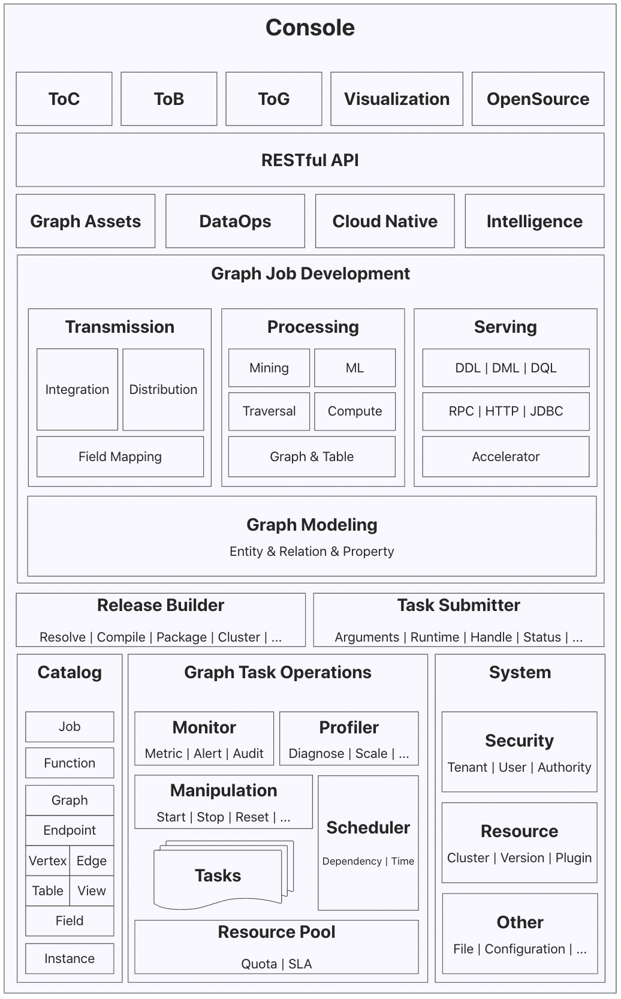
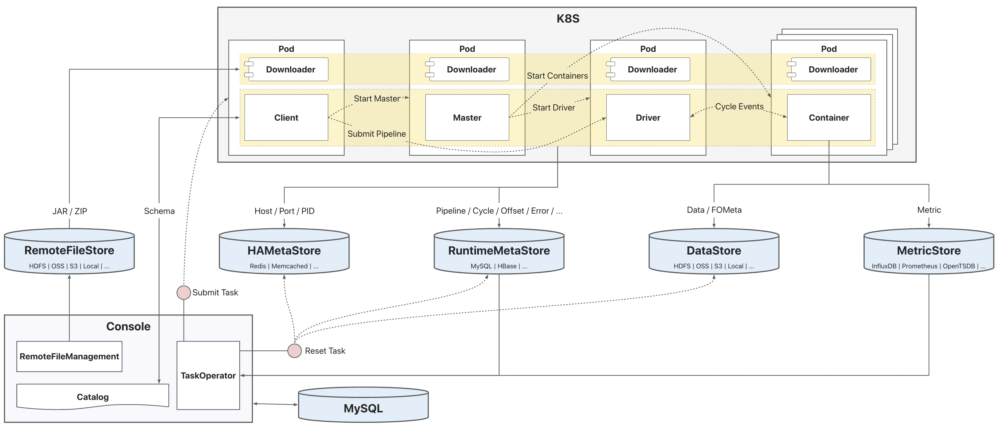

# GeaFlow Console Platform

GeaFlow Console provides a unified platform for graph development and operations, as well as metadata (Catalog) services for the engine runtime.

### Platform Architecture

* **RESTful API**: The platform provides standardized RESTful APIs and authentication mechanisms, supporting unified API services for web and application clients.
* **Job Development**: The platform supports graph data modeling based on the "Relationship-Entity-Attribute" paradigm. Based on field mapping configurations, users can define graph data integration (Import) and distribution (Export) tasks. Graph data processing tasks based on graph models support diverse computational scenarios, such as Traversal, Compute, Mining, etc. Graph data services based on data accelerators provide real-time analysis capabilities supporting multiple protocols and integration with BI and visualization analysis tools.
* **Build & Submit**: The platform separates the development state from the operational state through the independent abstraction of jobs and tasks. After development, jobs can be published, triggering the build pipeline (Release Builder) to generate a release version. The task submitter (Task Submitter) is responsible for submitting the contents of the release version to the execution environment to generate a computational task.
* **Task Operations**: Tasks are the runtime state of jobs. The platform provides operational capabilities for task manipulation (start/stop/reset), monitoring (metrics/alerts/auditing), optimization (diagnostics/scalability/tuning), and scheduling. Task runtime resources are allocated and managed by the resource pool.
* **Metadata Services**: The platform also hosts metadata services for the engine runtime, enabling automation for development and operations. Metadata is segregated based on instances, and development resources within an instance can be accessed directly by name, such as vertices, edges, graphs, tables, views, functions, etc.
* **System Management**: The platform provides multi-tenant isolation, fine-grained user permission control, and system resource management capabilities.

## Deployment Architecture

GeaFlow supports execution in various heterogeneous environments. Taking the common K8S deployment environment as an example, the physical deployment architecture of GeaFlow is as follows:

During the full lifecycle of a GeaFlow task, there are several key phases:

* **Development Phase**: The Console platform manages all development resources within an instance. Before creating a task, users can prepare the required development resource information in advance and store it in the Catalog.
* **Build Phase**: After the job is created, the build pipeline is triggered by the publish action. The user's JAR files, task's ZIP package, etc., are uploaded to the RemoteFileStore.
* **Submission Phase**: When a job is submitted, the Console creates a KubernetesJobClient based on the job's parameter configuration, runtime environment information, and remote file addresses. This client pod will bring up the master pod, container pods, and driver pod. After all pods are up and running, the client sends the pipeline to the driver for execution. The driver interacts with the containers through cycle scheduling events. When starting, each pod downloads the version JAR file, user JAR file, job ZIP package, etc., from the RemoteFileStore. When compiling DSL code, the driver also uses the Catalog API provided by the Console to operate on schema information.
* **Runtime Phase**: During task execution, various components report different data and information. The master reports heartbeat summary information for the task, the driver reports pipeline/cycle metrics and error information, and the containers report offsets, metric definitions, and error information. The RuntimeMetaStore stores pipeline/cycle metrics, offsets, heartbeat summaries, errors, etc., for the task. The HAMetaStore stores address information for various runtime components. The DataStore stores state data and metadata required for task failover. The MetricStore stores runtime metric information.
* **Monitoring Phase**: The Console primarily queries information stored in the RuntimeMetaStore and MetricStore for runtime monitoring of the task.
* **Cleanup Phase**: When a task is reset/deleted, the Console performs cleanup operations on the task's runtime metadata, HAMetaStore, and some data.
