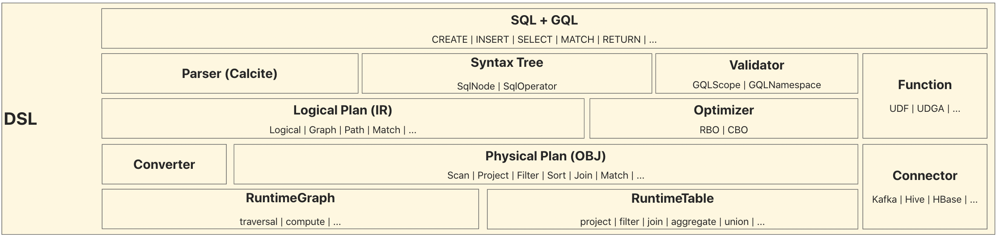

# GeaFlow DSL Architecture

The overall architecture of GeaFlow DSL is shown in the following figure:

DSL Layer is a typical compiler technology architecture, which consists of syntax analysis, semantic analysis, intermediate code generation (IR), code optimization, and target code generation (OBJ).

* **Language Design**: GeaFlow has designed a fusion syntax of SQL+GQL to address the demand for integrated analysis of graphs and tables.
* **Syntax Analysis**: By extending the SqlNode and SqlOperator of [Calcite](https://calcite.apache.org/), GeaFlow implements a syntax parser for SQL+GQL, generating unified syntax tree information.
* **Semantic Analysis**: By extending the Scope and Namespace of Calcite, GeaFlow implements a custom Validator to perform constraint semantic checks on the syntax tree.
* **Intermediate Code Generation**: By extending the RelNode of Calcite, GeaFlow implements Logical RelNode on the graph for the intermediate representation of GQL syntax.
* **Code Optimization**: The optimizer implements a large number of optimization rules (RBO) to improve execution performance, and may introduce CBO in the future.
* **Target Code Generation**: The code generator Converter is responsible for converting Logical RelNode to Physical RelNode, which is the target code. Physical RelNode can be directly translated into API calls on the graph or table.
* **Custom Functions**: GeaFlow provides a wide range of built-in system functions, and users can also register custom functions as needed.
* **Custom Plugins**: GeaFlow allows users to extend their own Connector types to support different data sources and data formats.

# Main Execution Flow of DSL
The main execution flow of DSL is illustrated in the following figure:

The DSL text is first parsed by the Parser to generate the AST syntax tree, and then the Validator performs semantic checking and type inference to generate a validated AST syntax tree. The graph-logic execution plan is then generated by the Logical Plan transformer. The logical execution plan is optimized by the Optimizer to generate an optimized logical execution plan. The physical execution plan is then generated by the Physical Plan transformer, and the physical execution logic is generated by the DAG Builder. GeaFlow DSL uses a two-level DAG structure to describe the physical execution logic of the flowchart.

# Two-level DAG Physical Execution Plan
Unlike traditional distributed table data processing engines such as Storm, Flink, and Spark, GeaFlow is a flowchart-integrated distributed computing system. Its physical execution plan uses a two-level DAG structure for the flowchart, as shown in the following figure:

The outer layer DAG contains operator for table processing and iterative operator for graph processing, which is the main part of the physical execution logic and links the computing logic of the flowchart. The inner DAG expands the graph computation logic through the DAG, representing the specific execution of graph iterative computation.
