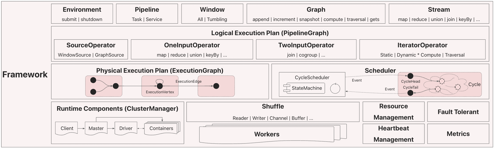
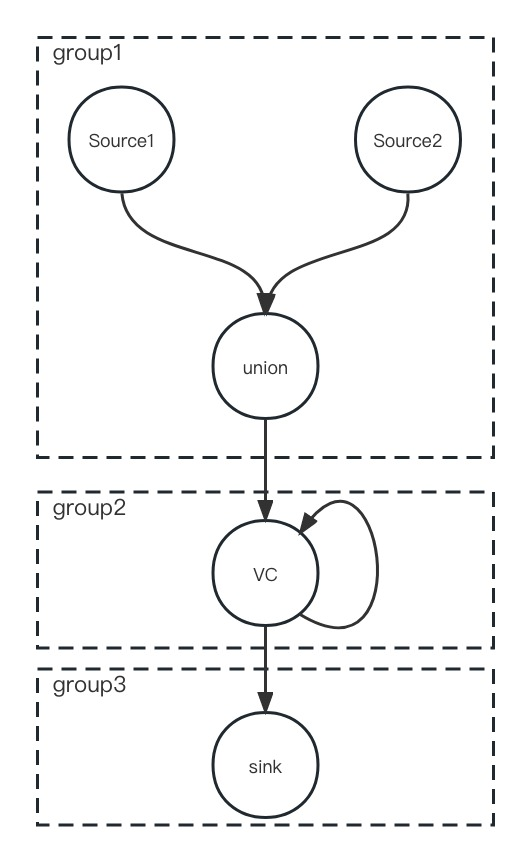

# Framework Architecture

The architecture of GeaFlow Framework is shown in the following diagram:

* **High Level API**: GeaFlow adapts to heterogeneous distributed execution environments (K8S, Ray, Local) through the Environment interface. It encapsulates the user's data processing flow using Pipelines and abstracts the stream processing (unbounded window) and batch processing (bounded window) using Windows. The Graph interface provides computation APIs on static graphs and dynamic graphs (streaming graphs), such as append/snapshot/compute/traversal, while the Stream interface provides unified stream and batch processing APIs, such as map/reduce/join/keyBy, etc.
* **Logical Execution Plan**: The logical execution plan information is encapsulated in the PipelineGraph object. It organizes the high-level API operators in a directed acyclic graph. Operators are categorized into 5 types: SourceOperator for data source loading, OneInputOperator/TwoInputOperator for traditional data processing, and IteratorOperator for static/dynamic graph computation. The vertices (PipelineVertex) in the DAG store crucial information about operators, such as type, parallelism, and operator functions, while the edges (PipelineEdge) record key information about data shuffling, such as partition rules (forward/broadcast/key), and encoders/decoders.
* **Physical Execution Plan**: The physical execution plan information is encapsulated in the ExecutionGraph object, which supports a two-level nested structure to schedule subgraphs that can be executed in pipelined manner. The example execution plan DAG in the graph is partitioned into three subgraph structures for execution.
* **Scheduler**: GeaFlow designs a Cycle-based scheduler (CycleScheduler) to achieve unified scheduling for stream, batch, and graph processing. The scheduling process is triggered by an event-driven model. Each subgraph in the physical execution plan is transformed into an ExecutionCycle object. The scheduler sends events to the head node (Head) of the cycle and receives events sent back from the tail node (Tail) to form a complete scheduling loop. For stream processing, each cycle scheduling round completes the processing of a window of data and continues indefinitely. For batch processing, the entire cycle scheduling is executed only once. For graph processing, each cycle scheduling round completes one iteration of graph computation.
* **Runtime Components**: GeaFlow's runtime launches the Client, Master, Driver, and Container components. When the Client submits a Pipeline to the Driver, it triggers the construction of the execution plan, task allocation (resources are provided by ResourceManagement), and scheduler. Each Container can run multiple Worker components, and data exchange between different Worker components is done through the Shuffle module. All workers need to regularly send heartbeats (HeartbeatManagement) to the Master and report runtime metric information to the time-series database. Additionally, GeaFlow's runtime provides fault tolerance mechanisms (FailOver) to continue execution in case of exceptions/interruptions.

# Computing Engine
The core modules of GeaFlow computing engine mainly include execution plan generation and optimization, unified cycle scheduling, and worker runtime execution. The following is an introduction to these core modules.

## Execution Plan
For the submitted PipelineTask in the stream graph scenario, a unified execution plan model is constructed, and different execution modes are aggregated together as a group for scheduling to provide a unified execution unit.

* PipelineGraph
  The PipelineGraph is constructed from the PipelineTask submitted by the user's API. The user's API is transformed into an operator corresponding to a vertex, and the data dependencies between vertices are represented by edges. The PipelineGraph only constructs a structured logical execution plan from the API and does not have the physical execution semantics.

* ExecutionGraph
  The ExecutionGraph aggregates a group of executable vertices together to build the corresponding ExecutionGroup based on different calculation models. Each group represents an independent schedulable unit. A group can be built from one or more vertices and can be considered as a small execution plan. The data exchange within the group is done in pipeline mode, while batch mode is used between groups. The group describes the specific execution mode, supports nesting, can be executed once or multiple times, and can execute data from one or more windows. The group is shown in the following figure. ExecutionGroup is ultimately transformed into the basic unit cycle for scheduling and execution.
  

## Scheduling Model
Scheduling generates scheduling basic units cycles based on ExecutionGroup defined in ExecutionGraph. A cycle is a basic unit that can be executed repeatedly and contains descriptions of input, intermediate calculations, data exchange, and output. The scheduling and execution process is mainly as follows:
1. Divide the execution plan into a group of cycles. If there is no data dependency between cycles, they can be executed in series or in parallel.
2. According to the scheduling data policy of the cycle, the cycle is scheduled and executed in order.
3. Wait until all cycles are executed, and return the scheduling execution results.
   Each cycle contains a group of executable ExecutionTasks, and each task can be distributed for remote execution. All execution tasks in a cycle can be divided as follows:
   Head task: the starting point of the cycle data stream. The scheduling sends an execution event to the head task, reads data from the source or the output of the previous cycle, processes it, and sends it to the downstream.
   Tail task: the end of the cycle data stream. After processing the data, the tail task sends an event to the scheduler, indicating that a round of calculation is completed.
   Other non-head/tail tasks: intermediate execution tasks that receive input data from upstream, process it, and send it directly to the downstream.
   The scheduling and execution process of the cycle is like a "loop," continuously sending events to the head and receiving return events from the tail, as shown in the following figure. The scheduling initializes the scheduling state according to the type of the cycle, and the scheduling process is also a process of state transition. Based on the received event, the scheduling decides the type of event to be sent to the head for the next round.
   

## Runtime Execution
### Overall Introduction
Runtime module is responsible for the specific computation and execution of all GeaFlow mode tasks, including streaming-batch, static/dynamic graph. Its entire worker process is as follows:
1. Scheduler is responsible for sending various types of events to Container for processing.
2. Dispatcher (inherited from AbstractTaskRunner) is responsible for receiving events sent by Scheduler and distributing them to specified TaskRunners according to their workerId.
3. TaskRunner (also inherited from AbstractTaskRunner) is responsible for fetching TASK(Event) from taskQueue, and the specific Event will be processed by Task. The whole lifecycle of Task includes creation, processing and ending. For abnormal Tasks, they can be directly interrupted.
   a. Task creation and initialization will be completed according to CreateTaskEvent. The lifecycle of Task will end according to DestroyTaskEvent.
   b. Other types of events will be completed on the semantic level of specific calculation through execute() method of corresponding CommandEvent. For example, according to InitCycleEvent, Worker will build upstream and downstream dependencies. According to LaunchSourceEvent, Worker will trigger source to start reading data, etc.
   
   The core data structure in the current TaskContext includes the Worker responsible for executing computations, the FetchService responsible for asynchronous data reading from upstream nodes to downstream, and the EmitterService responsible for outputting data generated by the execution Worker to downstream.
* Worker: mainly responsible for aligning and processing data in the flow graph, and calling back the corresponding DoneEvent to Scheduler after each batch processing, so that Scheduler can perform subsequent scheduling logic according to the DoneEvent.
* FetchService: responsible for asynchronously pulling data from the upstream channel, and putting it into the worker processing queue through the Listener registered by the worker.
* EmitterService: responsible for partition writing the data generated by the Worker into the corresponding Channel.

### Command Event
* Command Events can be divided into two types:
    * Normal Command Events, which do not have specific execute logic and are usually used to trigger the start and end of Task or Cycle lifecycles.
    * Executable Command Events, which have their own execute logic, such as Cycle initialization, data reading in the Source node, computation in the processing node, and cleanup after the Cycle ends.
* In the scheduling module, various types of events will be constructed into a State Machine for the lifecycle management of the entire scheduling task.
* Developers can extend Events and implement corresponding execute logic according to design needs, and add them to the State Machine. Then Scheduler can automatically schedule and execute them as expected.

## Fault Tolerance And Exception Recovery
### Cluster Component Fault Tolerance
For all runtime component processes, such as master/driver/container, they are initialized and run based on context. When creating a new process, the context required by the process is constructed first, and each process persists the context during initialization. When a process restarts abnormally, the context is recovered first, and then the process is re-initialized based on the context.

### Job Exception Recovery

* Distributed snapshot of job
  The Scheduler determines the new windowId to be sent to the running tasks based on its current scheduling state, triggering the computation of the new window. When each operator completes the calculation of the corresponding window, if a snapshot of the current window context needs to be taken, the corresponding state within the operator will be persisted to storage.
  Finally, after the Scheduler receives the message that all tasks for a certain window have completed, it will take a snapshot of the scheduling metadata as needed and persist it. Only then is the processing of this window considered finished. When the Scheduler and the operator recover to this window context, they can continue to execute based on that window.

* Snapshot persistence
  When a snapshot is taken after a window calculation is completed, the storage method for the snapshot can be chosen. Currently, MEMORY, ROCKSDB, and JDBC are available.

* State recovery
  The snapshot storage is distributed, with each component, Scheduler, and operator storing and persisting their own data. During recovery, the Scheduler first recovers the windowId that was last completed from the storage, and then the Scheduler context is restored to the snapshot corresponding to that windowId. Then, a rollback command is sent to all workers, and each worker is restored to the specified window context. Finally, the Scheduler begins sending execution tasks again, continuing to execute based on the recovered state.
