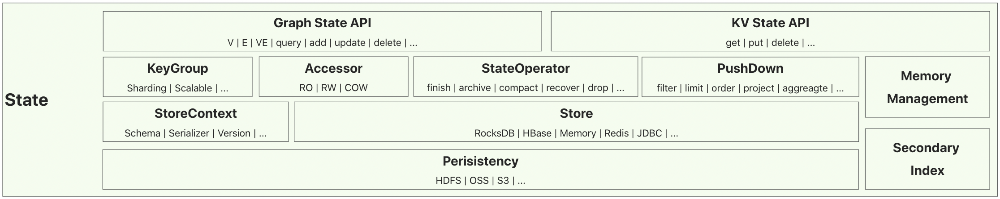
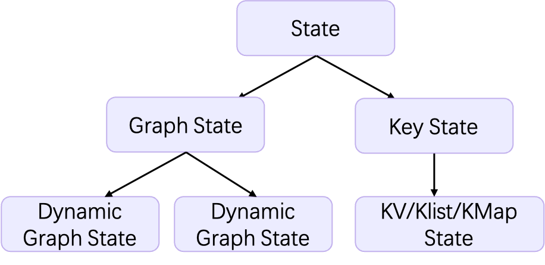

# State Management in Geaflow
In Geaflow, state refers to the intermediate calculation results of directly calculated nodes during graph and flow computation processes. This intermediate result may be organized source data information or some results generated by calculation. State management is responsible for the storage and access of this data as well as consistency assurance. As the central data hub of Geaflow, its functional model, performance, and reliability directly affect the entire use process of Geaflow, and it is the foundation of the entire system.

* In terms of the function, it supports Geaflow's real-time, multi-mode dynamic graph engine, including low-latency flow graph fusion computation, high-performance long-cycle graph simulation, large-scale dynamic graph exploration, and more.

* In terms of the computation model, the state management in Geaflow belongs to the combination of real-time model and graph model. It needs to overcome the processing mechanism with state in real-time computing, low latency, fault tolerance, and recovery mechanisms. Additionally, it also needs to solve the problems of complex data, high association, data-driven computation, and large intermediate results in graph models.

* In terms of performance, state management needs to solve the problem of achieving high throughput and low-latency storage and query capabilities under the premise of low cost, multiple scenarios, and large-scale data. This includes accessing data at the scale of trillions of edges, accessing larger attribute information, and random and traversal access with multiple pushdown semantics.

Therefore, we have the following architecture diagram, which is flexible and supports multiple pluggable components.

## State Architecture



* **State API**: Provides an API for key-value storage operations, such as get/put/delete. It also provides APIs for graph storage, such as V/E/VE, and operations for adding/updating/deleting vertices and edges.
* **State Execution Layer**: Implements data sharding and scalability through the design of KeyGroups. Accessor provides IO abstractions for different read/write strategies and data models. StateOperator abstracts the storage layer SPI, including operations like finish (flushing to disk), archive (checkpoint), compact (compression), recover (recovery), etc. Additionally, State provides various pushdown optimizations to accelerate IO access efficiency. Customized memory management and attribute-based secondary indexing are also provided for storage access optimization.
* **Store Layer**: GeaFlow supports multiple types of storage systems and encapsulates schemas, serializers, and data version information through StoreContext. This layer deals with how in-memory data structures are mapped to storage structures. Currently, storage engines include Redis, Rocksdb, and CStore (GeaFlow's proprietary storage system), which provide services through SPI. Depending on the characteristics of the storage engine, they may support different data models. For example, all data structures in Rocksdb need to be mapped to key-value pairs, while Redis inherently provides advanced data structures like lists/maps.
* **Persistence Layer**: GeaFlow State itself does not provide persistence capability. If a machine failure or disk corruption occurs, data loss may happen. Therefore, it relies on external components to provide persistence storage. These components are also pluggable and can support distributed file storage or object storage, such as HDFS/OSS/S3, etc.

## State Operational Process

The life of State shows below:


When failOver happens, it will recover from the last persistent data. The following is the detailed process.

### State Creation
The data processed by State is already divided into each partition dimension by the framework layer.

All State requests go through the StateFactory, and different States can be requested based on different Descriptors.

```java
buildGraphState(GraphStateDescriptor, Configuration):GraphState
buildKeyValueState(KeyValueStateDescriptor, Configuration):KeyValueState
buildKeyListState(KeyListDescriptor, Configuration):KeyListState
buildKeyMapState(KeyMapStateDescriptor, Configuration):KeyMapState
```

The Descriptor needs to declare basic information, including State name, Store type, etc. Different State names correspond to isolated States, and different States can be requested to represent different scenarios. For example, a Memory Store State can be requested as a temporary storage or calculation intermediate.

The choice of Store type is closely related to storage performance. For example, for Key State, if the underlying Store supports the KMap method, it will directly use the functions of KMap, which can perform incremental subkey operations. If it does not support KMap, it will be converted to a KV-model State, and the entire Map will be operated on, which will greatly magnify the size of both read and write operations.

After creation, we also need to read and write to the State.

### State Read and Write
Depending on the different types of State requested as mentioned above, they have different ways of reading and writing, which will be discussed in the end of the document.

### State Persistency
In a computing task, if there is an exceptional circumstance such as a machine failure, the state data stored on the disk can be lost. To enable normal rollback, State also needs to consider the ability of persistence, so that the machine that is reassigned can retrieve the State data and continue computing.

In each computing task, users need to periodically do a checkpoint to persist the data and ensure the safety of the state data. This can be done after a batch of tasks is completed, or after the derivative task is completed. The timing of the checkpoint should be consistent with the source offset. Only when both the state checkpoint and source offset are saved, can it be considered that all state data of this job has been persisted.

### State Recovery

When an exception occurs, the framework layer will perform FailOver, and State will automatically roll back to the latest state. Depending on the choice of the persistence layer as mentioned above, State data will be retrieved and loaded from the corresponding distributed file storage or object storage.

# The Types of State

State can be roughly divided into Graph State and Key State, corresponding to different data structures and mapping to different storage models in the Store layer. For example, for the store type of Rocksdb, there will be different types of storage models such as KV and Graph.



## Graph State

Graph State can be further classified into StaticGraph and DynamicGraph, based on whether it is a dynamic graph or not.
The difference is that StaticGraph treats the entire graph as a complete one, and all operations are performed on the complete graph.
On the other hand, DynamicGraph considers the graph to be dynamic, consisting of slice graphs that form a complete graph.

### Static Graph State

StaticGraphState API is divided into several parts, including query, upsert, delete, and manage.

* query: Graph query, which allows users to flexibly query GraphState from multiple dimensions such as nodes, edges, nodes and outbound edges. It can be a random or global query, and different pushdown conditions can be added. The final return value can be an iterator or a list.

* upsert: Adding nodes or edges.

* delete: Deleting a certain node or ID.

* manage: Divided into operator and other operations. Operator is the data operation of the State, which can perform flushing persistence or recovery. Other operations include obtaining information such as summary and metrics.

### Dynamic Graph State

DynamicGraphState API is similar to StaticGraphState, but each node and edge is associated with a version number.

At the same time, Dynamic Graph State also adds version-related queries, which can obtain all versions or the latest version corresponding to certain nodes, and can obtain the specific values of each version.

## Key State

KeyState API is divided into several parts, including:

* KeyValueState
* KeyListState
* KeyMapState

Each corresponds to a different user-level data structure. Similar to GraphState, KeyState also provides the ability to query, upsert, delete, and manage, but the query does not provide complex query semantic information like GraphState. Different State data structures have differences in querying and storage. For example, KMap allows modification and querying of a single subkey, while KV modifies and queries the entire value.
