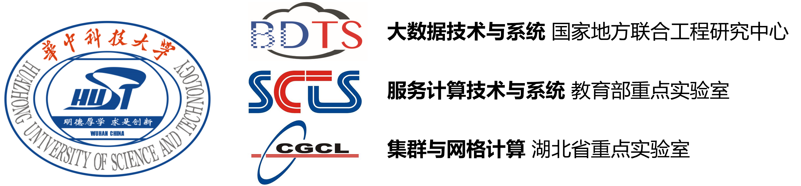

# Guide
Here is the documentation map to help users quickly learn and use geaFlow.

## Introduction
**GeaFlow** is the [**fastest**](https://ldbcouncil.org/benchmarks/snb-bi/) open-source OLAP graph database developed by Ant Group. It supports core capabilities such as trillion-level graph storage, hybrid graph and table processing, real-time graph computation, and interactive graph analysis. Currently, it is widely used in scenarios such as data warehousing acceleration, financial risk control, knowledge graph, and social networks.

For more information about GeaFlow: [GeaFlow Introduction](2.introduction.md)

For GeaFlow design paper: [GeaFlow: A Graph Extended and Accelerated Dataflow System](https://dl.acm.org/doi/abs/10.1145/3589771)

## Quick Start

Step 1: Package the JAR and submit the Quick Start task

1. Prepare Git、JDK8、Maven、Docker environment。
2. Download Code：`git clone https://github.com/apache/geaflow.git`
3. Build Project：`./build.sh --module=geaflow --output=package`
4. Test Job：`./bin/gql_submit.sh --gql geaflow/geaflow-examples/gql/loop_detection_file_demo.sql`

Step 2: Launch the console and experience submitting the Quick Start task through the console
5. Build console JAR and image (requires starting Docker)：`./build.sh --module=geaflow-console`
6. Start Console：`docker run -d --name geaflow-console -p 8888:8888 geaflow-console:0.1`

For more details：[Quick Start](3.quick_start/1.quick_start.md)。

## Development Manual

GeaFlow supports two sets of programming interfaces: DSL and API. You can develop streaming graph computing jobs using GeaFlow's SQL extension language SQL+ISO/GQL or use GeaFlow's high-level API programming interface to develop applications in Java.
* DSL application development: [DSL Application Development](5.application-development/2.dsl/1.overview.md)
* API application development: [API Application Development](5.application-development/1.api/1.overview.md)

## Real-time Capabilities

Compared with traditional stream processing engines such as Flink and Storm, which use tables as their data model for real-time processing, GeaFlow's graph-based data model has significant performance advantages when handling join relationship operations, especially complex multi-hops relationship operations like those involving 3 or more hops of join and complex loop searches.

## Partners
|                  |                  |                  |
|------------------|------------------|------------------|
|  |  |  |
|  |  |  |

