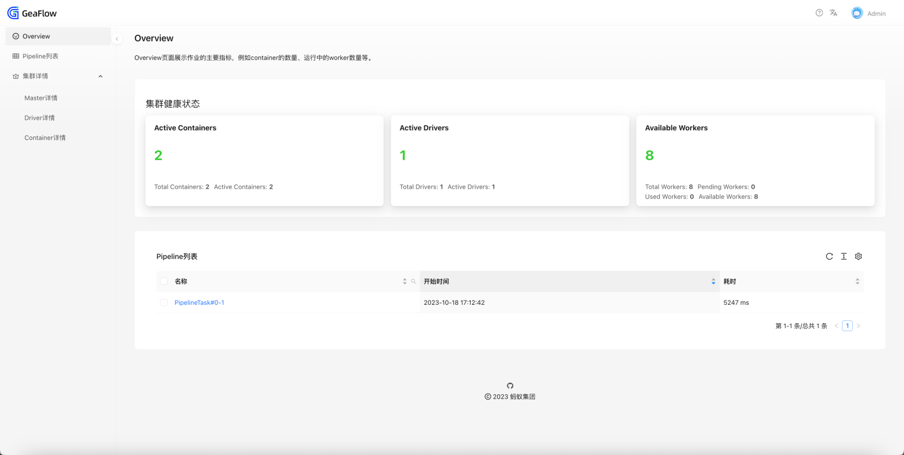

# Quick Start (Running in Local)
## Prepare
### Build Project
To compile GeaFlow, the following environments are required:
* JDK8
* Maven (recommended version 3.6.3 or higher)
* Git

Execute the following commands to compile the GeaFlow source code:
```shell
git clone https://github.com/TuGraph-family/tugraph-analytics.git
cd tugraph-analytics/
mvn clean package -DskipTests
```

## Running Job In Local

Here's how to run a real-time loop detection graph computing job in a local environment:

1. Start the stream graph job

After compiling the GeaFlow code, execute the following command in the project directory to start the real-time loop detection calculation job:

```shell
bin/gql_submit.sh --gql geaflow/geaflow-examples/gql/loop_detection.sql
```

If you want to use flame graph in the process for process analysis, you need to download and decompress async-profiler yourself.
And add the path to profiler.sh in the decompressed folder to the parameters. For example:

```shell
bin/gql_submit.sh --gql geaflow/geaflow-examples/gql/loop_detection.sql --profiler /tmp/async-profiler/profiler.sh
```

"loop_detection.sql" is a DSL calculation job for real-time querying all four-degree loops in a graph. Its contents are as follows:

```sql
set geaflow.dsl.window.size = 1;
set geaflow.dsl.ignore.exception = true;

CREATE GRAPH IF NOT EXISTS dy_modern (
  Vertex person (
    id bigint ID,
    name varchar
  ),
  Edge knows (
    srcId bigint SOURCE ID,
    targetId bigint DESTINATION ID,
    weight double
  )
) WITH (
  storeType='rocksdb',
  shardCount = 1
);

CREATE TABLE IF NOT EXISTS tbl_source (
  text varchar
) WITH (
  type='socket',
  `geaflow.dsl.column.separator` = '#',
  `geaflow.dsl.socket.host` = 'localhost',
  `geaflow.dsl.socket.port` = 9003
);

CREATE TABLE IF NOT EXISTS tbl_result (
  a_id bigint,
  b_id bigint,
  c_id bigint,
  d_id bigint,
  a1_id bigint
) WITH (
  type='socket',
    `geaflow.dsl.column.separator` = ',',
    `geaflow.dsl.socket.host` = 'localhost',
    `geaflow.dsl.socket.port` = 9003
);

USE GRAPH dy_modern;

INSERT INTO dy_modern.person(id, name)
SELECT
cast(trim(split_ex(t1, ',', 0)) as bigint),
split_ex(t1, ',', 1)
FROM (
  Select trim(substr(text, 2)) as t1
  FROM tbl_source
  WHERE substr(text, 1, 1) = '.'
);

INSERT INTO dy_modern.knows
SELECT DISTINCT
 cast(split_ex(t1, ',', 0) as bigint),
 cast(split_ex(t1, ',', 1) as bigint),
 cast(split_ex(t1, ',', 2) as double)
FROM (
  Select trim(substr(text, 2)) as t1
  FROM tbl_source
  WHERE substr(text, 1, 1) = '-'
);

INSERT INTO tbl_result
SELECT
  a_id,
  b_id,
  c_id,
  d_id,
  a1_id
FROM (
  MATCH (a:person) -[:knows]->(b:person) -[:knows]-> (c:person)
   -[:knows]-> (d:person) -> (a:person)
  RETURN a.id as a_id, b.id as b_id, c.id as c_id, d.id as d_id, a.id as a1_id
);
```
This DSL reads real-time data from the socket service on port 9003, constructs a graph in real-time, calculates all 4-degree loops in the graph, outputs the IDs of the vertex on the loop to the socket service on port 9003, and displays them on the socket console.

2. Start SocketServer

Run the following command to start the socket server program:
```shell
bin/socket.sh 
```
After the socket service is started, the following information is displayed on the console:


3. Input data

The input data is as follows: the "." in front of the data represents a point data, and the "-" represents an edge data (start, end, and weight).

```
. 1,jim
. 2,kate
. 3,lily
. 4,lucy
. 5,brown
. 6,jack
. 7,jackson
- 1,2,0.2
- 2,3,0.3
- 3,4,0.2
- 4,1,0.1
- 4,5,0.1
- 5,1,0.2
- 5,6,0.1
- 6,7,0.1
```
We can see the calculated loop data displayed on the socket console:


You can also continue to enter new point edge data to view the latest calculation results, such as entering the following data:

```
- 6,3,0.1
```
We can see that the new loop 3-4-5-6-3 is checked out:


4. Access the dashboard page

The local mode will use the local 8090 and 8088 ports and comes with a dashboard page.

Visit *http://localhost:8090* in the browser to access the front-end page.


For more dashboard related content, please refer to the documentation:
[Dashboard](../dashboard.md)

## Running in GeaFlow Console
GeaFlow Console is a graph computing research and development platform provided by GeaFlow. In this document, we will introduce how to launch the GeaFlow Console platform in a Docker container and submit graph computing jobs. 
Document address: [Running in Docker](4.quick_start_docker.md)

## Running with GeaFlow Kubernetes Operator
Geaflow Kubernetes Operator is a deployment tool that can quickly deploy Geaflow applications to kubernetes clusters.
We will introduce how to install geaflow-kubernetes-operator through Helm and quickly submit 
geaflow jobs through yaml files, and in addition, how to visit the operator's dashboard page to 
view the job details in the cluster.
Document address: [Running By kubernetes operator](../quick_start_operator.md)

## Visualization of flow graph computation jobs using G6VP

G6VP is an extensible visual analysis platform, including data source management, composition, personalized configuration of graphic elements, visual analysis and other functional modules. Using G6VP, it is easy to visualize the results of Geaflow calculations. Document address: [Document](../visualization/collaborate_with_g6vp.md)