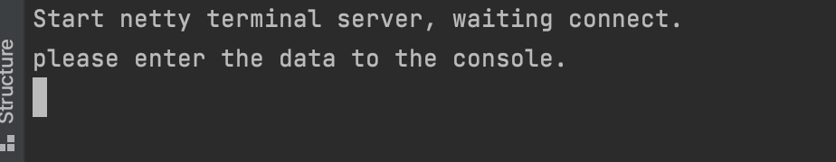

# Quick Start (Running in Local)
## Prepare
### Build Project
To compile GeaFlow, the following environments are required:
* JDK8
* Maven (recommended version 3.6.3 or higher)
* Git

Execute the following commands to compile the GeaFlow source code:
```shell
git clone https://github.com/apache/geaflow.git geaflow
cd geaflow/
./build.sh --module=geaflow --output=package
```

## Running Job In Local
Here's how to run a real-time loop detection graph computing job in a local environment:

### Demo1 Read data from local file

1. Directly execute the script:
```shell
bin/gql_submit.sh --gql geaflow/geaflow-examples/gql/loop_detection_file_demo.sql
```

"loop_detection.sql" is a DSL calculation job for real-time querying all four-degree loops in a graph. Its contents are as follows:
```sql
set geaflow.dsl.window.size = 1;
set geaflow.dsl.ignore.exception = true;

CREATE GRAPH IF NOT EXISTS dy_modern (
  Vertex person (
    id bigint ID,
    name varchar
  ),
  Edge knows (
    srcId bigint SOURCE ID,
    targetId bigint DESTINATION ID,
    weight double
  )
) WITH (
  storeType='rocksdb',
  shardCount = 1
);

CREATE TABLE IF NOT EXISTS tbl_source (
  text varchar
) WITH (
  type='file',
  `geaflow.dsl.file.path` = 'resource:///demo/demo_job_data.txt',
  `geaflow.dsl.column.separator`='|'
);

CREATE TABLE IF NOT EXISTS tbl_result (
  a_id bigint,
  b_id bigint,
  c_id bigint,
  d_id bigint,
  a1_id bigint
) WITH (
  type='file',
  `geaflow.dsl.file.path` = '/tmp/geaflow/demo_job_result'
);

USE GRAPH dy_modern;

INSERT INTO dy_modern.person(id, name)
  SELECT
  cast(trim(split_ex(t1, ',', 0)) as bigint),
  split_ex(trim(t1), ',', 1)
  FROM (
    Select trim(substr(text, 2)) as t1
    FROM tbl_source
    WHERE substr(text, 1, 1) = '.'
  );

INSERT INTO dy_modern.knows
  SELECT
  cast(split_ex(t1, ',', 0) as bigint),
  cast(split_ex(t1, ',', 1) as bigint),
  cast(split_ex(t1, ',', 2) as double)
  FROM (
    Select trim(substr(text, 2)) as t1
    FROM tbl_source
    WHERE substr(text, 1, 1) = '-'
  );

INSERT INTO tbl_result
  SELECT DISTINCT
  a_id,
  b_id,
  c_id,
  d_id,
  a1_id
  FROM (
  MATCH (a:person) -[:knows]->(b:person) -[:knows]-> (c:person)
  -[:knows]-> (d:person) -> (a:person)
  RETURN a.id as a_id, b.id as b_id, c.id as c_id, d.id as d_id, a.id as a1_id
  );
```

This DSL reads real-time data from the **demo_job_data.txt** file in the project resources, constructs a graph, calculates all 
4-degree loops in the graph, outputs the IDs of the vertex on the loop to the `/tmp/geaflow/demo_job_result` 
directory. Users can also set the parameter `geaflow.dsl.file.path` to modify the output path.

2. the output result is:
```
2,3,4,1,2
4,1,2,3,4
3,4,1,2,3
1,2,3,4,1
```

### Demo2 Read data from socket interactively

Users can also input data on the command console and build graphs in real time.
1. Execute the script:

```shell
bin/gql_submit.sh --gql geaflow/geaflow-examples/gql/loop_detection_socket_demo.sql
```

The main difference of "loop_detection_socket_demo.sql" is that the source table is read from socket data:
```sql
CREATE TABLE IF NOT EXISTS tbl_source (
  text varchar
) WITH (
  type='socket',
  `geaflow.dsl.column.separator` = '#',
  `geaflow.dsl.socket.host` = 'localhost',
  `geaflow.dsl.socket.port` = 9003
);

CREATE TABLE IF NOT EXISTS tbl_result (
  a_id bigint,
  b_id bigint,
  c_id bigint,
  d_id bigint,
  a1_id bigint
) WITH (
  type='socket',
    `geaflow.dsl.column.separator` = ',',
    `geaflow.dsl.socket.host` = 'localhost',
    `geaflow.dsl.socket.port` = 9003
);
```

This DSL reads real-time data from the socket service on port 9003, constructs a graph in real-time, calculates all 4-degree loops in the graph, outputs the IDs of the vertex on the loop to the socket service on port 9003, and displays them on the socket console.

2. Start SocketServer

Run the following command to start the socket server program:

```shell
bin/socket.sh
```

After the socket service is started, the following information is displayed on the console:



3. Input data

The input data is as follows: the "." in front of the data represents a point data, and the "-" represents an edge data (start, end, and weight).

```
. 1,jim
. 2,kate
. 3,lily
. 4,lucy
. 5,brown
. 6,jack
. 7,jackson
- 1,2,0.2
- 2,3,0.3
- 3,4,0.2
- 4,1,0.1
- 4,5,0.1
- 5,1,0.2
- 5,6,0.1
- 6,7,0.1
```

We can see the calculated loop data displayed on the socket console:


You can also continue to enter new point edge data to view the latest calculation results, such as entering the following data:

```
- 6,3,0.1
```
We can see that the new loop 3-4-5-6-3 is checked out:


4. Access the dashboard page

The local mode will use the local 8090 and 8088 ports and comes with a dashboard page.

Visit http://localhost:8090 in the browser to access the front-end page.


If the port is occupied, the `gql_submit.sh` will choose a larger available port number. 
Please check the console output for the following log to find the port being used.

```
View dashboard via http://localhost:${master_port}.
``` 

For more dashboard related content, please refer to the documentation:
[Dashboard](../7.deploy/3.dashboard.md)

### Demo3 Using SQL for Graph Queries

1. Run the shell to submit the pre-edited demo GQL:

```shell
bin/gql_submit.sh --gql geaflow/geaflow-examples/gql/sql_join_to_graph_demo.sql
```

Here, `sql_join_to_graph_demo.sql` is an SQL Join query in a simulated streaming graph. Its key content is as follows:

```sql
USE GRAPH dy_modern;

select u.name, friend.name
from person u, knows e, person friend
where u.id = e.srcId and e.targetId = friend.id
;
```

This DSL reads node and edge data from the **demo_job_data.txt** resource file within the project to construct the graph.

Then, it performs a join query on nodes and edges of the graph `dy_modern`. The engine automatically translates the join semantics into a graph query.

2. Output Results

You can print the contents of the result file by running the following command:

```shell
cat /tmp/geaflow/sql_join_to_graph_demo_result/partition_0  
```

The query results are written to `/tmp/geaflow/sql_join_to_graph_demo_result` by default. Users can also customize the output path by modifying the `geaflow.dsl.file.path` parameter.

```
jim,jim
kate,kate
lily,lily
lucy,lucy
jim,jim
lucy,lucy
lucy,lucy
jack,jack
``` 

For more information on SQL graph queries, please refer to the documentation:
[Doc](./4.quick_start_sql_to_graph.md)


## Running in GeaFlow Console
GeaFlow Console is a graph computing research and development platform provided by GeaFlow. In this document, we will introduce how to launch the GeaFlow Console platform in a Docker container and submit graph computing jobs.
Document address: [Running in Docker](2.quick_start_docker.md)

## Running with GeaFlow Kubernetes Operator
Geaflow Kubernetes Operator is a deployment tool that can quickly deploy Geaflow applications to kubernetes clusters.
We will introduce how to install geaflow-kubernetes-operator through Helm and quickly submit
geaflow jobs through yaml files, and in addition, how to visit the operator's dashboard page to
view the job details in the cluster.
Document address: [Running By kubernetes operator](../7.deploy/2.quick_start_operator.md)

## Visualization of flow graph computation jobs using G6VP

G6VP is an extensible visual analysis platform, including data source management, composition, personalized configuration of graphic elements, visual analysis and other functional modules. Using G6VP, it is easy to visualize the results of Geaflow calculations. Document address: [Document](../7.deploy/4.collaborate_with_g6vp.md)
