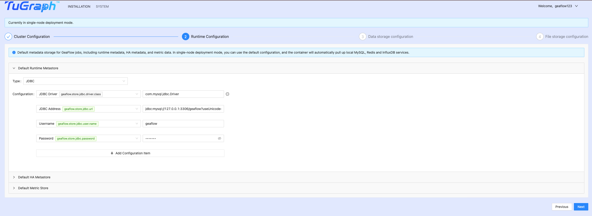

# Quick Start(Running in GeaFlow Console)
## Prepare
1. Install Docker and adjust Docker service resource settings (Dashboard-Settings-Resources), then start Docker service:


2. Pull GeaFlow Image

Run the following command to pull the remote geaflow console image:

For x86 architecture pull x86 image:
```shell
docker pull tugraph/geaflow-console:<version>
```

If it is arm architecture, pull the arm image:
```shell
docker pull tugraph/geaflow-console-arm:<version>
```

If the pull fails due to network problems, you can also run the following command to directly build the local image 
(before building the image, start the docker container, and the build the script to build the image of the 
corresponding type based on the machine type):

```shell
git clone https://github.com/apache/geaflow.git geaflow
cd geaflow/
./build.sh --module=geaflow-console

```

The entire compilation process may take some time, please be patient. After the image compilation is successful, use 
the following command to view the image.
```shell
docker images
```
The name of the remotely pulled image is: **tugraph/geaflow-console:0.1**(x86 architecture) or **tugraph/ 
geaflow-console-arm :0.1**(arm architecture)
. The name of the local image is **geaflow-console:0.1**. You only need to select one method to build the image.

## Running Job in Docker
Below is an introduction on running the flow graph job mentioned in Local Mode Execution inside a docker container.


1. Start the GeaFlow Console service locally.


* For the Remote Image:

**x86 architecture**
```shell
docker run -d --name geaflow-console -p 8888:8888 tugraph/geaflow-console:0.1
```

**arm Architecture**
```
docker run -d --name geaflow-console -p 8888:8888 tugraph/geaflow-console-arm:0.1
```

* For the Local Image
```shell
docker run -d --name geaflow-console -p 8888:8888 geaflow-console:0.1
```

**Note**: The tag name of the remote image is different from that of the local build image, and the startup 
command is different.

Enter the container and wait for the Java process to start. After that, access [localhost:8888](http://localhost:8888) to enter the GeaFlow Console platform page.

```shell
> docker exec -it geaflow-console tailf /tmp/logs/geaflow/app-default.log

# wait the logs below and open url http://localhost:8888
GeaflowApplication:61   - Started GeaflowApplication in 11.437 seconds (JVM running for 13.475)
```

2. Register Account

The first registered user will be set as the default administrator. Log in as an administrator and use the one-click installation feature to start system initialization.


3. Config GeaFlow

GeaFlow requires configuration of runtime environment settings during its initial run, including cluster settings, runtime settings, data storage settings, and file storage settings.

3.1 Cluster Config

Click "Next" and use the default Container mode, which is local container mode.


3.2 Runtime Config

For local runtime mode, you can skip this step and use the default system settings by clicking "Next" directly.



3.3 Storage Config

Select the graph data storage location. For local mode, select LOCAL and enter a local directory. If you don't need to fill it out, click "Next" directly.


3.4 File Config

This configuration is for the persistent storage of GeaFlow engine JAR and user JAR files, such as in HDFS. For local runtime mode, it is the same as the data storage configuration, so select LOCAL mode and enter a local directory. If you don't need to fill it out, click "Next" directly.


After completing the configuration, click the one-click installation button. After successful installation, the administrator will automatically switch to the default instance under the personal tenant and can directly create and publish graph computing tasks.


4. Submit compute job

Go to the `DEVELOPMENT` page, Console has automatically created a demo job after starting (The loop detection job in 
[Local Demo](1.quick_start.md)), shown as follows.


Click the `"Publish"` button to publish the job.


Then go to the Job Management page and click the `"Submit"` button to submit the task for execution.


5. After running, you can find the result file in the output path in docker (the default path is: 
   `/tmp/geaflow/demo_job_result`)
```
2,3,4,1,2
4,1,2,3,4
3,4,1,2,3
1,2,3,4,1
```

## K8S Deployment
GeaFlow supports K8S deployment. For details about the deployment mode, see the document: [K8S Deployment](../7.deploy/1.install_guide.md).
