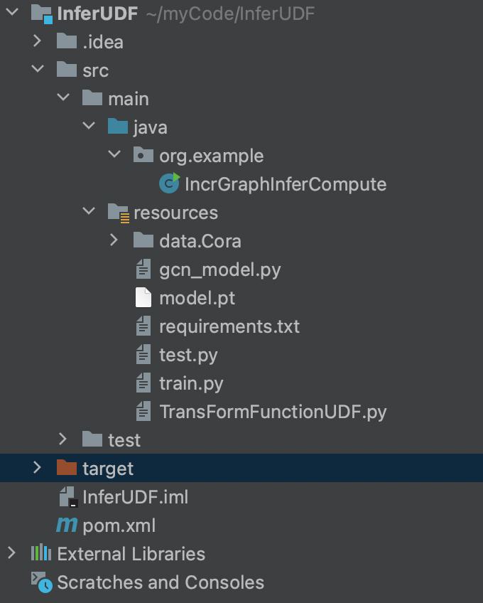
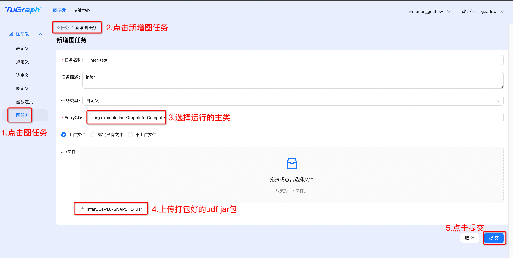
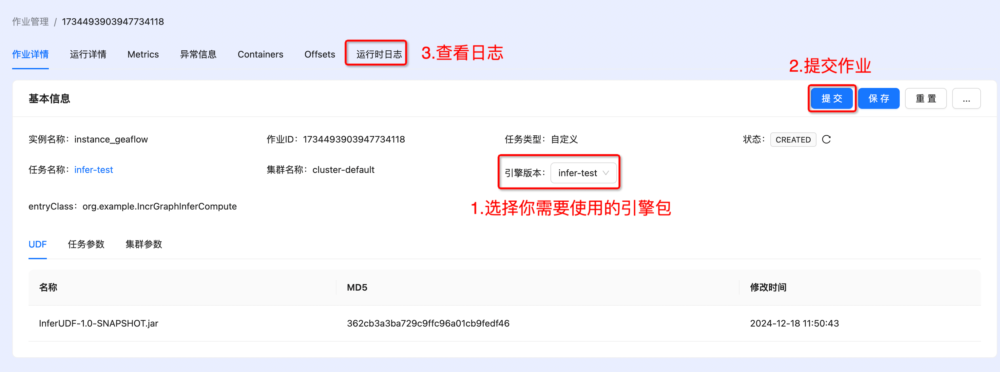

# Quick Start (Running near line inference with UDF)
GeaFlow provides near-line model inference capabilities. Users only need to provide the Python file for model calling.
There is no need to convert the model into an onnx model, which avoids the performance degradation caused by model conversion.
At the same time, it reduces the deployment difficulty for algorithm developers. This example shows how to use GeaFlow
to call the AI model for inference and obtain model inference results during the near-line computing process.
The AI model in this example is a graph node classification model trained on Cora, a commonly used data set for GNN.
GeaFlow reads the node id to construct a vertex, and then in the process of near-line calculation,
Send the node ID to the python model inference process, call the AI model inference to obtain the node prediction type
and the corresponding probability, and then return the result to the GeaFlow java process.
This example shows how to perform model reasoning through GeaFlow. In real scenarios, the logic of near-line
computing may be more complex. Model reasoning is only a step in near-line computing.
After obtaining the model results, complex iterative calculations can be performed, and the inference model can even
be called multiple times, which can be expanded as needed.
## Prepare

### 1. Compile GeaFlow Project

* Reference [1.quick_start.md](./1.quick_start.md)

## 2. Install docker
* Reference [2.quick_start_docker.md](./2.quick_start_docker.md)

## 3. Prepare udf
* [udf resources](../../../../data/InferUDF.zip)

* Structure of udf project


* IncrGraphInferCompute implements IncVertexCentricCompute api.
In this method, the AI model is called for inference and the inference results are obtained.
```java
package org.example;

import com.antgroup.geaflow.api.function.io.SinkFunction;
import com.antgroup.geaflow.api.graph.compute.IncVertexCentricCompute;
import com.antgroup.geaflow.api.graph.function.vc.IncVertexCentricComputeFunction;
import com.antgroup.geaflow.api.graph.function.vc.VertexCentricCombineFunction;
import com.antgroup.geaflow.api.graph.function.vc.base.IncGraphInferContext;
import com.antgroup.geaflow.api.pdata.stream.window.PWindowSource;
import com.antgroup.geaflow.api.window.impl.SizeTumblingWindow;
import com.antgroup.geaflow.common.config.Configuration;
import com.antgroup.geaflow.common.config.keys.ExecutionConfigKeys;
import com.antgroup.geaflow.common.config.keys.FrameworkConfigKeys;
import com.antgroup.geaflow.common.type.primitive.IntegerType;
import com.antgroup.geaflow.env.Environment;
import com.antgroup.geaflow.env.EnvironmentFactory;
import com.antgroup.geaflow.example.function.FileSink;
import com.antgroup.geaflow.example.function.FileSource;
import com.antgroup.geaflow.file.FileConfigKeys;
import com.antgroup.geaflow.model.graph.edge.IEdge;
import com.antgroup.geaflow.model.graph.edge.impl.ValueEdge;
import com.antgroup.geaflow.model.graph.meta.GraphMetaType;
import com.antgroup.geaflow.model.graph.vertex.IVertex;
import com.antgroup.geaflow.model.graph.vertex.impl.ValueVertex;
import com.antgroup.geaflow.pipeline.IPipelineResult;
import com.antgroup.geaflow.pipeline.Pipeline;
import com.antgroup.geaflow.pipeline.PipelineFactory;
import com.antgroup.geaflow.pipeline.task.IPipelineTaskContext;
import com.antgroup.geaflow.pipeline.task.PipelineTask;
import com.antgroup.geaflow.view.GraphViewBuilder;
import com.antgroup.geaflow.view.IViewDesc.BackendType;
import com.antgroup.geaflow.view.graph.GraphViewDesc;
import com.antgroup.geaflow.view.graph.PGraphView;
import com.antgroup.geaflow.view.graph.PIncGraphView;
import org.slf4j.Logger;
import org.slf4j.LoggerFactory;

import java.util.Arrays;
import java.util.Collections;
import java.util.HashMap;
import java.util.Iterator;
import java.util.List;
import java.util.Map;

public class IncrGraphInferCompute {

    private static final Logger LOGGER = LoggerFactory.getLogger(IncrGraphInferCompute.class);

    // Set result dir.
    public static final String RESULT_FILE_PATH = "/tmp/geaflow";
    public static final String INFER_PYTHON_CLASS_NAME = "myTransFormFunction";

    public static void main(String[] args) {
        Map<String, String> config = new HashMap<>();
        config.put(ExecutionConfigKeys.JOB_APP_NAME.getKey(), IncrGraphInferCompute.class.getSimpleName());
        config.put(FileConfigKeys.ROOT.getKey(), "/tmp/");
        Environment environment = EnvironmentFactory.onLocalEnvironment(args);
        Configuration configuration = environment.getEnvironmentContext().getConfig();

        configuration.putAll(config);
        IPipelineResult result = submit(environment);
        result.get();
    }

    public static IPipelineResult<?> submit(Environment environment) {
        final Pipeline pipeline = PipelineFactory.buildPipeline(environment);
        Configuration envConfig = environment.getEnvironmentContext().getConfig();

        envConfig.put(FrameworkConfigKeys.INFER_ENV_ENABLE, "true");
        envConfig.put(FrameworkConfigKeys.INFER_ENV_USER_TRANSFORM_CLASSNAME, INFER_PYTHON_CLASS_NAME);
        envConfig.put(FrameworkConfigKeys.INFER_ENV_INIT_TIMEOUT_SEC, "1800");
        // Replace according to your hardware.
        envConfig.put(FrameworkConfigKeys.INFER_ENV_CONDA_URL, "https://repo.anaconda.com/miniconda/Miniconda3-latest-Linux-aarch64.sh");
        envConfig.put(FileSink.OUTPUT_DIR, RESULT_FILE_PATH);

        //build graph view
        final String graphName = "graph_view_name";
        GraphViewDesc graphViewDesc = GraphViewBuilder.createGraphView(graphName)
                .withShardNum(1)
                .withBackend(BackendType.RocksDB)
                .withSchema(new GraphMetaType(IntegerType.INSTANCE, ValueVertex.class, Integer.class,
                        ValueEdge.class, IntegerType.class))
                .build();
        pipeline.withView(graphName, graphViewDesc);
        pipeline.submit(new PipelineTask() {
            @Override
            public void execute(IPipelineTaskContext pipelineTaskCxt) {
                Configuration conf = pipelineTaskCxt.getConfig();
                PWindowSource<IVertex<Integer, List<Object>>> vertices =
                        // extract vertex from edge file
                        pipelineTaskCxt.buildSource(new FileSource<>("data/Cora/node_ids.txt",
                                line -> {
                                    String[] fields = line.split(",");
                                    IVertex<Integer, List<Object>> vertex = new ValueVertex<>(
                                            Integer.valueOf(fields[0]), null);
                                    return Arrays.asList(vertex);
                                }), SizeTumblingWindow.of(10000))
                                .withParallelism(1);

                PWindowSource<IEdge<Integer, Integer>> edges =
                        pipelineTaskCxt.buildSource(new com.antgroup.geaflow.example.function.FileSource<>("data/Cora/node_ids.txt",
                                line -> {
                                    String[] fields = line.split(",");
                                    IEdge<Integer, Integer> edge = new ValueEdge<>(Integer.valueOf(fields[0]),
                                            Integer.valueOf(fields[0]), 1);
                                    return Collections.singletonList(edge);
                                }), SizeTumblingWindow.of(5000));


                PGraphView<Integer, List<Object>, Integer> fundGraphView =
                        pipelineTaskCxt.getGraphView(graphName);

                PIncGraphView<Integer, List<Object>, Integer> incGraphView =
                        fundGraphView.appendGraph(vertices, edges);
                int mapParallelism = 1;
                int sinkParallelism = 1;
                SinkFunction<String> sink = new FileSink<>();
                incGraphView.incrementalCompute(new IncGraphAlgorithms(1))
                        .getVertices()
                        .map(v -> String.format("%s,%s", v.getId(), v.getValue()))
                        .withParallelism(mapParallelism)
                        .sink(sink)
                        .withParallelism(sinkParallelism);
            }
        });

        return pipeline.execute();
    }

    public static class IncGraphAlgorithms extends IncVertexCentricCompute<Integer, List<Object>,
            Integer, Integer> {

        public IncGraphAlgorithms(long iterations) {
            super(iterations);
        }

        @Override
        public IncVertexCentricComputeFunction<Integer, List<Object>, Integer, Integer> getIncComputeFunction() {
            return new InferVertexCentricComputeFunction();
        }

        @Override
        public VertexCentricCombineFunction<Integer> getCombineFunction() {
            return null;
        }

    }

    public static class InferVertexCentricComputeFunction implements
            IncVertexCentricComputeFunction<Integer, List<Object>, Integer, Integer> {

        private IncGraphComputeContext<Integer, List<Object>, Integer, Integer> graphContext;
        private IncGraphInferContext<List<Object>> graphInferContext;

        @Override
        public void init(IncGraphComputeContext<Integer, List<Object>, Integer, Integer> graphContext) {
            this.graphContext = graphContext;
            this.graphInferContext = (IncGraphInferContext<List<Object>>) graphContext;
        }

        @Override
        public void evolve(Integer vertexId,
                           TemporaryGraph<Integer, List<Object>, Integer> temporaryGraph) {
            long lastVersionId = 0L;
            IVertex<Integer, List<Object>> vertex = temporaryGraph.getVertex();
            HistoricalGraph<Integer, List<Object>, Integer> historicalGraph = graphContext
                    .getHistoricalGraph();
            if (vertex == null) {
                vertex = historicalGraph.getSnapShot(lastVersionId).vertex().get();
            }

            if (vertex != null) {
                // Call the AI model to predict the class to which the node belongs and the corresponding probability.  
                List<Object> result = this.graphInferContext.infer(vertexId);
                // Sink result.
                graphContext.collect(vertex.withValue(result));
                LOGGER.info("node-{} max prob: {}, predict class: {}", vertexId, result.get(0), result.get(1));
            }
        }

        @Override
        public void compute(Integer vertexId, Iterator<Integer> messageIterator) {
        }

        @Override
        public void finish(Integer vertexId, MutableGraph<Integer, List<Object>, Integer> mutableGraph) {
        }
    }

}
```
* The AI inference model(Classify graph nodes in [Cora dataset](https://linqs-data.soe.ucsc.edu/public/lbc/cora.tgz)) is defined in the TransFormFunctionUDF.py file, as follows:
```python
import abc
from typing import Union, List
import torch
import ast
from torch_geometric.datasets import Planetoid
from gcn_model import GCN

def safe_int(number):
    try:
        return int(number)
    except:
        return 0


def safe_float(number):
    try:
        return float(number)
    except:
        return 0.0


class TransFormFunction(abc.ABC):
    def __init__(self, input_size):
        self.input_size = input_size

    @abc.abstractmethod
    def load_model(self, *args):
        pass

    @abc.abstractmethod
    def transform_pre(self, *args) -> Union[torch.Tensor, List[torch.Tensor]]:
        pass

    @abc.abstractmethod
    def transform_post(self, *args):
        pass


# User class need to inherit TransFormFunction.
class myTransFormFunction(TransFormFunction):
    def __init__(self):
        super().__init__(1)
        print("init myTransFormFunction")
        self.device = torch.device('cuda' if torch.cuda.is_available() else 'cpu')
        self.dataset = Planetoid(root='./data', name='Cora')
        self.data = self.dataset[0].to(self.device)
        self.load_model('model.pt')

    def load_model(self, model_path: str):
        model = GCN(self.dataset.num_node_features, self.dataset.num_classes).to(self.device)
        model.load_state_dict(torch.load(model_path))
        model.eval()
        out = model(self.data)
        self.prob = torch.exp(out)

    # Define model infer logic.
    def transform_pre(self, *args):
        node_prob = self.prob[args[0]]
        max_prob, max_class = node_prob.max(dim=0)
        return [max_prob.item(), max_class.item()], [max_prob.item(), max_class.item()]

    def transform_post(self, res):
        return res

```
* Set the python dependencies required for model inference in requirements.txt, as follows:
```text
--index-url https://pypi.tuna.tsinghua.edu.cn/simple
torch
torchvision
torchaudio
torch-scatter
torch-sparse
torch-cluster
torch-spline-conv
torch-geometric
```
* model.pt is the trained model file that needs to be used.
* The corresponding engine dependencies need to be introduced in pom.xml, 
and the version needs to be modified to the version of the GeaFlow engine you are using.
```xml
<?xml version="1.0" encoding="UTF-8"?>
<project xmlns="http://maven.apache.org/POM/4.0.0"
         xmlns:xsi="http://www.w3.org/2001/XMLSchema-instance"
         xsi:schemaLocation="http://maven.apache.org/POM/4.0.0 http://maven.apache.org/xsd/maven-4.0.0.xsd">
    <modelVersion>4.0.0</modelVersion>

    <groupId>org.example</groupId>
    <artifactId>InferUDF</artifactId>
    <version>1.0-SNAPSHOT</version>
    <packaging>jar</packaging>

    <properties>
        <maven.compiler.source>8</maven.compiler.source>
        <maven.compiler.target>8</maven.compiler.target>
        <project.build.sourceEncoding>UTF-8</project.build.sourceEncoding>
    </properties>
    <dependencies>
        <dependency>
            <groupId>org.apache.geaflow</groupId>
            <artifactId>geaflow-api</artifactId>
            <version>0.5.0-SNAPSHOT</version>
        </dependency>

        <dependency>
            <groupId>org.apache.geaflow</groupId>
            <artifactId>geaflow-pdata</artifactId>
            <version>0.5.0-SNAPSHOT</version>
        </dependency>

        <dependency>
            <groupId>org.apache.geaflow</groupId>
            <artifactId>geaflow-cluster</artifactId>
            <version>0.5.0-SNAPSHOT</version>
        </dependency>

        <dependency>
            <groupId>org.apache.geaflow</groupId>
            <artifactId>geaflow-on-local</artifactId>
            <version>0.5.0-SNAPSHOT</version>
        </dependency>

        <dependency>
            <groupId>org.apache.geaflow</groupId>
            <artifactId>geaflow-pipeline</artifactId>
            <version>0.5.0-SNAPSHOT</version>
        </dependency>

        <dependency>
            <groupId>org.apache.geaflow</groupId>
            <artifactId>geaflow-infer</artifactId>
            <version>0.5.0-SNAPSHOT</version>
        </dependency>

        <dependency>
            <groupId>org.apache.geaflow</groupId>
            <artifactId>geaflow-operator</artifactId>
            <version>0.5.0-SNAPSHOT</version>
        </dependency>

        <dependency>
            <groupId>org.apache.geaflow</groupId>
            <artifactId>geaflow-api</artifactId>
            <version>0.5.0-SNAPSHOT</version>
        </dependency>

        <dependency>
            <groupId>org.apache.geaflow</groupId>
            <artifactId>geaflow-common</artifactId>
            <version>0.5.0-SNAPSHOT</version>
        </dependency>

        <dependency>
            <groupId>org.apache.geaflow</groupId>
            <artifactId>geaflow-examples</artifactId>
            <version>0.5.0-SNAPSHOT</version>
        </dependency>
    </dependencies>
</project>
```
* Execute the command "mvn clean install", and you can get the compiled udf package in the target directory.
## 3. Run udf in console
* Create job
  
* Publish job
  
* Submit job
  
* View results. The results are saved in the path /tmp/geaflow/result_0
  

