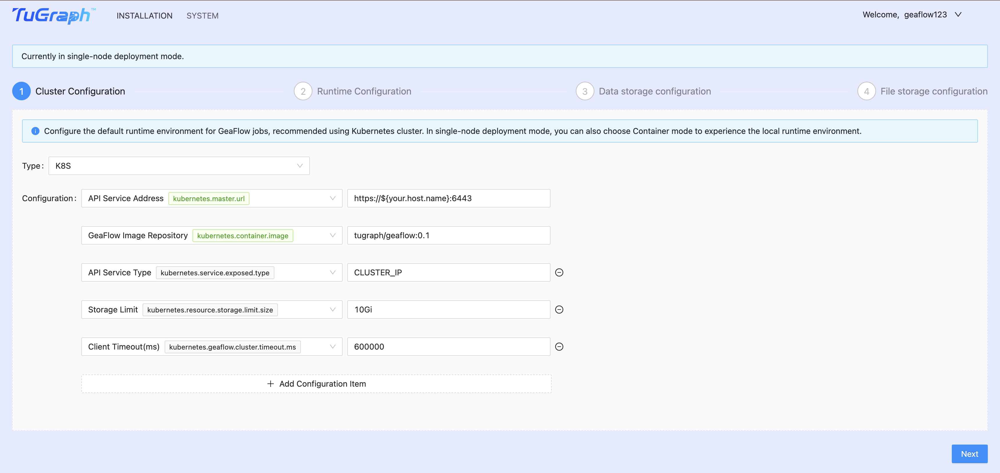
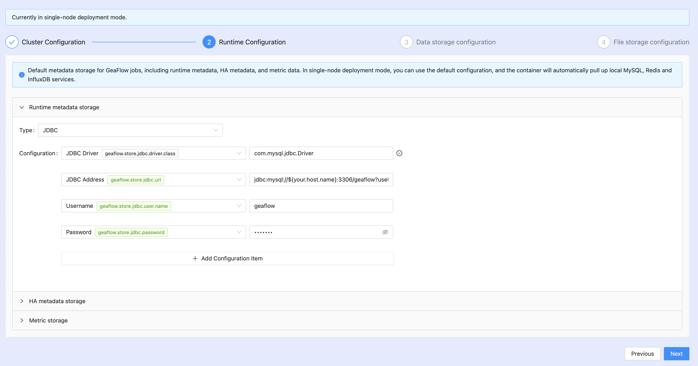
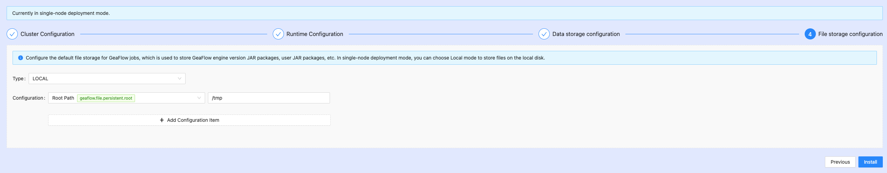
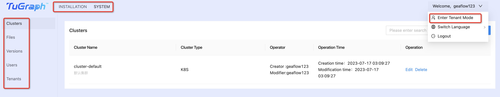
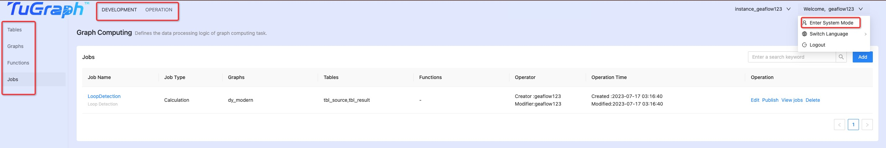
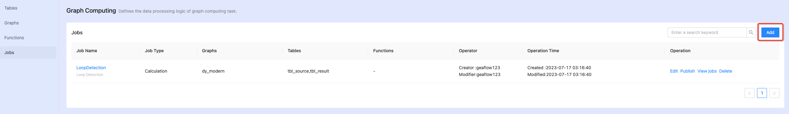
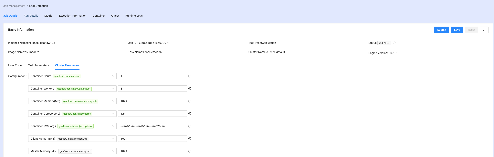

# Kubernetes Cluster Deployment
## Prepare K8S Environment

Here, we use minikube as an example to simulate a Kubernetes cluster on a single machine. If you already have a Kubernetes cluster set up, you may proceed directly to the next steps and skip this section. For instructions on installing minikube, refer to the [Installing Minikube](6.install_minikube.md) chapter.

Create a geaflow service account, otherwise the program has no permission to create new K8S
resources (only needed for the first time)
```shell
# Create a geaflow service account
kubectl create serviceaccount geaflow
kubectl create clusterrolebinding geaflow-role-binding --clusterrole=edit --serviceaccount=default:geaflow --namespace=default
```

Finally, in order to allow the containers inside Docker to access the Minikube API, it is necessary to proxy Minikube to ${your_local_ip}:8000, so that other containers can directly access Minikube through this port.

Do not to close the terminal process that the proxy belongs to. For subsequent operations, please start a new terminal.
```shell
# Create a proxy for port 8000
kubectl proxy --port=8000 --address='${your_local_ip}' --accept-hosts='^.*' &
```

## Build Images

Download GeaFlow source code, build GeaFlow engine image and GeaFlow Console image.

```shell
git clone https://github.com/apache/geaflow.git geaflow
cd geaflow/
bash ./build.sh --all
```

After the image compilation is successful, use the following command to view the images:
```shell
# check geaflow image
eval $(minikube docker-env)
docker images

# check geaflow-console image
eval $(minikube docker-env --unset)
docker images
```
The default GeaFlow platform image name is "geaflow-console:0.1", and the engine image name is "geaflow:0.1". After starting the platform image "geaflow-console:0.1", you can access the GeaFlow console through a web browser to create and submit GeaFlow jobs. The GeaFlow jobs are run based on the built engine image "geaflow:0.1" by default.

## Start Containers

Start the GeaFlow Console platform service locally, suitable for Minikube environment. (Replace ${your.host.name} with the public IP address of your machine.)

```shell
docker run -d --name geaflow-console -p 8888:8888 -p 3306:3306 -p 6379:6379 -p 8086:8086 -e geaflow.host=${your.host.name} geaflow-console:0.1
```

Start the external GeaFlow Console platform service, suitable for a real K8S cluster environment. (Replace ${your.host.name} with the internal IP address of your machine, for example 172.xx.xxx.xx; replace ${your.public.ip} with the external public IP address, so that GEAFlow Console can be accessed from the outside.)

```shell
docker run -d --name geaflow-console -p 8888:8888 -p 3306:3306 -p 6379:6379 -p 8086:8086 -e geaflow.host=${your.host.name} geaflow-console:0.1
```

The container starts in "local" mode by default, and local MySQL, Redis, and InfluxDB are launched by default.

```properties
# /opt/geaflow/config/application.properties
geaflow.deploy.mode=local
geaflow.host=127.0.0.1
geaflow.gateway.port=8888
geaflow.gateway.url=http://${geaflow.host}:${geaflow.gateway.port}

# Datasource
spring.datasource.driver-class-name=com.mysql.jdbc.Driver
spring.datasource.url=jdbc:mysql://${geaflow.host}:3306/geaflow?useUnicode=true&characterEncoding=utf8
spring.datasource.username=geaflow
spring.datasource.password=geaflow
```

Enter the container and wait for the GeaFlow web process to start. After that, access [localhost:8888](localhost:8888) to enter the GeaFlow Console platform page.

```shell
> docker exec -it geaflow-console tailf /tmp/logs/geaflow/app-default.log

# wait the logs below and open url http://localhost:8888
GeaflowApplication:61   - Started GeaflowApplication in 11.437 seconds (JVM running for 13.475)
```

If you want to start the container in "cluster" mode, you need to adjust the datasource configuration to point to an external data source and set a unified service URL for external access. The container supports environment variable injection of datasource configuration and service URL. For example:

```shell
docker run -d --name geaflow-console -p 8888:8888 \
-e geaflow.deploy.mode="cluster" \
-e geaflow.host=${your.host.name} \
-e geaflow.gateway.port=8888 \
-e geaflow.gateway.url=${your.geaflow.gateway.url} \
-e spring.datasource.url=${your.datasource.url} \
-e spring.datasource.username=${your.datasource.username} \
-e spring.datasource.password=${your.datasource.password} \
geaflow-console:1.0
```

If you want to modify the port number of the front-end Node process or Java process, you only need to set the environment variables "geaflow.gateway.port" and remap the port number. for example:
```shell
docker run -d --name geaflow-console -p 9999:9999 \
-e geaflow.gateway.port=9999 \
geaflow-console:1.0
```

## Register and Login
The first registered user will be set as the administrator by default. Log in as an administrator and use the "One-click Installation" function to start system initialization.


## System Initialization
When the administrator logs into the GeaFlow system for the first time, the one-click installation process will be triggered to prepare the system for initialization.

### Cluster Configuration
Configure the runtime cluster for GeaFlow jobs, and it is recommended to use Kubernetes. In local mode, the default proxy address is ${your.host.name}:8000. Please make sure that minikube has been started locally and the proxy address has been set. If you set the address of the K8S cluster, please ensure that the connectivity of the address is normal.



Add the following configuration for K8S cluster:
```
# Set storage limit to 10Gi
"kubernetes.resource.storage.limit.size":"10Gi"
# Configure service API to the K8S service address, usually on port 6443
"kubernetes.master.url":"https://${your.host.name}:6443"
# Find the configuration file '/etc/kubernetes/admin.conf' in the K8S cluster, and configure the following three fields from top to bottom
"kubernetes.ca.data":""
"kubernetes.cert.data":""
"kubernetes.cert.key":""
```

### Runtime Configuration
Configure the storage of runtime metadata for GeaFlow jobs. Runtime metadata includes information such as the job's Pipeline, Cycle, checkpoint, and exceptions. It is recommended to use MySQL.

Configure the storage of HA metadata for GeaFlow job runtime. HA metadata includes information such as Master, Driver, Container, and other main components. It is recommended to use Redis.

Configure the storage of metric data for GeaFlow job runtime, which is used for job metric monitoring. It is recommended to use InfluxDB.



In local mode, when the docker container starts, MySQL, Redis, and InfluxDB services will be automatically pulled up by default.

Add the following configuration for K8S cluster:
```
# Configure influshdb.token as a random value
"influxdb.token":"f5fb50a361f762a0af045c47d98f66e401f1b632b3133b3dc2680110262d1135"
```

### Data Storage Configuration
Configure the persistent storage of GeaFlow job, graph, and table data, and it is recommended to use HDFS. In local mode, the default is the disk inside the container.


### File Storage Configuration
Configure the persistent storage of GeaFlow engine JAR and user JAR files, and it is recommended to use HDFS. In local mode, the default is the disk inside the container.



After the installation is successful, **the administrator will automatically switch to the default instance under the default tenant**, and you can directly create and publish graph computation tasks at this time.

## Work Mode
GeaFlow console supports tenant isolation and supports system mode perspective and tenant mode perspective to use product features.

**Note:**
The user icon menu in the upper right corner of the page provides a quick mode switching entry.

### System Mode
When the user logs in as an administrator, they will enter the system mode. At this time, you can perform system operations such as one-click installation and system management.



In system mode, the administrator can manage information such as clusters, GeaFlow engine versions, files, users, tenants, etc.

### Tenant Mode
After normal user login, they will enter tenant mode. At this time, they can perform graph computing development and maintenance operations.



In tenant mode, users can create development resources such as instances, graphs, tables, and graph computing tasks. They can also publish graph computing tasks, submit graph computing jobs, and perform other related operations.

## Task Management
Add a graph computing task and describe the business logic of graph computing using SQL+GQL.



After creating a task, click on "publish" to enter the job operation and maintenance interface.

## Task Maintenance
Before submitting a job, you can also adjust the default task parameters and cluster parameters to facilitate adjustments to job behavior.



Access other tabs on the job details page to view information about job runtime, metrics, containers, exceptions, logs, and more.


