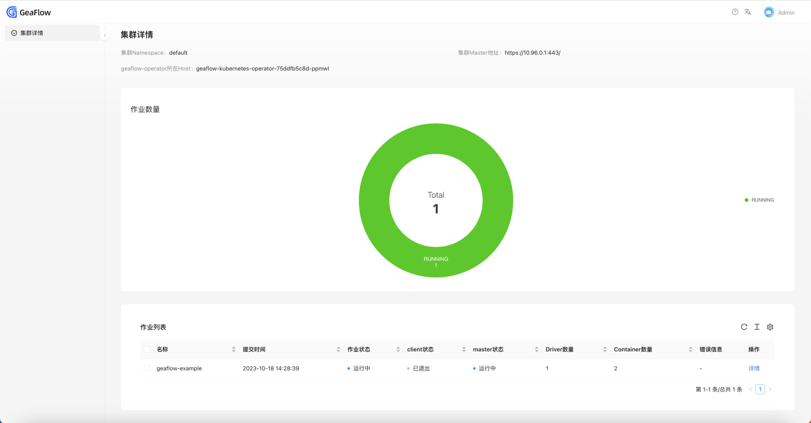

# Deploying Kubernetes Operator

## Prepare
1. Download and install Docker and Minikube. Refer to the documentation: [Installing Minikube](6.install_minikube.md).

2. Pull GeaFlow Image

Run the following command to pull the remote geaflow image:

```shell
docker pull tugraph/geaflow:0.6
```

If the pull fails due to network problems, you can also run the following command to directly build the local image
(before building the image, start the docker container):

```shell
git clone https://github.com/apache/geaflow.git geaflow
cd geaflow/
bash ./build.sh --module=geaflow
```


The entire compilation process may take some time, please be patient. After the image compilation is successful, use
the following command to view the image.
```shell
docker images
```
The name of the remotely pulled image is: **tugraph/geaflow:0.6**
. The name of the local image is **geaflow:0.1**. You only need to select one method to build the image.

## Install Geaflow Kubernetes Operator
Below is an introduction on installation of Geaflow Kubernetes Operator。

1. Download the code of GeaFlow。
```shell
git clone https://github.com/apache/geaflow.git geaflow
cd geaflow/
```
2. Build the image of Geaflow Kubernetes Operator
```shell
docker pull tugraph/geaflow-kubernetes-operator:0.6
```

If the pull fails due to network problems, you can also run the following command to directly build the local image
(before building the image, start the docker container):


```shell
cd geaflow/geaflow-kubernetes-operator/
bash ./build-operator.sh
```

Geaflow-kubernetes-operator need JDK11 or above version to 
build. The entire compilation process may take some time, please be patient. After the image compilation is successful, use
the following command to view the image.
```shell
docker images
```
The name of the remotely pulled image is: **tugraph/geaflow-kubernetes-operator:0.6**
. The name of the local image is **geaflow-kubernetes-operator:0.1**. You only need to select one 
method to build the image.

3. Confirm and modify the image name in helm

Open the file /helm/geaflow-kubernetes-operator/values.yaml.
If you need to modify the image name, you could change **image.repository** and **image.
tag** to use the correct image.

4. Install Geaflow Kubernetes Operator by Helm
```shell
cd geaflow/geaflow-kubernetes-operator/
helm install geaflow-kubernetes-operator helm/geaflow-kubernetes-operator
```


5. Check whether the pod is running normally in the minikube dashboard

6. Proxy GeaFlow-Operator-Dashboard to the local port through port-forward (default port is 8089)

Please replace **${operator-pod-name}** with the actual operator pod name.
```shell
kubectl port-forward ${operator-pod-name} 8089:8089
```


7. Visit localhost:8089 with your browser to open the operator cluster page.


## Submit Geaflow Job by Geaflow Kubernetes Operator

After geaflow-kubernetes-operator is successfully deployed and run, you can write the job's yaml file and submit the job.
First, we write a yaml file of geaflow's built-in sample job.

```yaml
apiVersion: geaflow.antgroup.com/v1
kind: GeaflowJob
metadata:
  # Job name
  name: geaflow-example
spec:
  # Job image name
  image: geaflow:0.1
  # Image pull policy of the job pods
  imagePullPolicy: IfNotPresent
  # Kubernetes service account of the job
  serviceAccount: geaflow
  # Java main class of the job
  entryClass: com.antgroup.geaflow.example.graph.statical.compute.khop.KHop
  clientSpec:
    # Resource params of client pod
    resource:
      cpuCores: 1
      memoryMb: 1000
      jvmOptions: -Xmx800m,-Xms800m,-Xmn300m
  masterSpec:
    # Resource params of master pod
    resource:
      cpuCores: 1
      memoryMb: 1000
      jvmOptions: -Xmx800m,-Xms800m,-Xmn300m
  driverSpec:
    # Resource params of driver pod
    resource:
      cpuCores: 1
      memoryMb: 1000
      jvmOptions: -Xmx800m,-Xms800m,-Xmn300m
    # Driver number
    driverNum: 1
  containerSpec:
    # Resource params of container pod
    resource:
      cpuCores: 1
      memoryMb: 1000
      jvmOptions: -Xmx800m,-Xms800m,-Xmn300m
    # Container number
    containerNum: 1
    # Worker number per container pod
    workerNumPerContainer: 4
  userSpec:
    # Metric params of job
    metricConfig:
      geaflow.metric.reporters: slf4j
      geaflow.metric.stats.type: memory
    # State config of job
    stateConfig:
      geaflow.file.persistent.type: LOCAL
      geaflow.store.redis.host: host.minikube.internal
      geaflow.store.redis.port: "6379"
    # Additional user defined params
    additionalArgs:
      geaflow.system.state.backend.type: MEMORY
```

The Geaflow job relies on the redis component. You can quickly start a redis container through docker and map the port to localhost.
```shell
docker pull redis:latest
docker run -p 6379:6379 --name geaflow_redis redis:latest
```
If you have already deployed a redis component, you can replace the following parameters in example.yaml with the existing redis host and port number.
```yaml
spec:
   userSpec:
     stateConfig:
       geaflow.store.redis.host: ${your.redis.host}
       geaflow.store.redis.port: ${your.redis.port}
```

Then run the following command to submit the job:
```shell
cd geaflow/geaflow-kubernetes-operator/example
kubectl apply example_hla.yml
```

### Submit HLA Jobs
When submitting HLA jobs, you need to pay extra attention to the following parameters:
* entryClass is required.
* udfJars is optional. If you need, please fill in the url address of your own file.

```yaml
spec:
  # Required
  entryClass: com.example.MyEntryClass
  # Optional
  udfJars:
    - name: myUdf.jar
      url: http://localhost:8888/download/myUdf.jar
```

### Submit DSL Job
When submitting DSL jobs, you need to pay extra attention to the following parameters:
* Do not fill in entryClass, leave it blank.
* gqlFile is required, please fill in the name and url address of your file.
* udfJars is optional. If available, please fill in the url address of your own file.

```yaml
spec:
  # Do not fill in entryClass
  # entryClass: com.example.MyEntryClass
  # Required
  gqlFile:
    # Name must be correct
    name: myGql.gql
    url: http://localhost:8888/download/myGql.gql
  # Optional
  udfJars:
    - name: myUdf.jar
      url: http://localhost:8888/download/myUdf.jar
```
Regarding more parameters of DSL jobs and HLA jobs, we have prepared two demo jobs in the 
project directory **geaflow-kubernetes-operator/example** directory for your reference. Please 
refer to the sample files in the project respectively:
* example/example-dsl.yml
* example/example-hla.yml

### Query Job Status
#### Query by dashboard page of geaflow-kubernetes-operator
Visit http://localhost:8089, you can open the cluster overview page to view the list and details of 
all geaflow job CRs in the cluster.


#### Query by Command
Run the following command to view the status of CR
```shell
kubectl get geaflowjob geaflow-example
```
