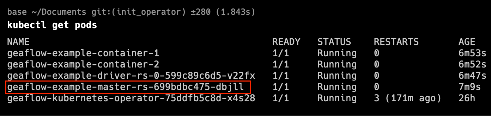
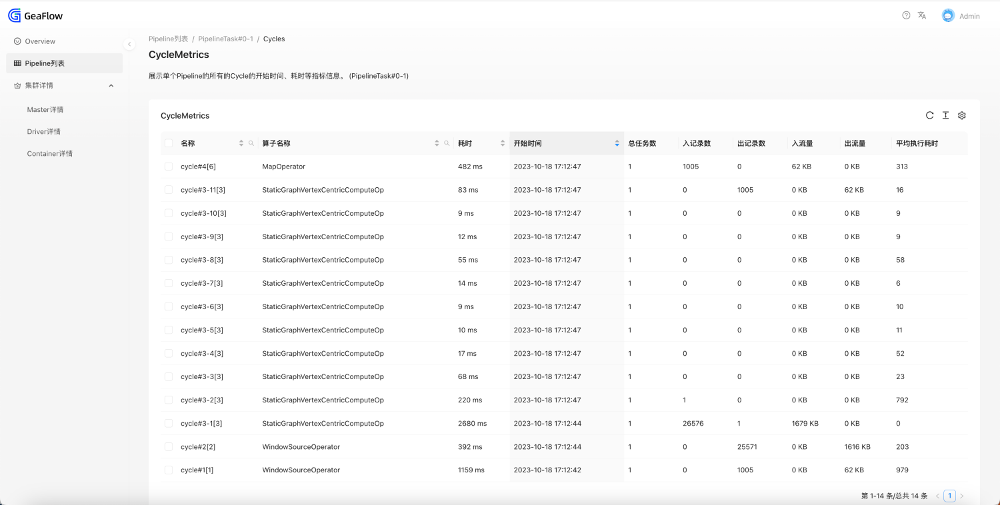
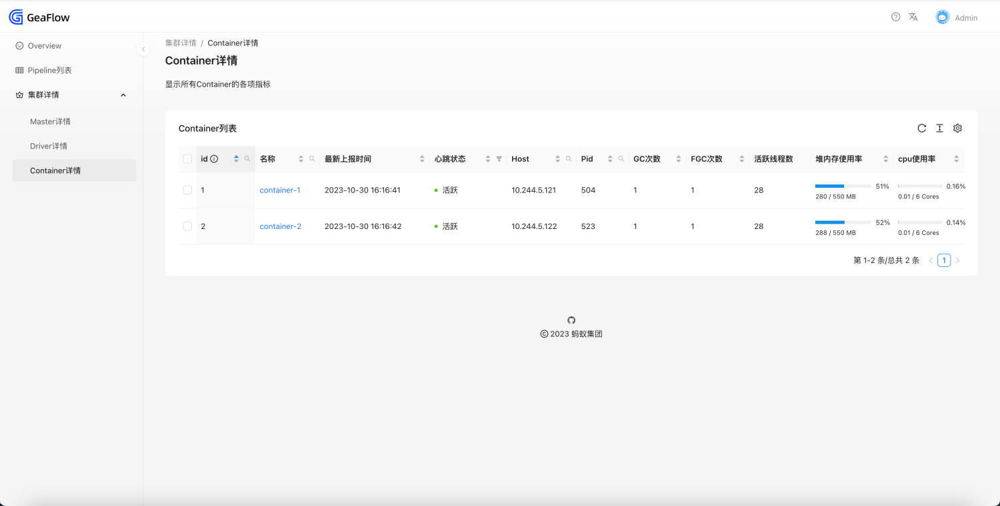
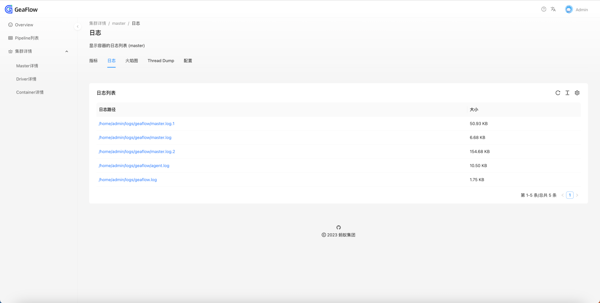
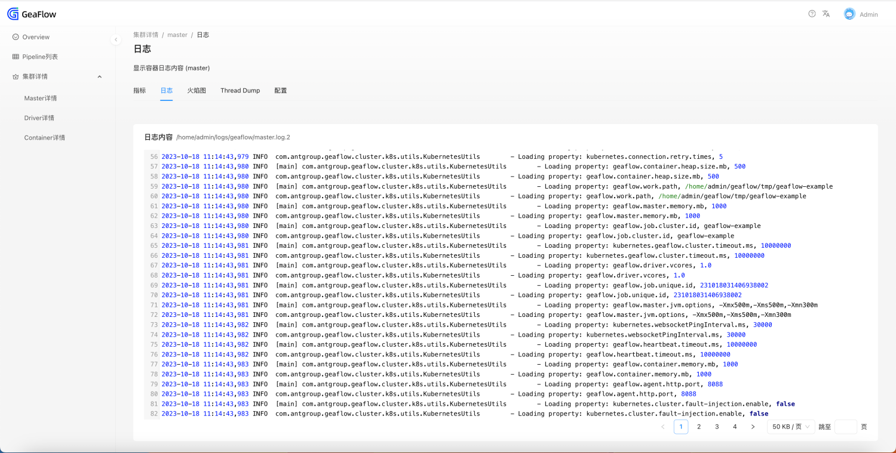
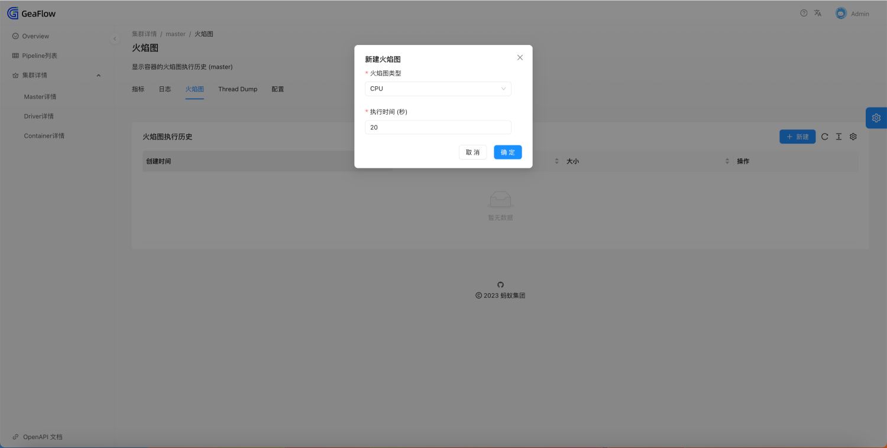
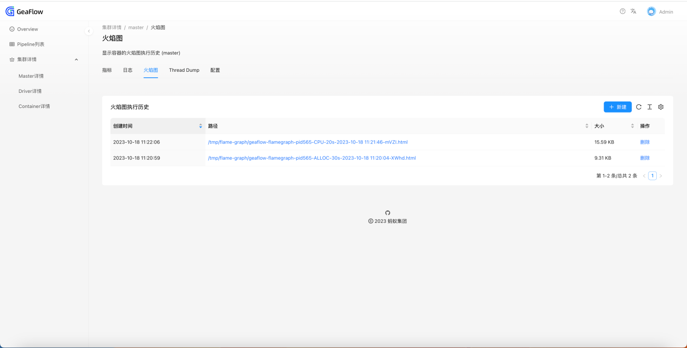
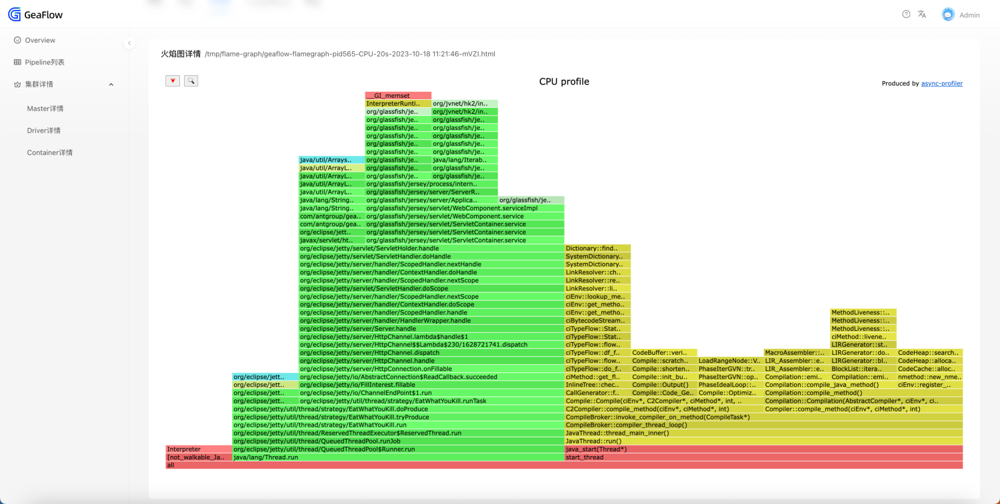
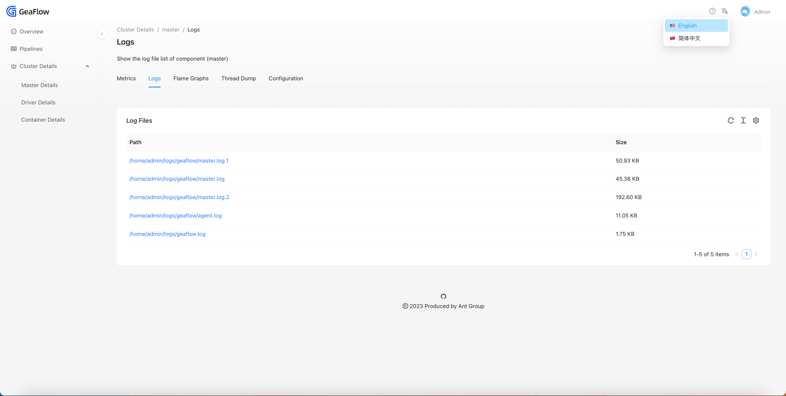

# GeaFlow Dashboard
## Introduction
Geaflow-dashboard provides a job-level monitoring page for Geaflow. You can easily view the following information of the job through the dashboard:
* Job health (Container and Worker activity)
* Job progress (Pipeline and Cycle information)
* Runtime logs of each component of the job
* Process metrics for each component of the job
* Flame graph of each component of the job
* Thread Dump of each component of the job

## Access The Page
When the job is running in a k8s cluster, the HTTP service can be exposed externally through the master's service and can be accessed directly through the service.
In the local or development environment, you can also directly map to the master pod port through the kubectl port-forward command.

### Take Minikube as An Example
1. Deploy the job to minikube. For how to deploy the job, please refer to [Quick Start](../3.quick_start/1.quick_start.md).
2. Open minikube-dashboard and find the pod name of the master (or enter the following command in the terminal to obtain it).
```shell
kubectl get pods
```

3. Open the terminal and enter the following command to map the 8090 port in the pod container to the localhost's local port 8090.
   Please replace **${your-master-pod-name}** with your own pod name.
```shell
kubectl port-forward ${your-master-pod-name} 8090:8090
```
4. Open the browser and visit http://localhost:8090 to open the page.

## Features
### Overview
The Overview page displays the health status of the entire job. You can check here whether the container and driver are running normally.

In addition, the Overview page will also display the Pipeline list of the job.


### Pipeline List
You can also enter the page through the Pipeline menu in the sidebar. The page includes the name,
start time, and cost time of each Pipeline of the job.
If the cost is 0, means that the Pipeline has started execution but has not yet completed.


### Cycle List
Click on the Pipeline name to enter the secondary menu and view information on all Cycle lists under the current Pipeline.



### Job Component Details
You can view various information about each component of the job (including master, driver, and container).
It can be accessed via the menu in the sidebar.

The Driver details display the basic information of all drivers. Container details display the basic information of all Containers.





### Component Runtime Details
By clicking the Master details in the left column, or by clicking the component name in the Driver/Container details, you can jump to the component's runtime page.
In the runtime page, you can view the following contents.
* View the process metrics of the component


* View real-time logs of the component. Here we take the master as an example to introduce the log files.
  * master.log: Java main process log of master.
  * master.log.1/master.log.2: Java main process log backup of master.
  * agent.log: Agent service log of master.
  * geaflow.log: shell startup script log after entering the container.



* Perform CPU/ALLOC analysis on the process and generate flame graph.
  
The flame graph analysis type can be selected as CPU or ALLOC. A single analysis can last up to 60 seconds, and a maximum of 10 historical records can be retained.





* Perform Thread Dump on the process. Keep the results of the latest dump.


* View all configurations of the process (only master owns this page)


## Other Functions
### List Sorting and Search
Partial list columns can be sorted and searched.

When searching, click the "Search" icon, enter keywords, and click the "Search" button.

When resetting, click the "Reset" button and the list will be refreshed.


### Localization
The page supports switching between Chinese and English. Click the "Text A" icon in the upper right corner to select the language.