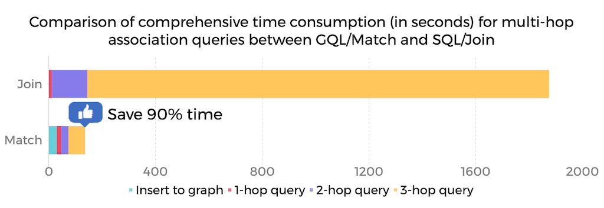
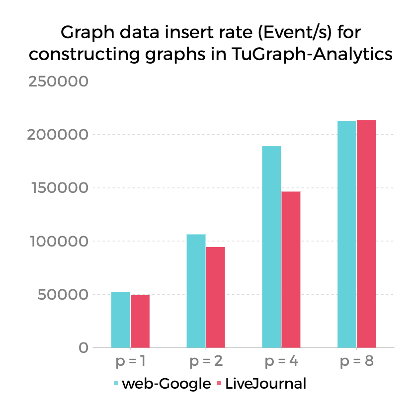
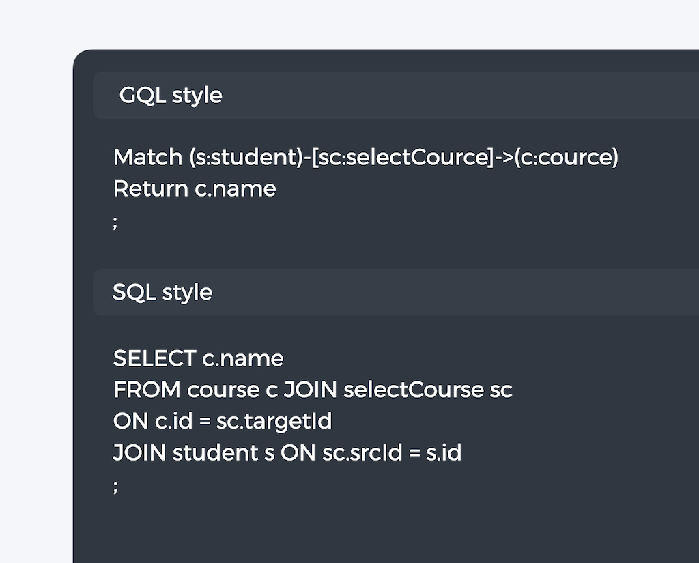
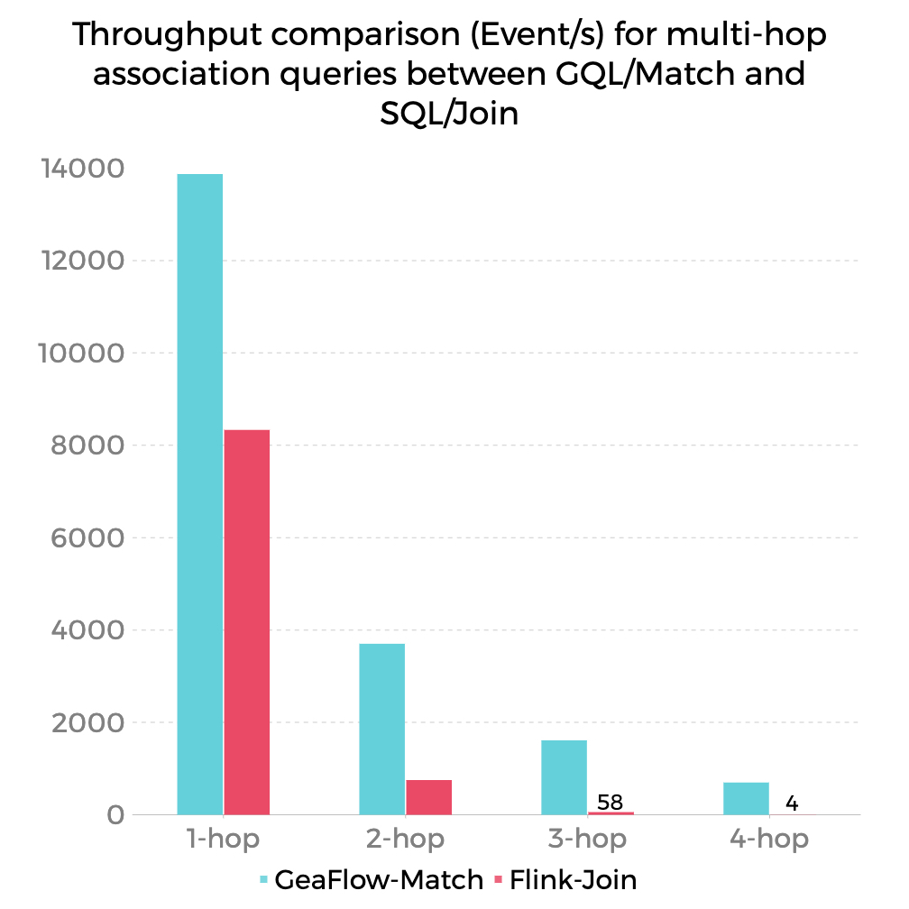

# Why using graphs for relational operations is more appealing than table joins?

## The relational model is not suitable for handling relationships

The relational model is widely used for data modeling in database and data warehouse systems. However, **the model with the word "relationship" in its name is not suitable for handling relationships.**

In the table-based modeling used in the relational model, relationship operations are handled through join operations. However, in practical use, especially with streaming updates, this approach has many pain points.

### Pain point 1: High cost of relationship operations

The focus of the table model is to represent multiple records as tables, but it lacks the ability to describe relationships itself, and can only be achieved through join operations.

In both batch and streaming computational systems, Join operations involve a significant amount of shuffle and computational overhead. Furthermore, the intermediate results generated by Join are duplicated multiple times due to association, leading to exponential data expansion and redundancy, resulting in high storage consumption.

In the experiment shown in the figure below, we simulated scenarios of performing one-hop, two-hop, and three-hop relationship operations in sequence. It is clear that the more complex the multi-hop relationship calculation, the worse the performance of join operations in the relational model. In terms of total time, using graph-based Match calculations can save more than 90% of the time.

Figure 1

### Pain point 2: Data redundancy and low timeliness

In many data warehouse analysis scenarios, in order to improve data query performance, multiple tables are often materialized into a large wide table in advance. 

Although the wide table can accelerate query performance, it suffers from severe data inflation and redundancy. Due to the one-to-many association between tables, the data in one table is multiplied through associations, resulting in exponential data inflation and redundancy. 

Moreover, once the wide table is generated, it is difficult to change it, otherwise a new wide table needs to be regenerated, which is time-consuming and labor-intensive, and not flexible enough. 

In this case, using a graph model can easily solve this problem. A graph is a natural representation of relationships, where entities are represented by nodes and relationships are represented by edges. 

For example, in a social network graph, each person can be represented by a node, and the relationships between people can be represented by edges. There can be various complex relationships between people, which can be represented by different edges. 

Obviously, **the process of constructing a graph is essentially the extraction of relationships between entities, and at the data storage level, it actually materializes the relationships to achieve better relationship calculation performance.**

Compared to the relationship materialization method of wide tables, due to the aggregation of points and edges in the graph structure itself, constructing a graph is very efficient. The figure below shows the performance of high-performance graph construction in GeaFlow, which demonstrates that the graph construction operation itself is extremely fast, and due to the sharding feature of graphs, it has excellent scalability.

Figure 2

In the experiment shown in Figure 1, it can also be observed that we spent a small amount of time inserting the graph (the cost of the green "insert to graph" part) in exchange for the acceleration effect of the graph modeling on subsequent join queries.

### Pain point 3: Difficulties in describing complex relationship queries

Analytical systems based on table modeling only support SQL join for relationship analysis, which is very limited in complex scenarios. For example, querying all friends within 4 degrees of separation for a person, or finding the shortest path, these complex relationship queries are difficult to describe using SQL join on tables. 

GeaFlow provides a query language that combines GQL and SQL styles. This is a data analysis language that combines graphs and tables, inherited from standard SQL+ISO/GQL, and can easily perform graph and table analysis.

Figure 3

**In the DSL, the results of graph computation and table queries are equivalent and can be processed like table data for relationship operations.** This means that both the GQL and SQL descriptions in Figure 3 can achieve similar effects, greatly enhancing the query expression capability of users。

The GeaFlow DSL engine will support automatic conversion of SQL joins into GQL execution. Users can freely mix SQL and GQL style queries, and perform graph matching, graph algorithms, and table queries at the same time.

## GeaFlow, the streaming graph computing engine

GeaFlow is an open-source distributed streaming graph computing engine developed by Ant Group. Within Ant Group, it has been widely used in scenarios such as data warehouse acceleration, financial risk control, knowledge graph, and social networks. 

GeaFlow was officially open-sourced in June 2023, opening up its core capability of graph-based streaming and batch computing. Compared to traditional streaming computing engines such as Flink and Storm, which are based on table models for real-time processing, GeaFlow has a self-developed graph storage as its foundation and a streaming-batch computing engine as its weapon. It integrates GQL/SQL DSL language as its flag, and has significant advantages in complex multi-degree relationship operations.

Figure 4

Figure 4 shows the use of the Match operator in GeaFlow to perform multi-hop relationship queries on a graph, compared to the real-time throughput improvement brought by the Join operator in Flink. In complex multi-hop scenarios, existing streaming computing engines are basically unable to handle real-time processing. The existence of the graph model breaks through this limitation and extends the application scenarios of real-time streaming computing.