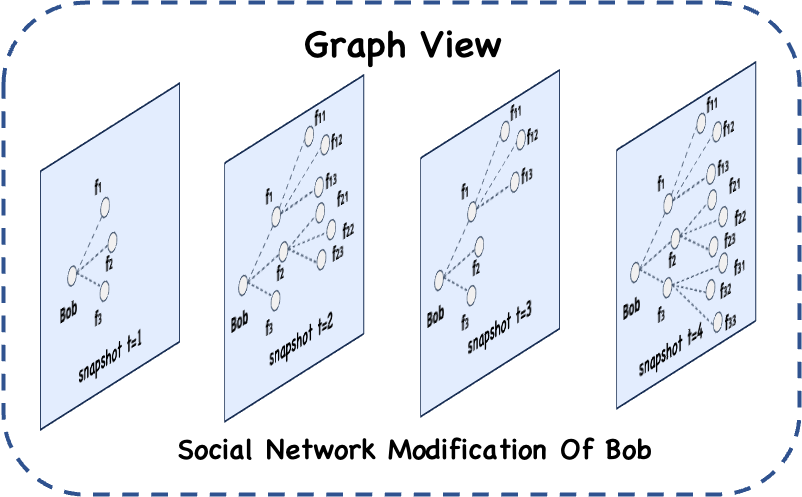

## Fundamental Conception

GraphView is the critical core data abstraction in Geaflow, representing a virtual view based on graph structure. It is an abstraction of graph physical storage, which can represent the storage and operation of graph data on multiple nodes. In Geaflow, GraphView is a first-class citizen, and all user operations on the graph are based on GraphView. For example, distributing point and edge streams as GraphView incremental point/edge data sets, generating snapshots for the current GraphView, and triggering calculations based on snapshot graphs or dynamic GraphViews.

## Functional Description

GraphView has the following main functions:
* Graph manipulation：it can add or delete vertex and edge data, as well as perform queries and take snapshots based on a specific time slice.
* Graph storage: it can be stored in a graph database or other storage media (such as a file system, KV storage, wide-table storage, native graph, etc.).
* Graph partitioning: it also supports different graph partitioning methods.
* Graph computation: it can perform iterative traversal or computation on the graph.



## Example Introduction

Define a GraphView for a social network that describes interpersonal relationships.

DSL Code
```SQL
CREATE GRAPH social_network (
	Vertex person (
	  id int ID,
	  name varchar
	),
	Edge knows (
	  person1 int SOURCE ID,
	  person2 int DESTINATION ID,
	  weight int
	)
) WITH (
	storeType='rocksdb',
	shardCount = 128
);
```


HLA Code
```java
//build graph view.
final String graphName = "social_network";
GraphViewDesc graphViewDesc = GraphViewBuilder
	.createGraphView(graphName)
	.withShardNum(128)
	.withBackend(BackendType.RocksDB)
    .withSchema(new GraphMetaType(IntegerType.INSTANCE, ValueVertex.class,
                String.class, ValueEdge.class, Integer.class))
	.build();

// bind the graphview with pipeline1
pipeline.withView(graphName, graphViewDesc);
pipeline.submit(new PipelineTask());

```
