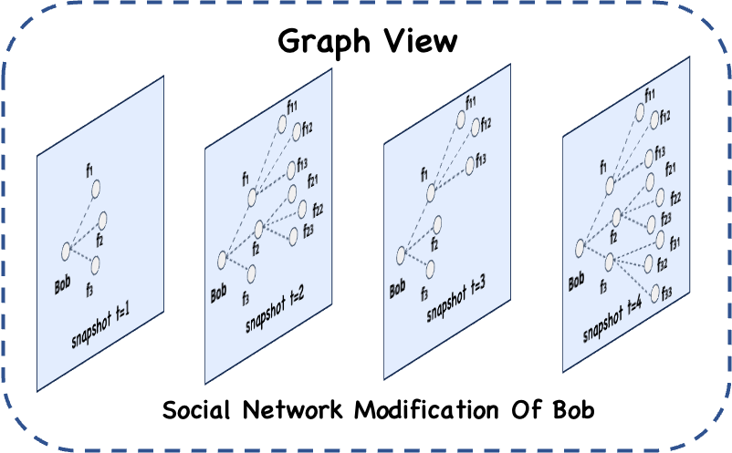

# Graph View

## 基本概念

GraphView是Geaflow中最核心的数据抽象，表示基于图结构的虚拟视图。它是图物理存储的一种抽象，可以表示存储和操作在多个节点上图数据。在 Geaflow中，GraphView是一等公民，用户对图的所有操作都是基于GraphView，例如将分布式点、边流作为 GraphView 增量的点/边数据集，对当前 GraphView 生成快照，用户可以基于快照图或者动态的 GraphView 触发计算。


## 功能描述

GraphView 主要有以下几个功能：
* 图操作，GraphView可以添加或删除点和边数据，亦可以进行查询和在基于某个时间点切片快照。
* 图介质，GraphView可以存储到图数据库或其他存储介质(如文件系统、KV存储、宽表存储、native graph等)。
* 图切分，GraphView还支持不同图切分方法。
* 图计算，GraphView可以进行图的迭代遍历或者计算。



## 示例介绍
定义一个 Social Network 的 GraphView, 描述人际关系。

DSL 代码
```SQL
CREATE GRAPH social_network (
	Vertex person (
	  id int ID,
	  name varchar
	),
	Edge knows (
	  person1 int SOURCE ID,
	  person2 int DESTINATION ID,
	  weight int
	)
) WITH (
	storeType='rocksdb',
	shardCount = 128
);
```


HLA 代码
```java
//build graph view.
final String graphName = "social_network";
GraphViewDesc graphViewDesc = GraphViewBuilder
	.createGraphView(graphName)
	.withShardNum(128)
	.withBackend(BackendType.RocksDB)
    .withSchema(new GraphMetaType(IntegerType.INSTANCE, ValueVertex.class,
                String.class, ValueEdge.class, Integer.class))
	.build();

// bind the graphview with pipeline1
pipeline.withView(graphName, graphViewDesc);
pipeline.submit(new PipelineTask());

```
