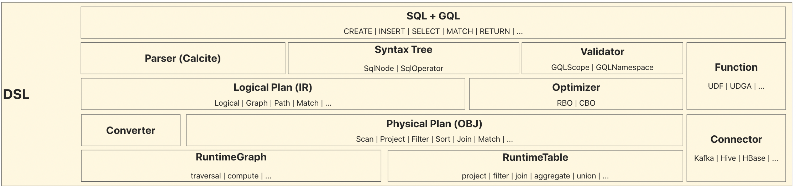
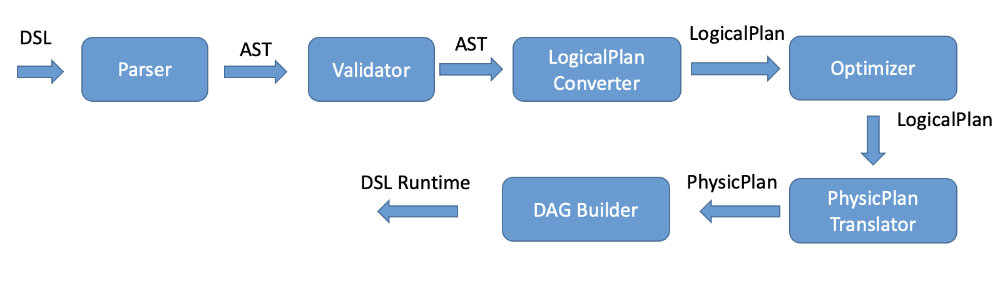
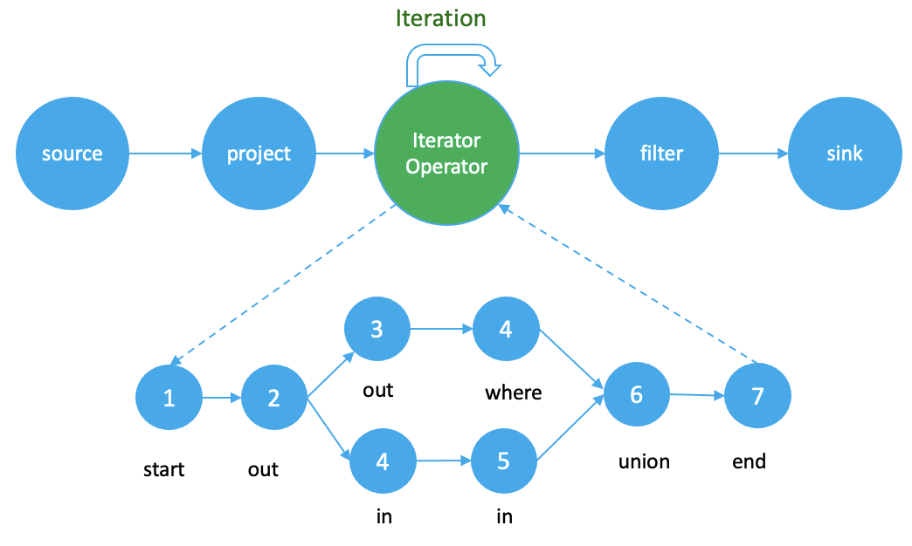

# DSL原理介绍

## GeaFlow DSL架构

GeaFlow DSL整体架构如下图所示：

DSL层是一个典型的编译器技术架构，即语法分析、语义分析、中间代码生成(IR)、代码优化、目标代码生成（OBJ）的流程。

* **语言设计**：GeaFlow设计了SQL+GQL的融合语法，解决了图+表一体化分析的诉求。
* **语法分析**：通过扩展[Calcite](https://calcite.apache.org/)的SqlNode和SqlOperator，实现SQL+GQL的语法解析器，生成统一的语法树信息。
* **语义分析**：通过扩展Calcite的Scope和Namespace，实现自定义Validator，对语法树进行约束语义检查。
* **中间代码生成**：通过扩展Calcite的RelNode，实现图上的Logical RelNode，用于GQL语法的中间表示。
* **代码优化**：优化器实现了大量的优化规则（RBO）用于提升执行性能，未来也会引入CBO。
* **目标代码生成**：代码生成器Converter负责将Logical RelNode转换为Physical RelNode，即目标代码。Physical RelNode可以直接翻译为Graph/Table上的API调用。
* **自定义函数**: GeaFlow提供了大量的内置系统函数，用户也可以根据需要注册自定义函数。
* **自定义插件**: GeaFlow允许用户扩展自己的Connector类型，以支持不同的数据源和数据格式。

## DSL主要执行流程
DSL的主要执行流程如下图所示：

DSL文本首先经过Parser解析生成AST语法树，然后再经过Validator校验器做语义检查和类型推导生成校验后的AST语法树。接着通过Logical Plan转换器生成图表一体的逻辑执行计划。逻辑执行计划通过优化器进行优化处理生成优化后的逻辑执行计划，接下来由物理执行计划转换器转换成物理执行计划，物理执行计划通过DAG Builder生成图表一体的物理执行逻辑。GeaFlow DSL采用有两级DAG结构来描述图表一体的物理执行逻辑。

## 两级DAG物理执行计划
和传统的分布式表数据处理引擎Storm、Flink和Spark的系统不同，GeaFlow是一个流图一体的分布式计算系统。其物理执行计划采用图表两级DAG结构，如下图所示：

外层DAG包含表处理相关的算子以及图处理的迭代算子，为物理执行逻辑的主体部分，将图表的计算逻辑链接起来。内层DAG则将图计算的逻辑通过DAG方式展开，代表了图迭代计算具体执行方式.

