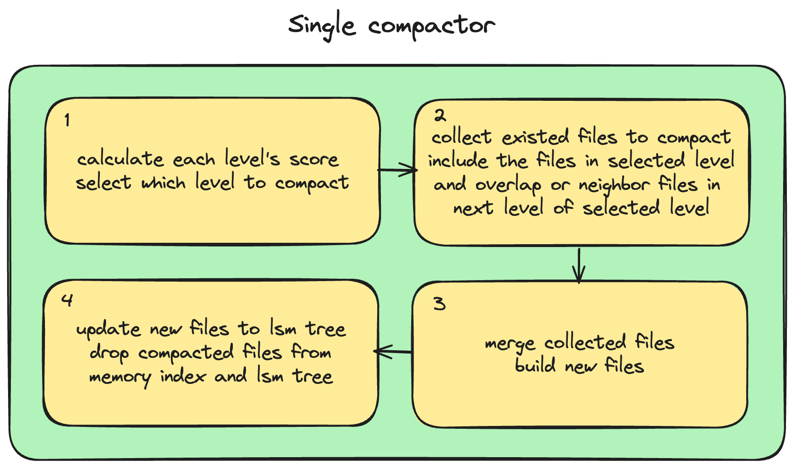
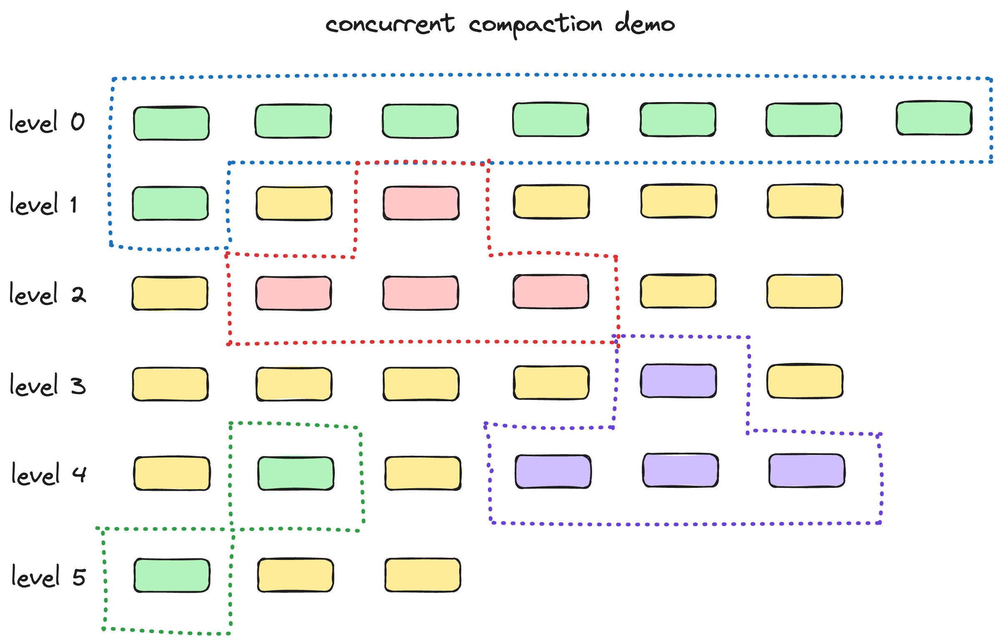

# 1. Compaction

## 2. Compaction Manager

compaction 模块的结构如上图所示，Compaction 是异步在后台进行的，支持多个线程并发执行，图中每个 single compactor 对应一个 compaction 工作线程。不同 compactor 线程、compaction 的清理线程（清理被 compact 的文件）是并行执行的。

## 3. Single compactor

单个 compactor 内部的执行流程如上图所示。主要包括四个步骤：计算不同层得分并选出最高得分的层、收集需要 compact 的文件、compact 收集的文件并生成新文件、将新文件更新到 lsm tree 和内存索引中。

## 4. Concurrent Conpaction

Compaction 支持并发，如上图所示，支持同层、不同层、相邻层文件完全并发进行。