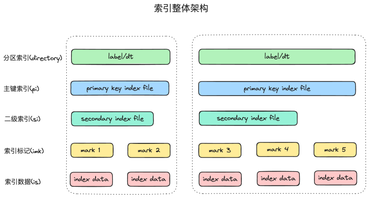
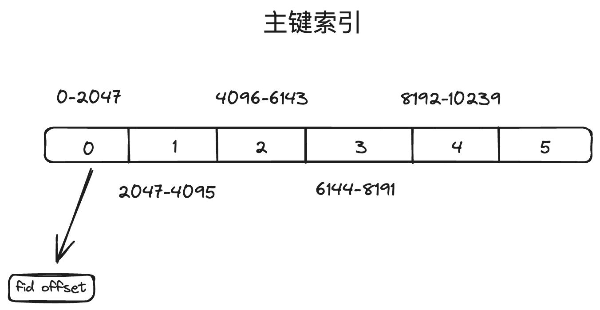
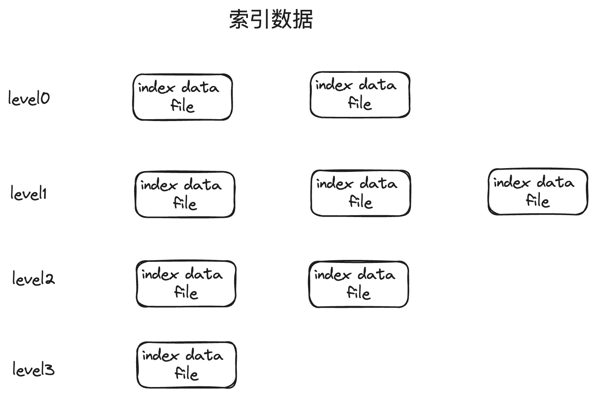

# 1. Index Overview
ctore使用多级索引结构，提供在超大规模图数据中快速找到目标点边的能力。

# 2. Index Partition
构建索引的时候根据label或者dt把数据分布到不同的分区，每个分区有独立的索引。在物理上表示为不同的目录。

# 3. Primary Key Index
主键索引是稀疏索引，目前支持以id化的src_id构建主键。主键索引常驻内存，archive时刷盘持久化，recover时从磁盘load到内存。

# 4. Secondary Index
二级索引包括min max索引，bloom filter索引等。用于快速判断某个稀疏索引块是否包含某个主键。
min max索引记录某个索引块的上界和下界，bloom filter记录索引块的主键。

# 5. Index Mark
索引标记是内存索引到索引数据磁盘存储位置的桥梁，记录了索引文件压缩前的offset到压缩后的offset的映射关系。

# 6. Index Data File
相同主键的索引会被聚集序列化到一个block，若干个block压缩后，构成is文件。

is文件按照LSM tree结构组织，每个is文件的的key内部有序，level0 文件内对于key内部有序，其他level文件对于key文件间有序。

