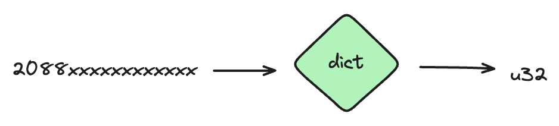
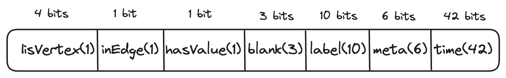
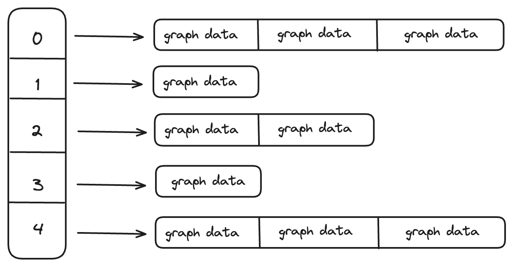
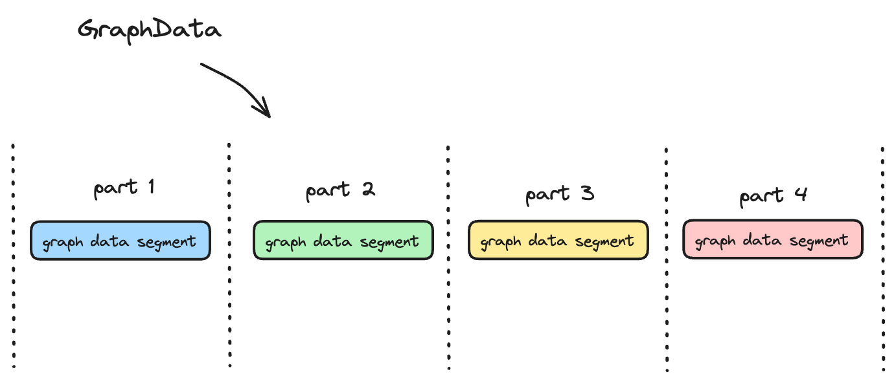
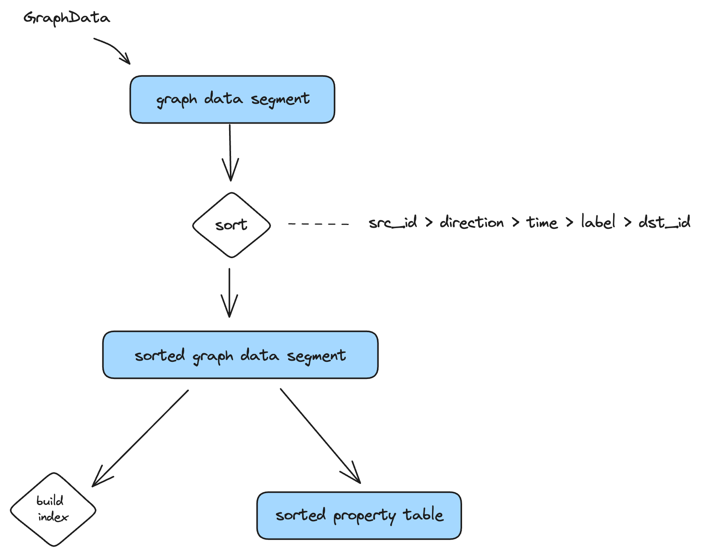

# 1. Graph ID Normalization

用户定义的src_id长度不可控且没有规则，如果要构建维护src_id的索引，需要使用类似B++，字典树，hash等结构。使用ID后有几个优点：
1. ID化后的src_id只占用4个bytes，省内存。
2. ID化的src_id规则，可以用array来做内存索引，array的index为src_id，查询效率为O(1)。

# 2. Graph Serialization
点边数据进入到cstore后被序列化为GraphData结构，GraphData包括SecondKey和Property，SecondKey为索引数据，存储在索引文件（is）中，Property为点边属性，存储在数据文件（vs）中。
SecondKey结构如下，target id大小不固定，其他部分消耗20 bytes。

其中graph info存储了点边元数据，编码方式如下。

# 3. GraphData Segment
## 3.1 Segment Memory Structure
GraphData Segment存储临时数据，为内存数据结构，使用skiplist, 维护src_id -> graph_data list结构。

GraphData Segment主要有两个功能：
1. 数据聚合。把相同的src_id的点边数据聚合到一起存储。
2. 排序。
   1. 把src_id排序，compaction需要。
   2. 按照用户指定顺序把相同src_id的点边数据排序，用于建立二级索引。

## 3.2 Segment Partition
不同分区维护不同的GraphSegment, 每个GraphSegment之间相互独立。数据写入到GraphSegment，一旦超过了阈值，把最大的GraphSegment排序->构建索引->数据写入到磁盘。如果用户调用flush，把所有GraphSegment排序->构建索引->数据写入到磁盘。

## 3.3 Separated Storage Architecture 
cstore采用key-value分离架构，对key构建索引，value直接append写入到文件，维护key到value的索引关系。这里的value对应到点边数据的属性数据，属性数据写入到磁盘后，记为.vs文件。
不同分区的索引和属性数据在物理上相互隔离，分布在不同的磁盘目录。

